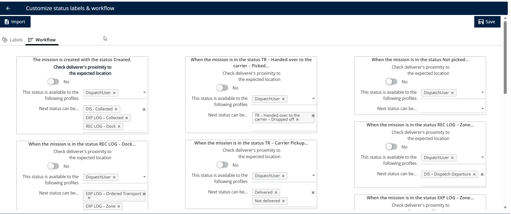
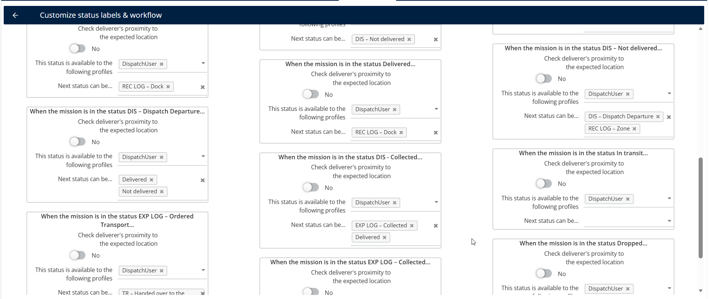

# Customizing Workflow

The customized workflow feature allows you to define how mission statuses progress and who can change them. The configured **user profiles** define who can sign in and perform delivery-related actions, including updating mission statuses. This ensures a structured, secure, and geographically verified delivery process.

#### Getting Started

This feature is enabled exclusively for accounts configured in No Route mode.

* Access to the **Configuration** page.

#### Steps

1. Open the **Configuration** page.
2. Click on **Customize Status Tables and Workflow**.
3. To learn more about customizing labels, refer to the following link

[customizing-status-labels](../../8-6-missions/customizing-status-labels.md)

* Click the **Workflow** tab.

<figure><figcaption></figcaption></figure>

#### Feature Overview

* **Workflow Mapping**: Define which status can be changed to a specific next status.
* **Proximity Toggle**: Enable this option to require the user to be close to the customer's address when this status is applied in the mobile app.
* **Profile Definition**: Only users who have the appropriate rights can move a mission from one status to another.

#### How To: Customize a Mission Workflow

1. Select a starting status in the workflow grid, such as **Waiting**.
2. Assign a user role from the **Profile** dropdown to control who can change the status.
3. Select which target statuses the mission can transition to, such as **DIS collected** or **EXP log collected**.
4. Configure the next transition, such as allowing a **Dispatch User** to scan a mission and change it to **Delivered**.
5. Select the custom fields, if you want to nullify the field Suring the status transition

<figure><figcaption></figcaption></figure>

6. Click on **Save** to apply the changes.

**Note**: The **Workflow** page allows users to configure the mission status flow. They can define which statuses a mission can transition between and specify the **user profiles** that are authorized to perform each status change. This provides complete control over the delivery workflow by ensuring that only designated profiles can execute specific status transitions.

<figure><figcaption></figcaption></figure>

#### Productivity Tips

* ⚠️ **Unsaved Changes**: Always click the Save button after making adjustments to ensure the workflow changes are saved
