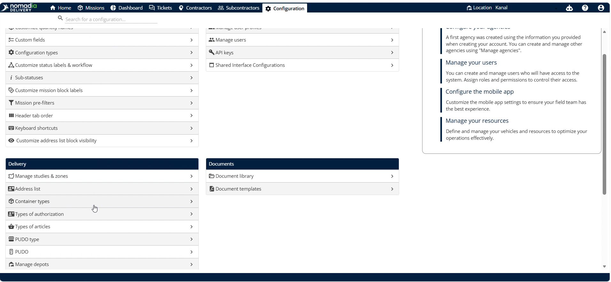
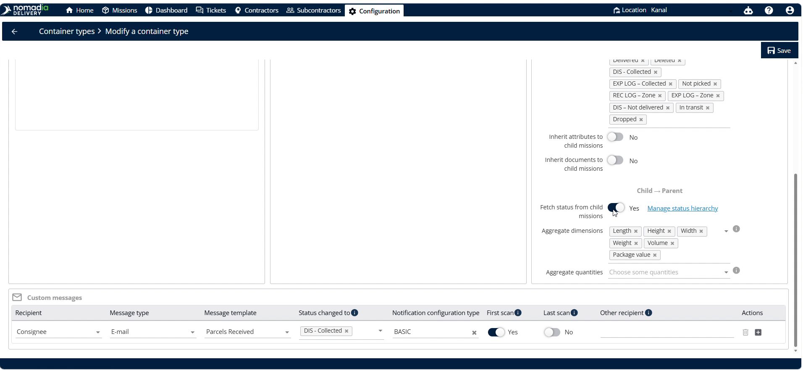
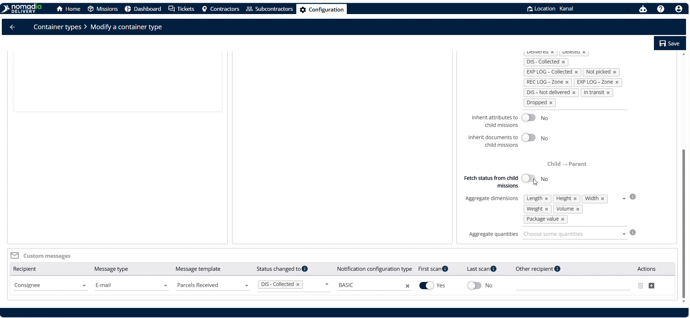
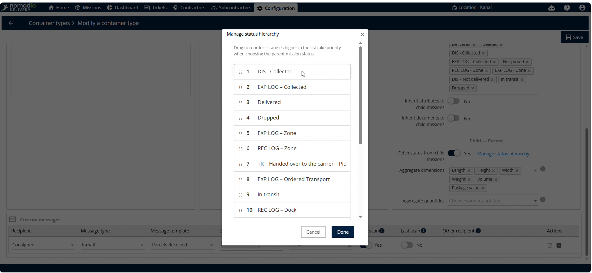
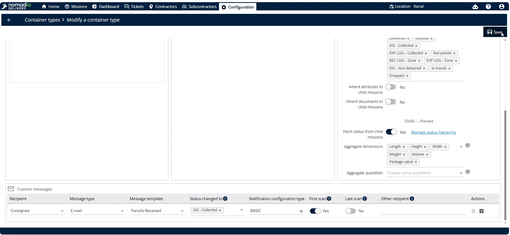
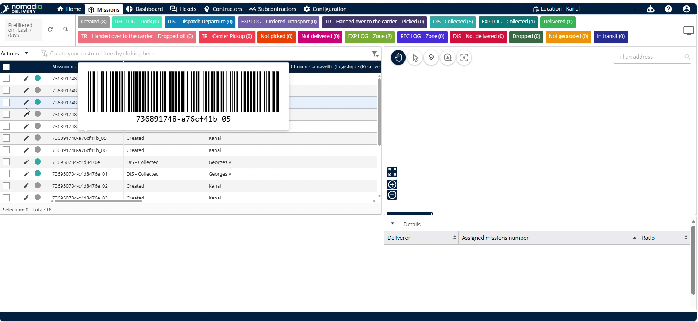
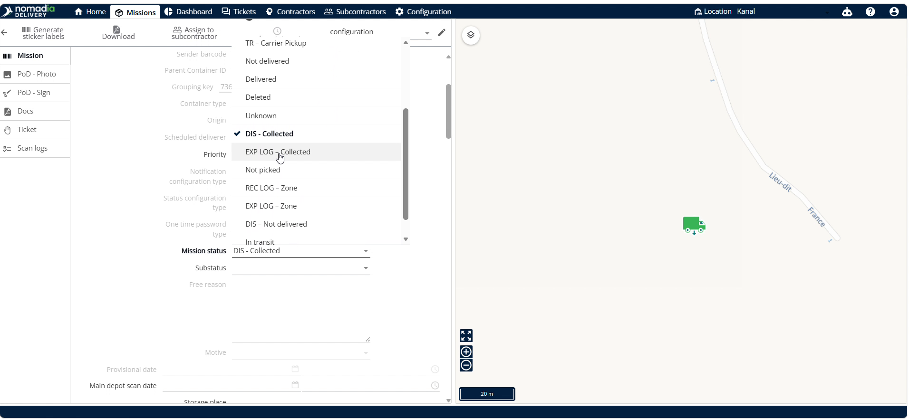
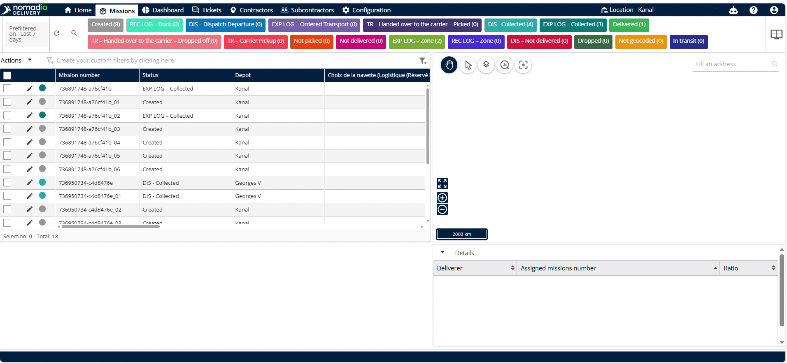

# Customize the Status Hierarchy

This feature allows dispatchers to manage how status changes on child missions affect parent containers. It ensures accurate real-time tracking across your logistics operations. Customize status priorities easily to streamline container state synchronization.

#### Getting Started

Before you begin, ensure you meet the following prerequisites:

* Create a parent container in the system.
* Create a child container.

#### Feature Overview

* **Container types**: Selects the container category you want to configure.
* **Identifier name**: Specifies the unique name to identify the container type.
* **Fetch status from side missions**: Enables retrieving status updates from child machines.
* **Manage status hierarchy**: Opens the status prioritize interface to arrange priorities.

Follow these initial setup steps:

1. Navigate to the **Configuration** menu.

2. Select **Container types.**&#x20;

3. Scroll down to select the correct **Identifier name.**&#x20;

<figure><figcaption></figcaption></figure>

4. Locate the **Fetch status from child missions** option in the bottom right corner.

5. Check if the option is enabled.

6. Click on **Manage status hierarchy** once the option is enabled.

#### How To: Customize Status Hierarchy

1. Open the status hierarchy configuration window.

2. Drag the desired status to the top priority position.
3. Click on **Done**.

4. Click **Save**.

5. Go to **Missions**.

6. Click any **Child container** (individual missions connected to the parent container).

7. Change the status.

8. Click on Save.

9. Verify that the parent container status changes successfully.

#### Productivity Tips

* 💡 **Status Prioritization**: Drag any status to the top of the list to easily set its priority.
* ⚠️ **Enable Fetch Status**: Enable **Fetch status from side missions** first, or the **Manage status hierarchy** option will not be visible.

