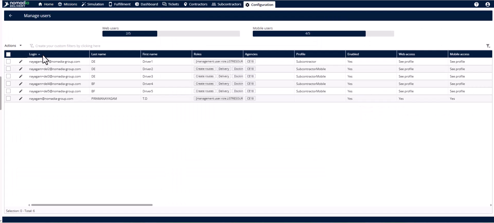
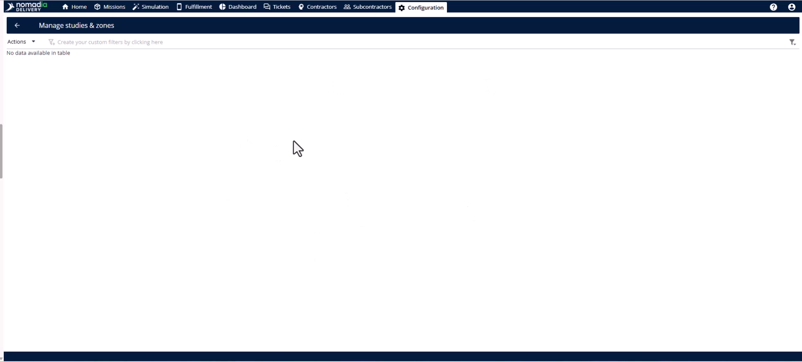
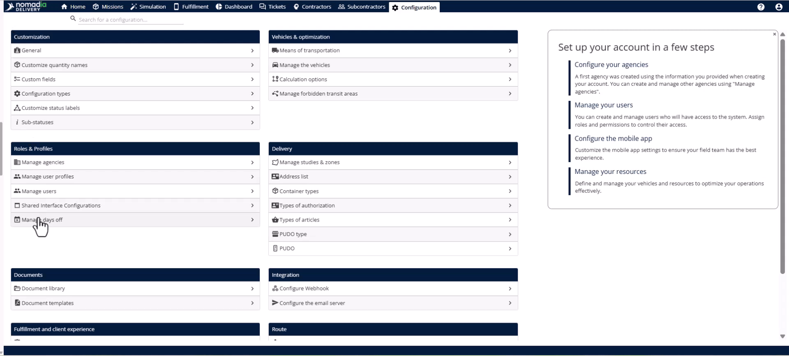
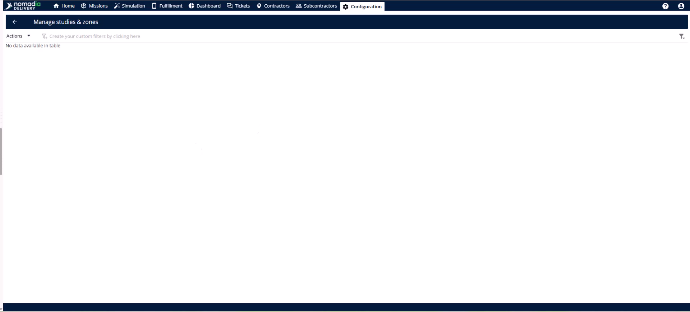
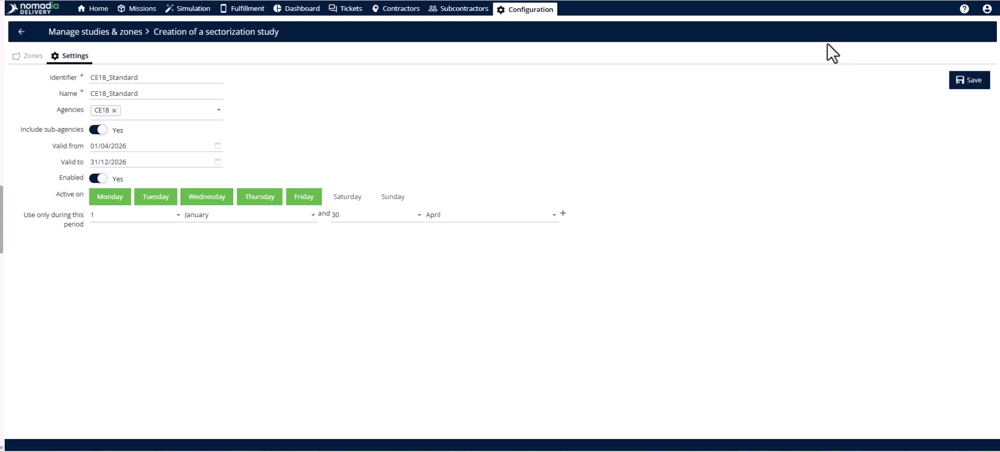
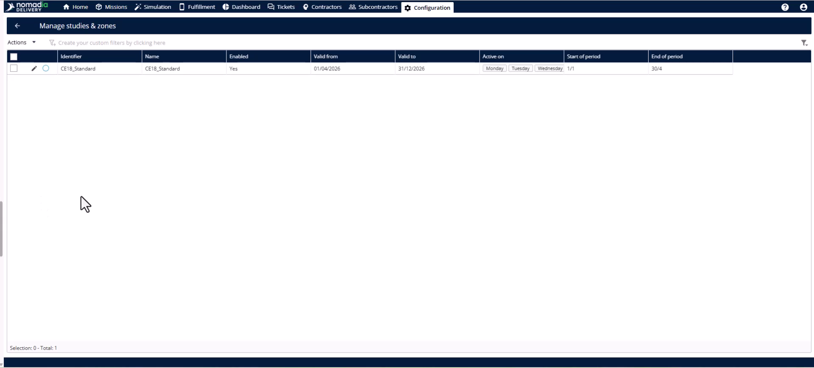
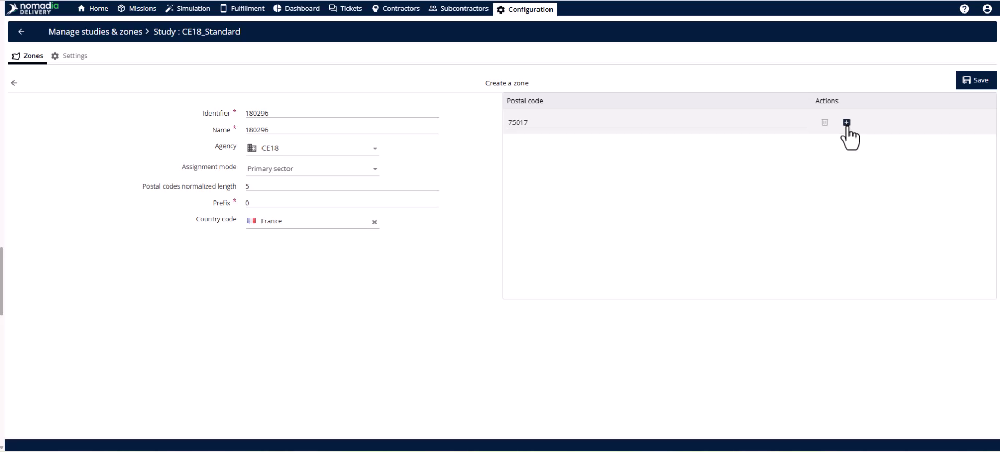

# Study Creation with Primary Zone

## Case\_studies-study\_creation-with\_primary\_zone

## Case-Studies

Manage delivery territories effectively during peak seasons and fluctuating volumes. Organize coverage by creating seasonal plans that activate automatically at the right time. Achieve precise logistics operations that reflect real-world coverage for your field teams.

#### Getting Started

To create and manage studies, ensure you have the correct administrative permissions.

* Access to the **Configuration** module.
* Permission for **Create and update zones** and **Create and update studies**.

1. Click the **Configuration** module in the top banner. 
2. Select the **Manage Users** page. 
3. Edit the specific user and click the **Roles and Rights** tab. 
4. Enable rights for **Create and update zones** and **List of zones**.
5. Click the **Save** button to apply permissions. 

#### Feature Overview

* **Study**: A structured object defining how delivery territories are organized. 
* **Primary Zone**: A top-level geographical area assigned to a team and tied to postal codes. 
* **Study Management Page**: Your central hub for creating and editing studies and zones. 

#### How To: Create a Study

1. Navigate to the **Studies and Zones** page under the **Delivery** section in **Configuration**. 
2. Click the **Actions** menu in the top right. 
3. Select **Create Empty Study**.
4. Enter the **Identifier**, **Name**, and **Agency**.
5. Set the **Validity Start Date** and **Validity End Date**.
6. Toggle the study to **Enable**.
7. Select the active days of the week for this plan.
8. Define the specific seasonal activation period.
9. Click the **Save** button. 

#### How To: Create a Primary Zone

1. Open the **Zone** tab within your new study. 
2. Open the **Actions** menu.
3. Select **Add a Postal Code Zone**. 
4. Fill in the **Identifier**, **Name**, and **Agency**.
5. Select the **Country** and set the **Postal Code Normalized Length**.
6. Select **Primary Zone** in the **Assignment Mode** field. 
7. Enter postal codes manually using the **Plus** button. 
8. Click the **Save** button. 

#### Productivity Tips

* 💡 **Bulk Import**: Use the **Import** option in the **Actions** menu to upload large lists of postal codes.
* 💡 **Instant Visualization**: Watch the map on the right to see postal code polygons rendered automatically.
* 💡 **API Automation**: Use the **create study** endpoint to trigger study creation programmatically for large workflows.
* ⚠️ **Assignment Mode**: Always select **Primary Zone** for top-level areas to avoid creating subzones by mistake.
