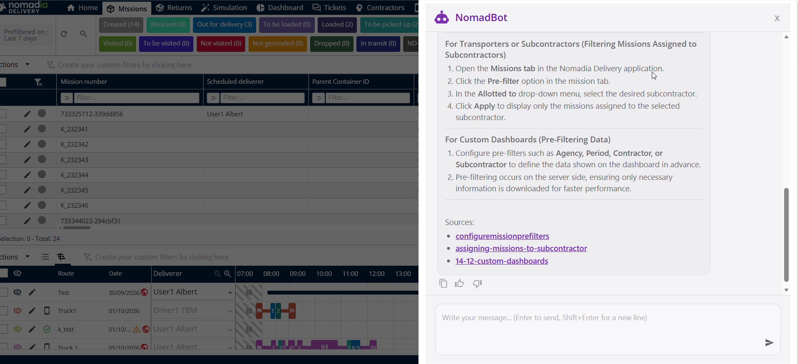
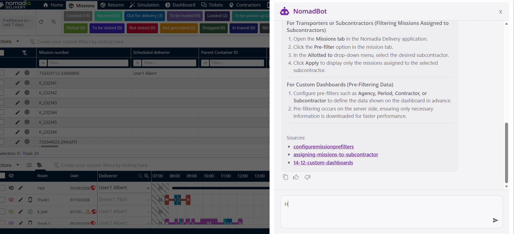

# Nomadbot

The **Nomadbot** feature in **Nomadia Delivery** provides an automated virtual assistant for dispatchers and planners. You can select predefined questions or type custom queries directly in the typing window. This helps you resolve operational questions quickly without leaving the platform.

#### Getting Started

Ensure you meet all system requirements before accessing the feature.

* Active **Nomadia Delivery** account with dispatcher or planner permissions.
* Supported web browser with an active internet connection.

1. Log into **Nomadia Delivery**.
2. Locate the top right navigation bar.&#x20;

3. Click the **Chatbot icon**.

#### Feature Overview

* **Chatbot icon**: Opens the virtual assistant interface from the top navigation bar.
* **Predefined Questions**: List of ready-to-use questions and answers for quick self-service.
* **Typing Window**: Input field where you enter custom inquiries.
* **Send button**: Submits your typed question to the virtual assistant.

#### How To: Access Predefined Questions

1. Click the **Chatbot icon** in the top right header.

2. Review the listed **Predefined Questions and Answers**.

#### How To: Ask a Custom Question

1. Click inside the **Typing Window**.

2. Type your question into the **Typing Window**.

3. Click **Send**.

4. Observe the **Typing Indicator** while the response generates.

5. Read the displayed answer based on your question.

#### Productivity Tips

* 💡 **Predefined Questions**: Review built-in questions for instant answers to common topics.
* 💡 **Specific Queries**: Type clear questions in the typing window to receive targeted answers.
