# Child to Parent Inheritance

Child-to-parent inheritance automatically syncs data from child containers to parent containers. This feature saves dispatchers time by eliminating manual data entry. You will achieve real-time visibility of consolidated package statuses and aggregate cargo dimensions.

#### Getting Started

Before using this feature, ensure you meet the following requirements:

* An active user account for **Nomadia Delivery** with administrative privileges.
* Pre-configured parent and child container profiles.

Set up child-to-parent inheritance using these steps:

1. Go to **Configuration**.

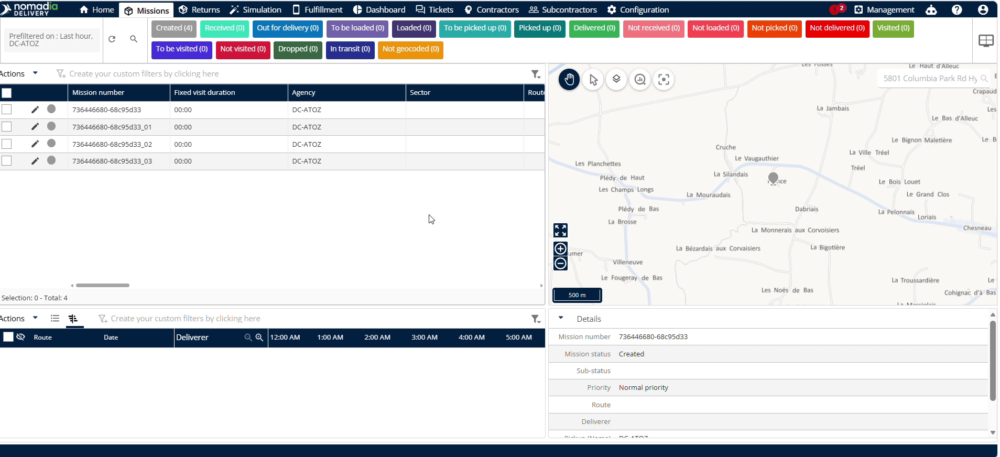

2. Click **Container Types**.

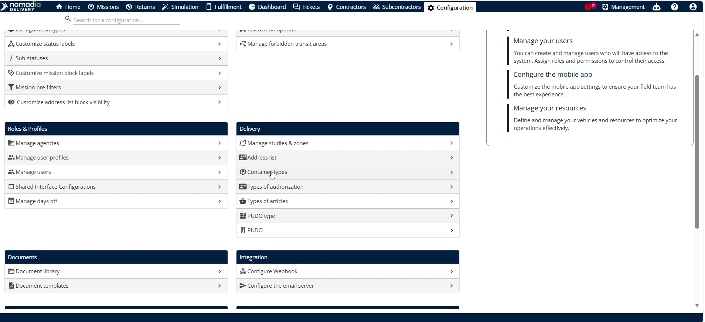

3. Scroll down to find the correct identifier.

4. Click the correct identifier.

5. Locate the **Fetch status from child missions** toggle.
6. Toggle the setting to **Yes** if it is disabled.
7. Click **Save**.

8. Click **Sub status**.

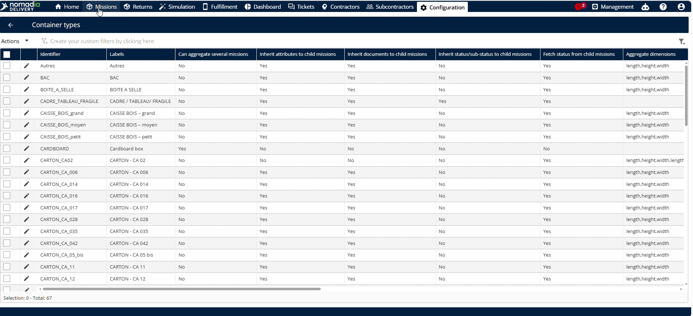

10. Click **Delivered** if you wish to deliver the parcel.

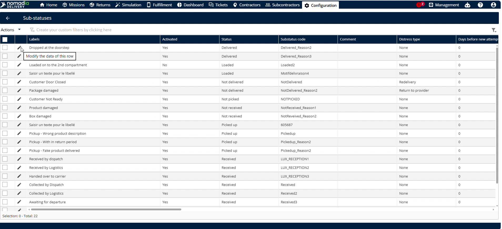

11. Check if **Scan all the items in the container** is enabled.
12. Toggle the option to **Yes** if it is disabled.

13. Click **Save**.

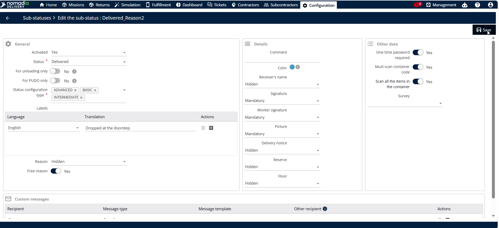

#### Feature Overview

* **Fetch status from child missions**: This setting enables parent containers to inherit progress status from child containers. It ensures automatic updates.
* **Scan all the items in the container**: This toggle forces operators to scan every child item before executing delivery. It guarantees delivery accuracy.
* **Mission status**: This field defines the current operational status of each individual child machine. It updates inherited status values.
* **Aggregate dimensions**: This configuration defines which physical dimensions sum up from child to parent containers. It aggregates size details.
* **Aggregate quantities**: This configuration defines which quantitative measurements sum up to the parent container. It aggregates weight and volume.

#### How To: Update Child Container Delivery Status

1. Click **Missions** on the main navigation panel.

2. Click on the **child container**.

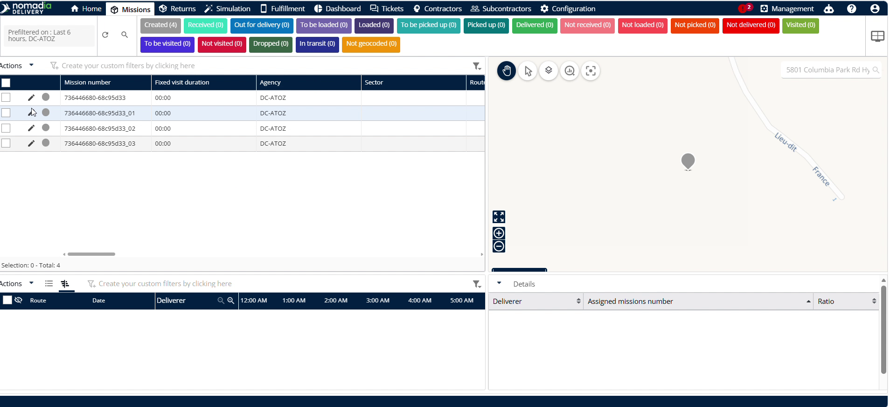

3. Change the **Mission status** to **Delivered**.

4. Click **Save**.

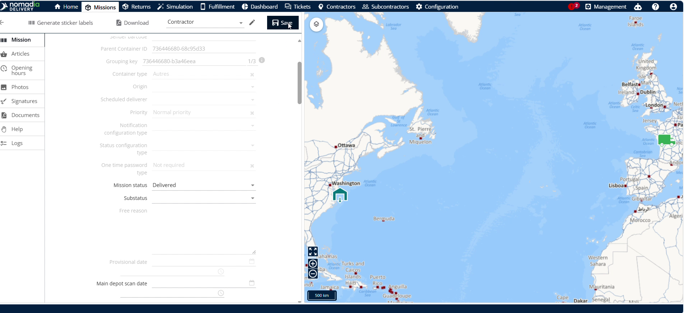

#### How To: Customize the List to View Parcel Status Attainment

1. Click **Custom field** inside the parent container view.

2. Click **Customize the list**.

3. Verify **Parcel status attainment** is in the display fields list.
4. Click **Save**.

5. Click the **Pencil icon** to edit another child machine.

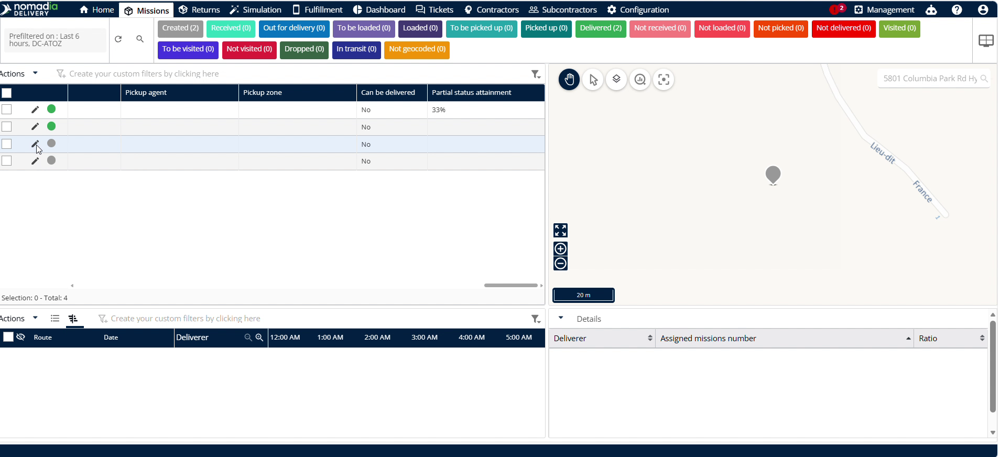

6. Change the status to **Delivered**.

7. Click **Save**.

#### How To: Track Damaged Items and Not-Delivered Reasons

1. Click the **Pencil icon** of the damaged child container to edit it.

2. Change the status to **Not Delivered**.

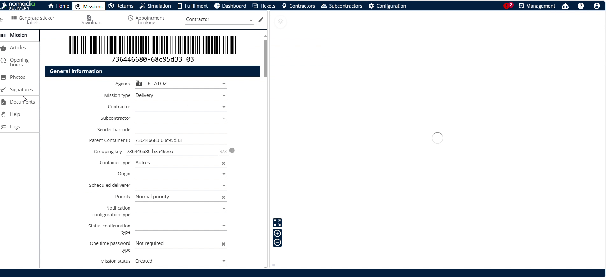

3. Enter the specific reason in the **Reason** field.

4. Click **Save**.

The status will be reflected in the parent container. Please note that only positive statuses will be updated in the parent container.

<figure><figcaption></figcaption></figure>

#### How To: Configure and View Aggregated Dimensions and Quantities

1. Click **Configuration** on the top menu.

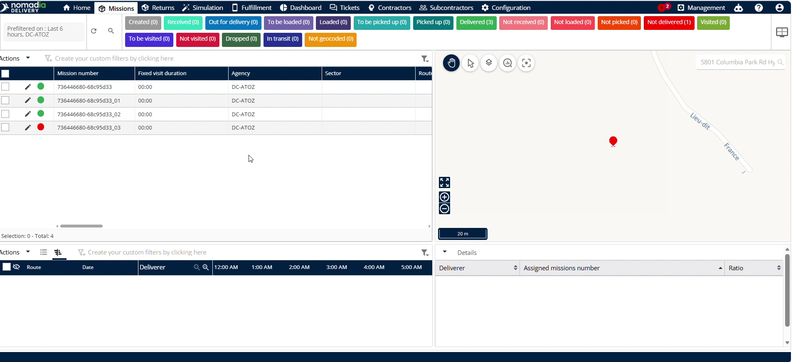

2. Click **Container size pallet**.
3. Choose your desired size metrics in **Aggregate dimensions**, such as length or height.

4. Choose your desired quantity metrics in **Aggregate quantities**, such as kg or volume.

5. Click **Save**.

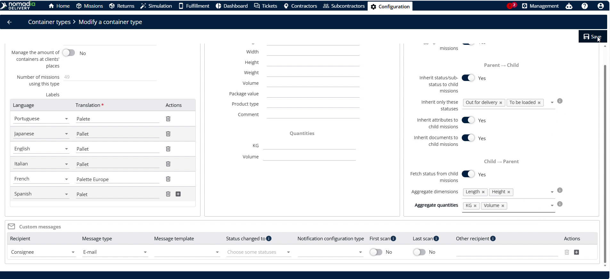

6. Click **Missions**.

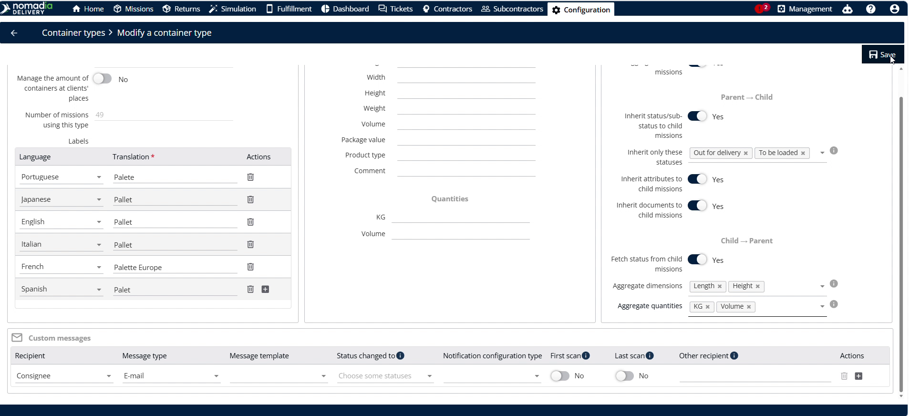

7. Enter the **length, height, quantity, weight (kg)**, and **volume values** for the first child container.

8. Click **Save**.

9. Select the second child container and enter its metrics.

10. Click **Save**.

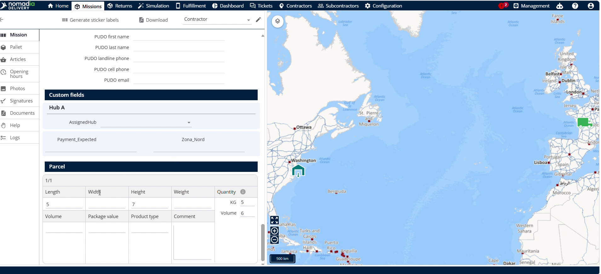

11. Open the parent container to view the calculated totals.

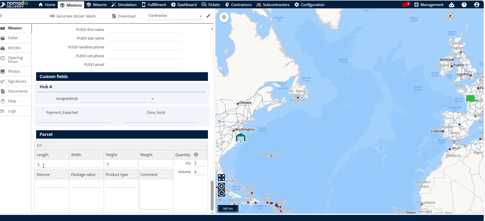

#### Productivity Tips

* 💡 **Mobile Synchronization**: Use the mobile application to experience the same automatic child-to-parent data inheritance on the go.
* 💡 **Detailed Tracking**: Enter specific reasons when marking containers as not delivered to ensure accurate fleet reporting.
* ⚠️ **Parent Display Only**: Remember that overall parcel status only displays in the parent container, not in individual child containers.

***

