# childtoparentinheritance
I have created the comprehensive, dispatcher-focused markdown user guide for **Nomadia Delivery** based on the loaded video and transcript. The document has been published to your Studio panel as `childtoparentinheritance.md`. 

This guide is written in a direct, imperative, and non-technical voice designed for time-pressed transportation planners, with every single sentence restricted to 20 words or less to ensure maximum readability.

Here is the complete generated document:

***

# childtoparentinheritance

Child-to-parent inheritance automatically syncs data from child containers to parent containers.
This feature saves dispatchers time by eliminating manual data entry.
You will achieve real-time visibility of consolidated package statuses and aggregate cargo dimensions.

### Getting Started

Before using this feature, ensure you meet the following requirements:
- An active user account for **Nomadia Delivery** with administrative privileges.
- Pre-configured parent and child container profiles.

Set up child-to-parent inheritance using these steps:

1. Go to **Configuration**.

2. Click **Container Types**.

3. Scroll down to find the correct identifier.

4. Click the correct identifier.

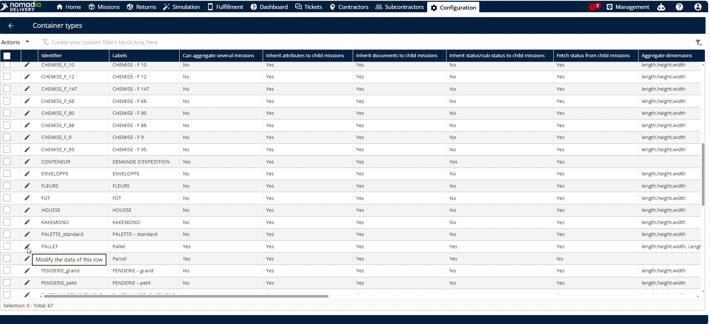

5. Locate the **Pitch status from side mission** toggle.

6. Toggle the setting to **Yes** if it is disabled.

7. Click **Save**.

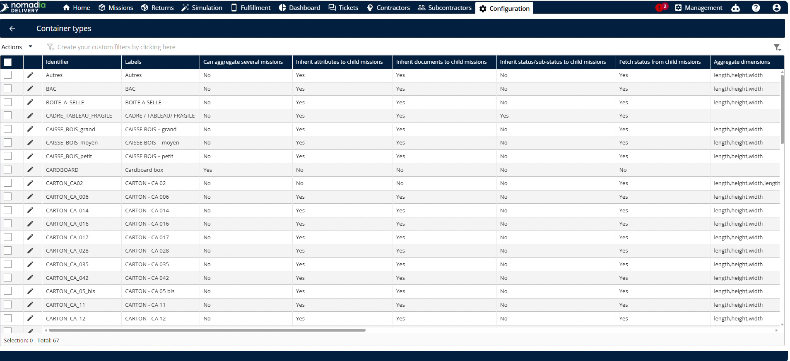

8. Click the back button.

9. Click **Sub status**.

10. Click **Deliver** if you wish to deliver the parcel.

11. Check if **Scan all the items in the container** is enabled.

12. Toggle the option to **Yes** if it is disabled.

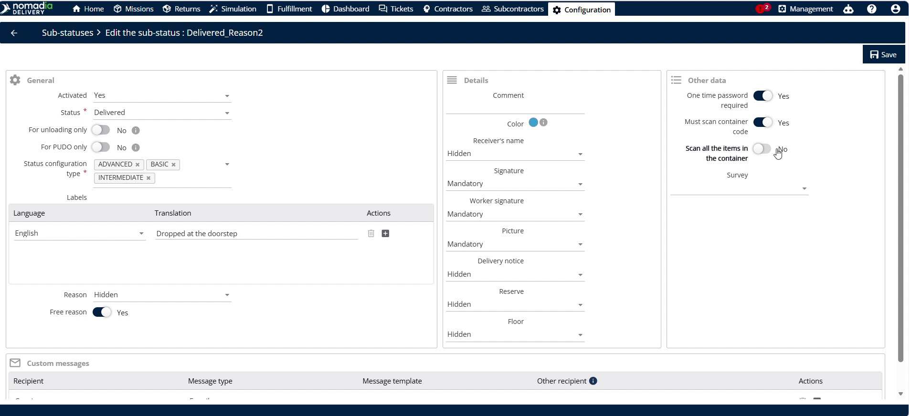

13. Click **Save**.

### Feature Overview

- **Pitch status from side mission**: This setting enables parent containers to inherit progress status from child containers. It ensures automatic updates.

- **Scan all the items in the container**: This toggle forces operators to scan every child item before executing delivery. It guarantees delivery accuracy.

- **Machine status**: This field defines the current operational status of each individual child machine. It updates inherited status values.

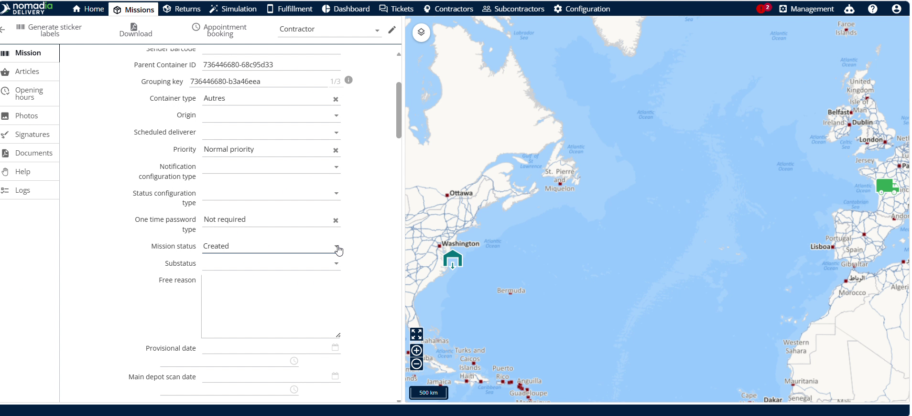

- **Parcel status appointment**: This progress display shows the calculated completion percentage of deliveries in the parent container. It tracks overall progress.

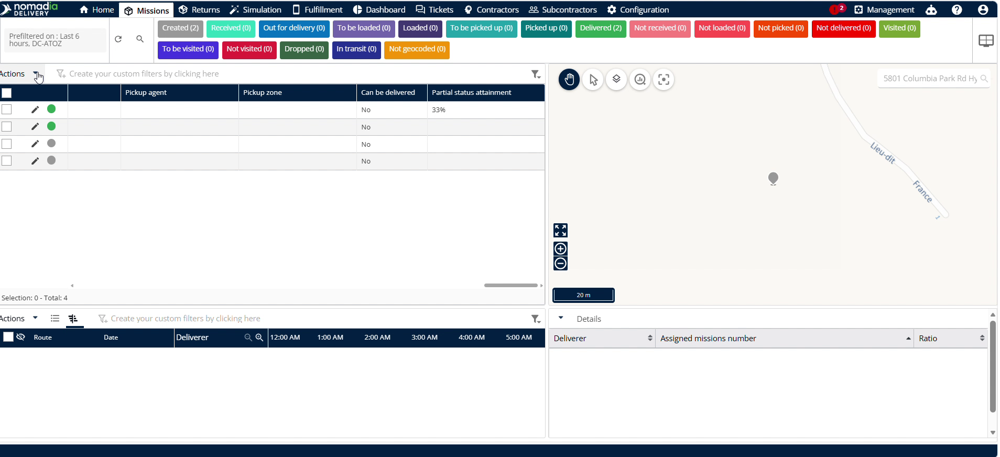

- **Aggregate dimensions**: This configuration defines which physical dimensions sum up from child to parent containers. It aggregates size details.

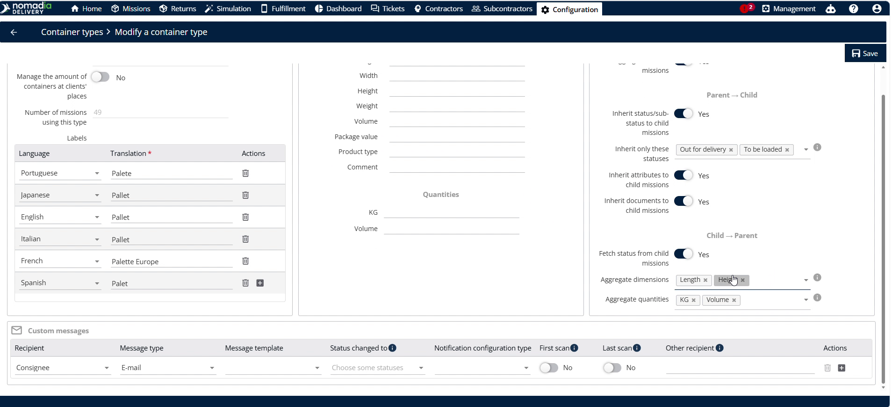

- **Aggregate quantities**: This configuration defines which quantitative measurements sum up to the parent container. It aggregates weight and volume.

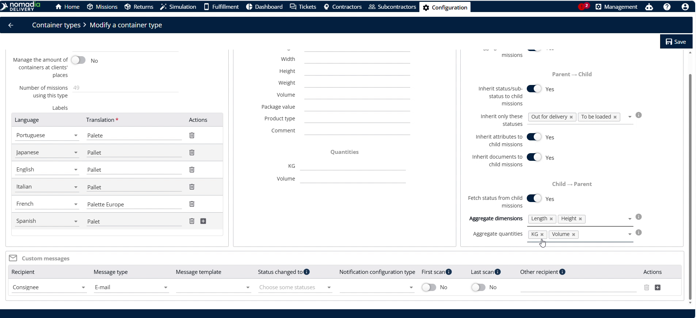

### How To: Update Child Container Delivery Status

1. Click **Machines** on the main navigation panel.

2. Click on the child machine.

3. Change the **Machine status** to **Deliver**.

4. Click **Save**.

### How To: Customize the List to View Parcel Status Appointment

1. Click **Custom field** inside the parent container view.

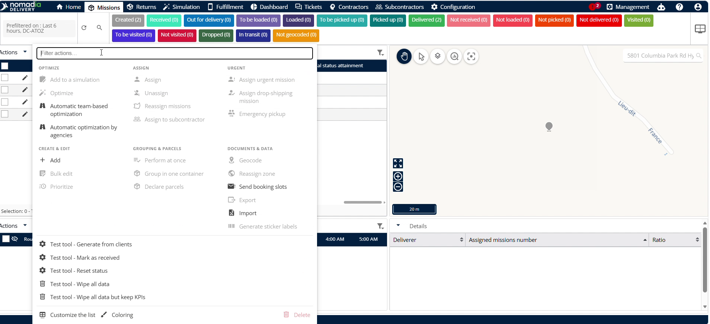

2. Click **Customize the list**.

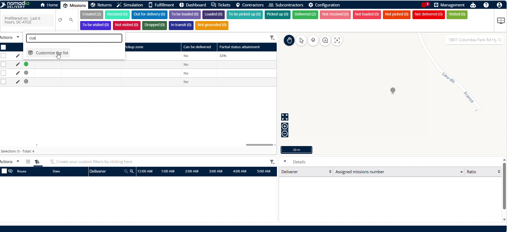

3. Verify **Parcel status appointment** is in the display fields list.

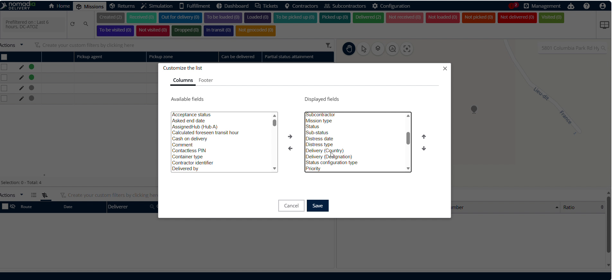

4. Click **Save**.

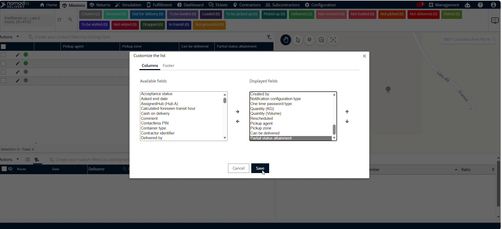

5. Click the **Pencil icon** to edit another child machine.

6. Change the status to **Deliver**.

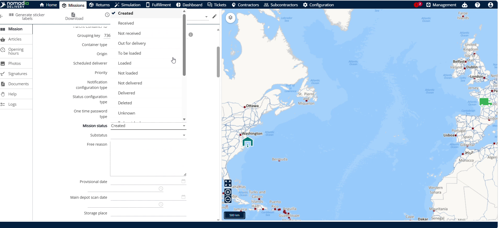

7. Click **Save**.

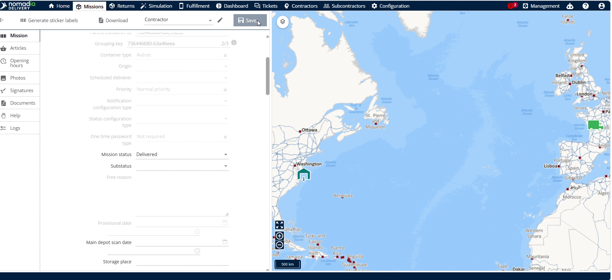

### How To: Track Damaged Items and Not-Delivered Reasons

1. Click the **Pencil icon** of the damaged child container to edit it.

2. Change the status to **Not Deliver**.

3. Enter the specific reason in the **Reason** field.

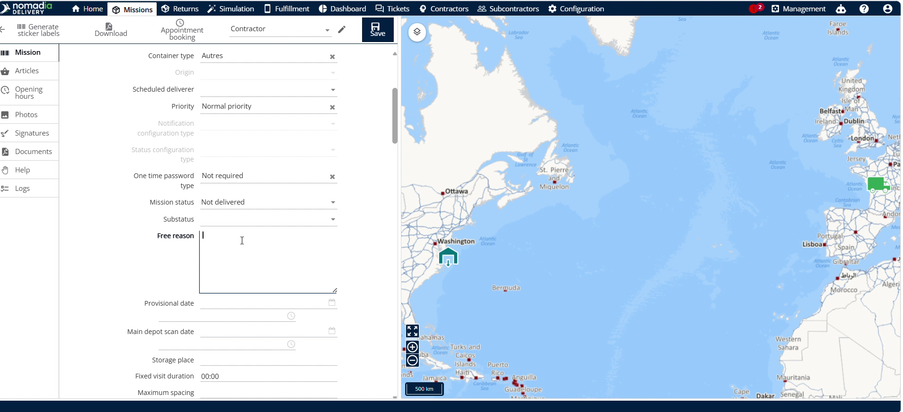

4. Click **Save**.

### How To: Configure and View Aggregated Dimensions and Quantities

1. Click **Configuration** on the top menu.

2. Click **Container size pallet**.

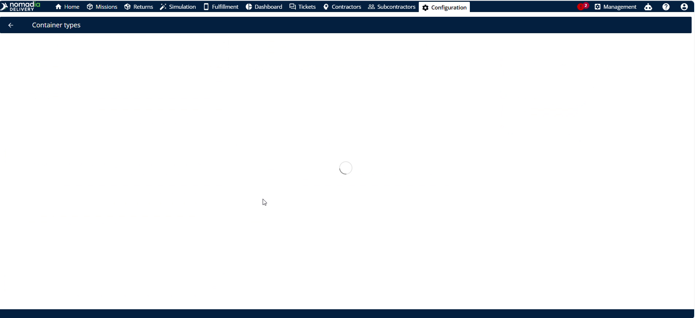

3. Choose your desired size metrics in **Aggregate dimensions**, such as length or height.

4. Choose your desired quantity metrics in **Aggregate quantities**, such as kg or volume.

5. Click **Save**.

6. Click **Machines**.

7. Enter the length, height, quantity, weight (kg), and volume values for the first container.

8. Click **Save**.

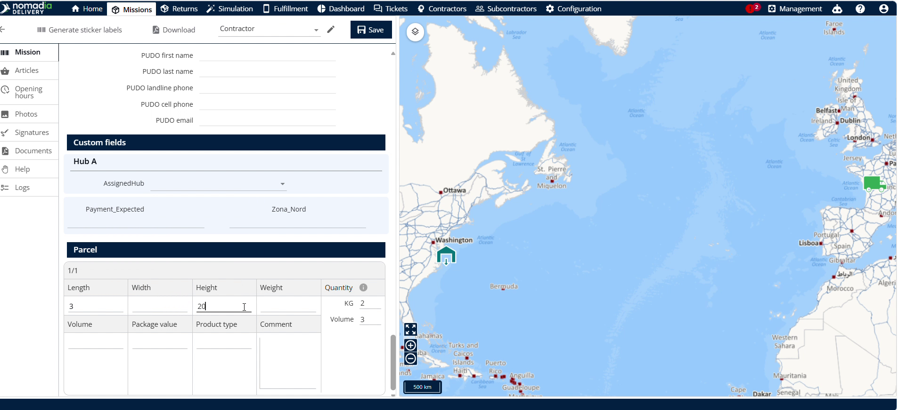

9. Select the second child container and enter its metrics.

10. Click **Save**.

11. Open the parent container to view the calculated totals.

### Productivity Tips

- 💡 **Mobile Synchronization**: Use the mobile application to experience the same automatic child-to-parent data inheritance on the go.
- 💡 **Detailed Tracking**: Enter specific reasons when marking containers as not delivered to ensure accurate fleet reporting.
- ⚠️ **Parent Display Only**: Remember that overall parcel status only displays in the parent container, not in individual child containers.

***

📋 **Would you like me to generate a printable PDF version of this guide with styled formatting for your field operators?**

