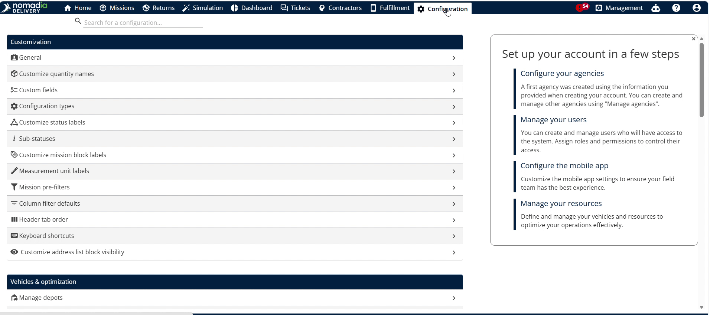
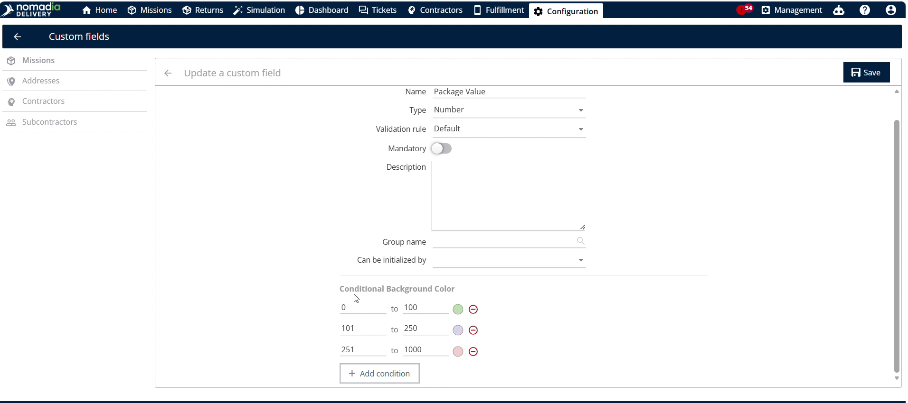
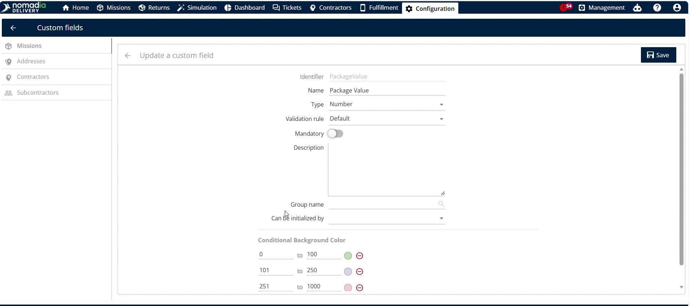
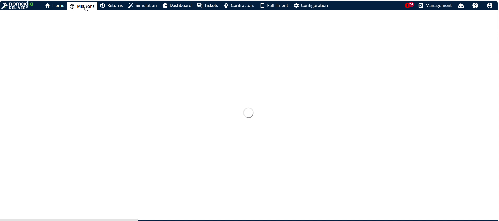
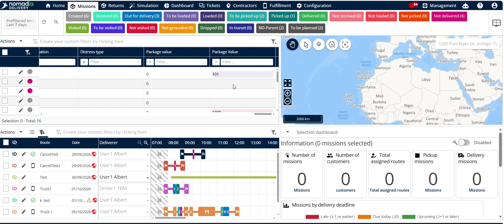
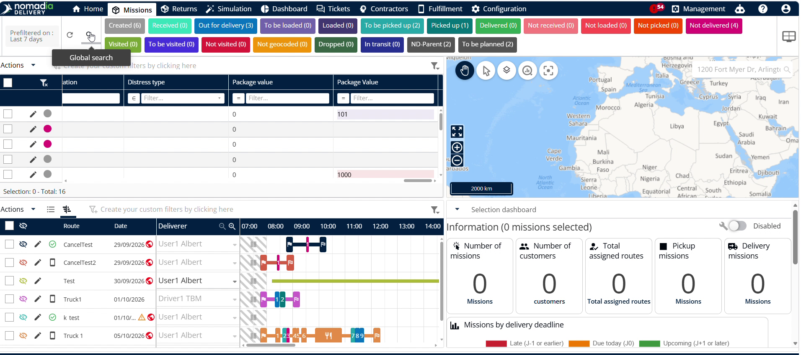
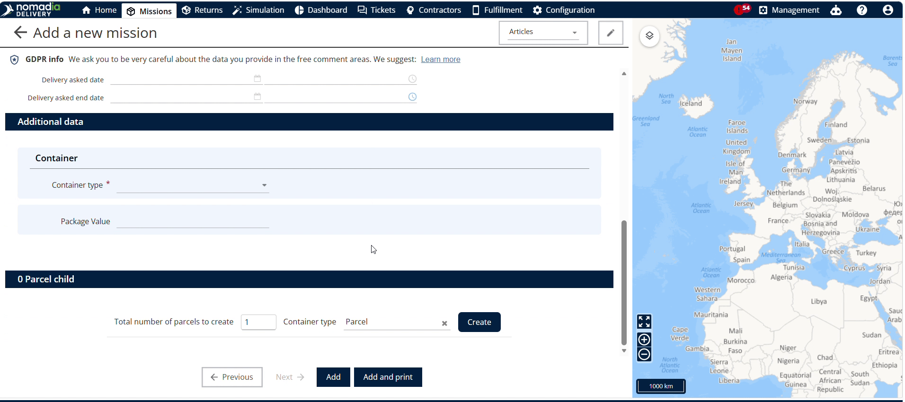
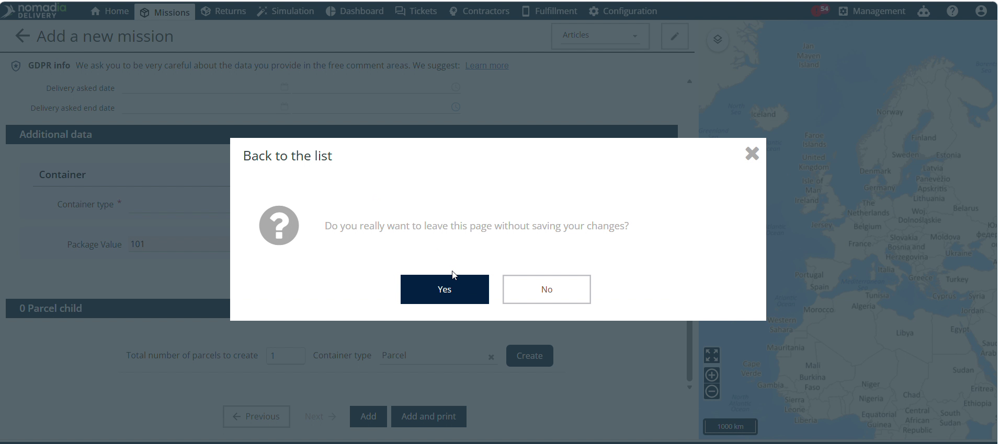
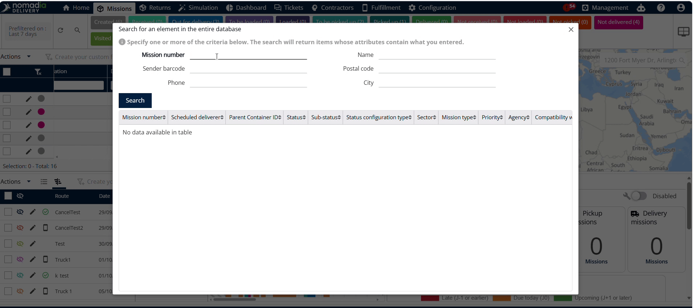
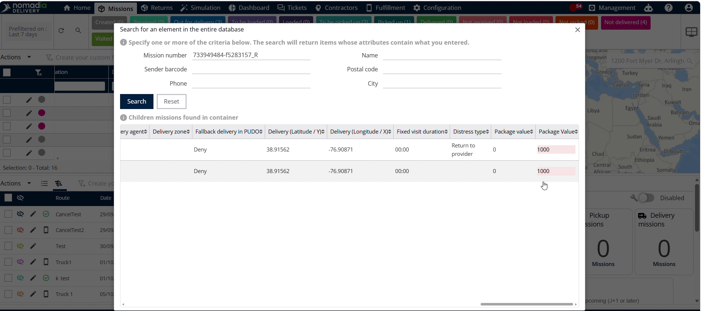

# colorcodingthecustomfields
# colorcodingthecustomfields

Color coding custom fields visually highlights key data based on value ranges in **Nomadia Delivery**. Use this feature to quickly spot critical operational metrics and make faster decisions. Set up custom rules to automatically color-code values across your system workflows.

---

### Getting Started

Prerequisites:
- Active account in **Nomadia Delivery** with administrative access.
- Pre-existing custom field parameters configured in the system.

Initial Setup Steps:
1. Log into **Nomadia Delivery**, navigate to **Configuration**, and select **Custom Field**.

2. Select a value and click the **Edit** button next to **Practice Value**.

3. Scroll down to the **Conditional Background Color** section.

4. Configure value ranges and select color assignments for each range.

5. Click the **Save** button to store your configuration.

---

### Feature Overview

- **Configuration**: Accesses administrative system settings to locate custom parameters.

- **Custom Field**: Opens the management list for custom fields across the system.

- **Practice Value**: Represents the specific numerical custom field attribute assigned to assets.

- **Edit Button**: Opens configuration options for the selected custom field attribute.

- **Conditional Background Color**: Defines numerical threshold ranges and their corresponding background colors.

- **Save Button**: Applies and stores all background color coding rules.

- **Machine Screen**: Displays individual machine entries where color coding applies upon data entry.

- **Systems Table**: Displays a tabular view of system records with color-coded practice values.

- **Search Button**: Filters machine records by machine number to verify attribute colors.

---

### How To: Configure Color Coding Rules

1. Log into **Nomadia Delivery** and click **Configuration**.

2. Click **Custom Field** from the configuration menu.

3. Locate the target field and click the **Edit** button next to **Practice Value**.

4. Scroll down to **Conditional Background Color**.

5. Input numerical value ranges and assign background colors.

6. Click **Save** to apply the color rules.

### How To: Verify Color Coding in Machine Entry

1. Click **Machine** from the main navigation menu.

2. Click **Add** to create a new machine entry.

3. Select the **Machine Type** and **Agency**, then click **Next**.

4. Enter a numerical value in **Practice Value** to trigger conditional color highlighting.

5. Click **Add** to complete saving the machine entry.

### How To: Verify Color Coding in Systems Table

1. Navigate back to the main overview screen.

2. Locate the **Systems Table** view on the screen.

3. Review the **Practice Value** column to confirm automatic background coloring.

### How To: Verify Color Coding via Machine Search

1. Click the **Search** button in the top interface.

2. Search for the target machine using the **Machine Number**.

3. Scroll right across the search table using the horizontal scroll bar.

4. Verify the visual color highlighting applied under the **Practice Value** header.

---

### Productivity Tips

- 💡 **Multi-Location Verification**: Verify custom field color coding across machine creation, systems tables, and search views.
- 💡 **Horizontal Scroll Access**: Use the horizontal scroll bar in search tables to locate hidden practice value colors.
- ⚠️ **Unsaved Configuration Rules**: Click Save after editing color ranges or your custom background rules will not apply.

