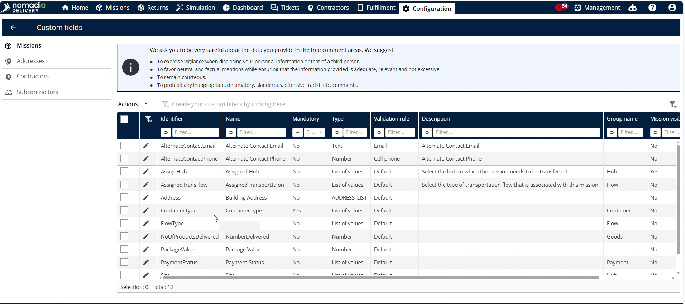
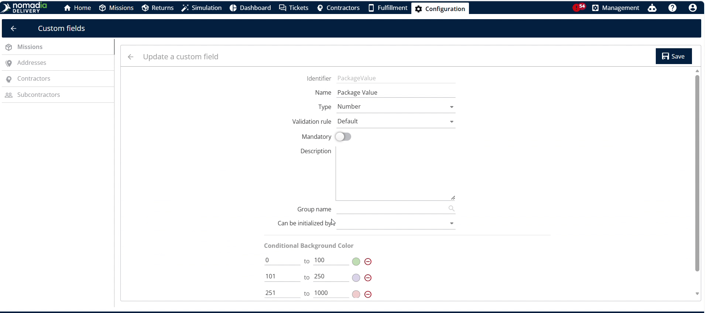
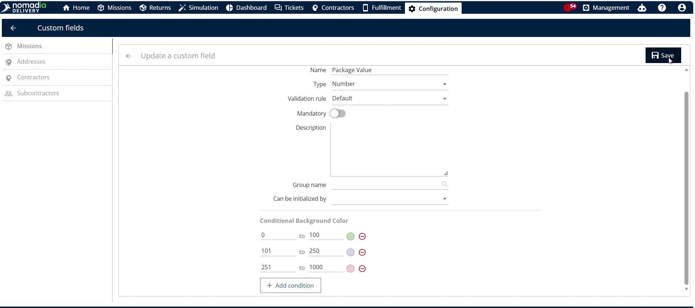
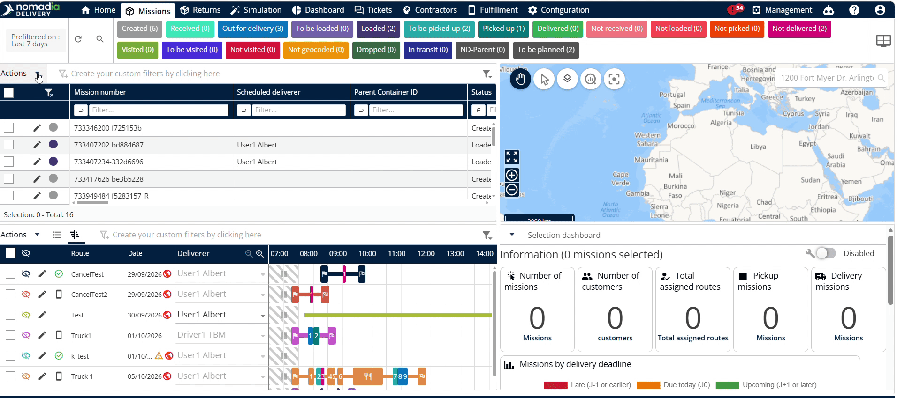
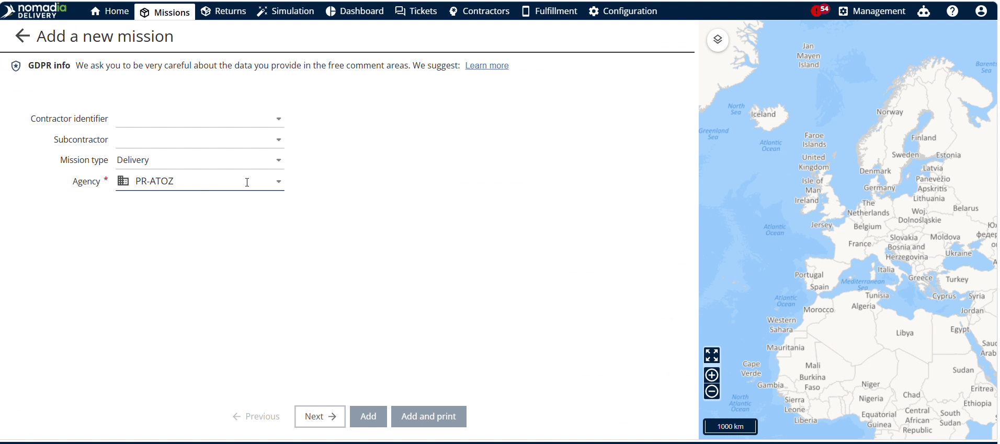
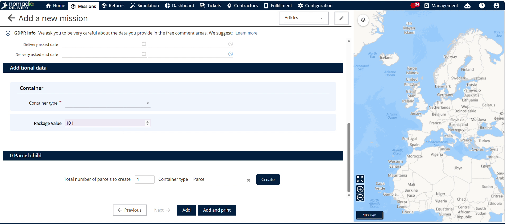
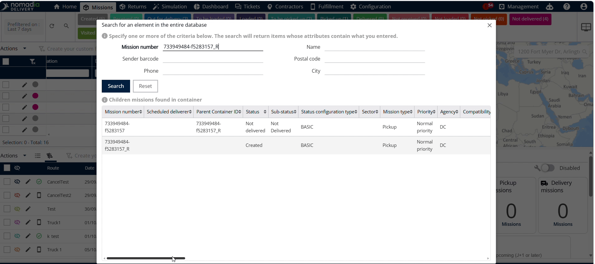

# Color coding the custom fields

Color coding custom fields visually highlights key data based on the value ranges in **Nomadia Delivery**. Use this feature to quickly spot critical operational metrics and make faster decisions. Set up custom rules to automatically color-code values across your system workflows.

#### Getting Started

Prerequisites:

* Active account in **Nomadia Delivery** with administrative access.
* Pre-existing custom field parameters configured in the system.

Initial Setup Steps:

1. Log into **Nomadia Delivery**, navigate to **Configuration**, and select **Custom Field**.

#### Feature Overview

* **Configuration**: Accesses administrative system settings to locate custom parameters.
* **Custom Field**: Opens the management list for custom fields across the system.
* **Package Value**: Represents the specific numerical custom field attribute assigned to assets.
* **Edit Button**: Opens configuration options for the selected custom field attribute.
* **Conditional Background Color**: Defines numerical threshold ranges and their corresponding background colors.
* **Search Button**: Filters mission records by machine number to verify attribute colors.

#### How To: Configure Color Coding Rules

1. Log into **Nomadia Delivery** and click **Configuration**.

2. Click **Custom Field** from the configuration menu.

3. Locate the target field and click the **Edit** button next to **Package Value**.

4. Scroll down to **Conditional Background Color**.

5. Input numerical value ranges and assign background colors.

6. Click **Save** to apply the color rules.

#### How To: Verify Color Coding in Mission Entry

1. Click **Mission** from the main navigation menu.
2. Click **Add** to create a new machine entry.

3. Select the **Mission Type** and **Agency**, then click **Next**.

4. Enter a numerical value in **Package Value** to trigger conditional color highlighting.

5. Click **Add** to complete saving the Mission entry.

#### How To: Verify Color Coding in Mission Table

1. Navigate back to the main overview screen.
2. Locate the **Mission Table** view on the screen.

3. Review the **Package Value** column to confirm automatic background coloring.

#### How To: Verify Color Coding via Mission Search

1. Click the **Search** button in the top interface.

2. Search for the target mission using the **Mission Number**.

3. Scroll right across the search table using the horizontal scroll bar.

4. Verify the visual color highlighting applied under the **Package Value** header.

***

#### Productivity Tips

* 💡 **Multi-Location Verification**: Verify custom field color coding across mission creation, systems tables, and search views.
* 💡 **Horizontal Scroll Access**: Use the horizontal scroll bar in search tables to locate hidden package value colors.
* ⚠️ **Unsaved Configuration Rules**: Click Save after editing color ranges or your custom background rules will not apply.
