# configuremissionprefilters
# configuremissionprefilters

The **Configure Managed Machine Pre-Filters** feature creates custom filter rules based on machine status and type in **Nomadia Delivery**. You need this feature to control fleet visibility and focus workflows on specific operational tasks. By configuring pre-filters, you will streamline tracking and optimize machine management across your team.

### Getting Started

Prerequisites and requirements:
- Access to **Nomadia Delivery** with administrative or dispatcher access.
- Active machine records configured in the system.
- Web browser connected to the SaaS platform.

Initial setup steps:
1. Navigate to **Configuration** in the main menu.

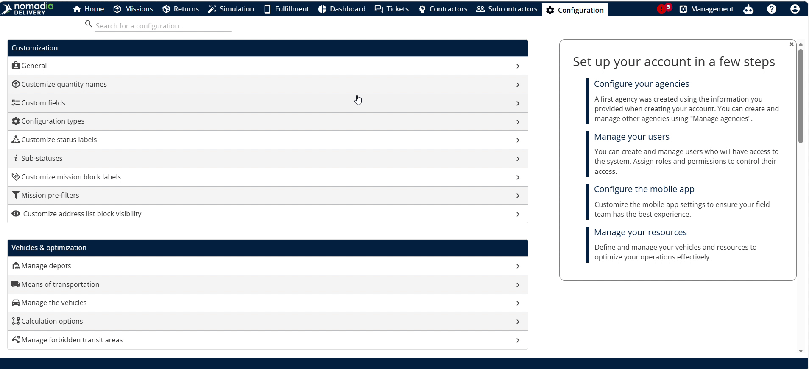

2. Select **Machine Pre-Filters** from the settings list.

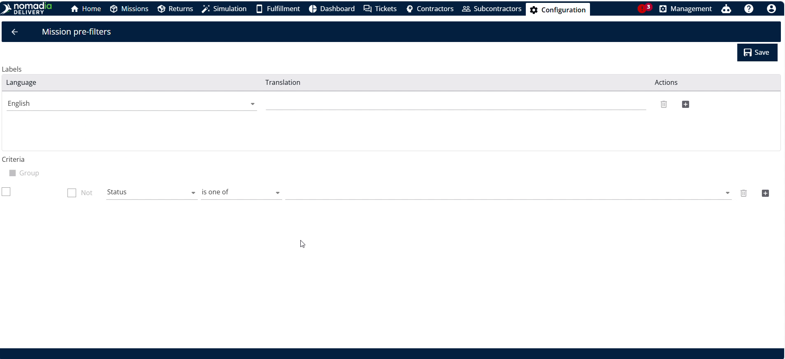

3. Click **Actions** and select **Add** to open the filter configuration builder.

### Feature Overview

- **Status Field**: Selects specific machine operational statuses for the query. It filters the fleet view to show relevant machine states.

- **Machine Type Field**: Specifies machine categories included in the filter. It restricts query results to designated machine types.

- **Logic Operator (AND/OR)**: Toggles conditional logic between filter rules. It defines whether all or any conditions must match.

- **Group Condition**: Combines multiple filter statements into a logical group. It allows complex nested filtering logic.

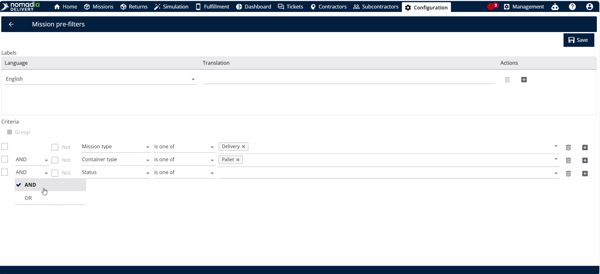

- **Query Name Field**: Accepts a custom text label for the filter query. It helps users identify saved filter configurations easily.

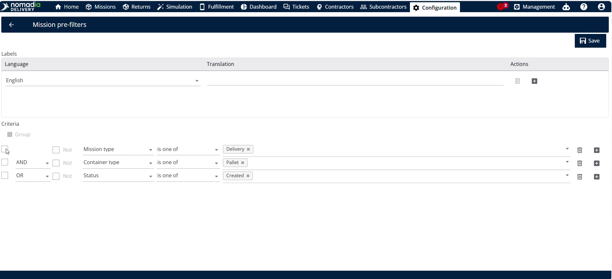

- **Translation Plus Symbol**: Opens translation entry fields for additional languages. It enables multi-language support for regional dispatchers.

- **Delete Language Button**: Removes an added language translation entry. It deletes unneeded language fields from the query.

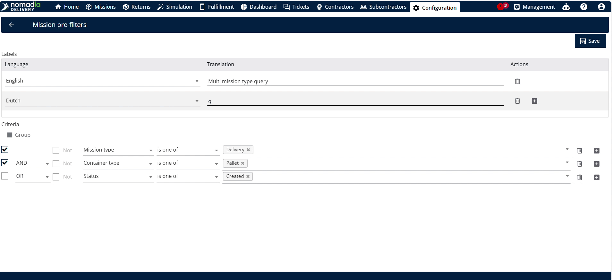

- **Save Button**: Stores the configured filter rules and query name. It updates system records with your filter configuration.

- **Manage Usage Option**: Opens user access assignment settings for pre-filters. It controls which users receive restricted machine views.

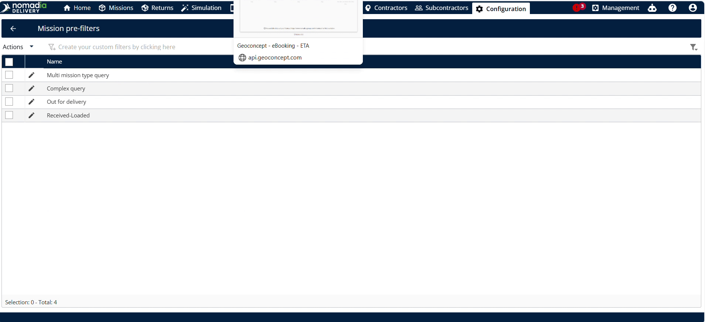

- **Apply Button**: Executes active filter parameters on the machine list. It refreshes the display to show matching fleet records.

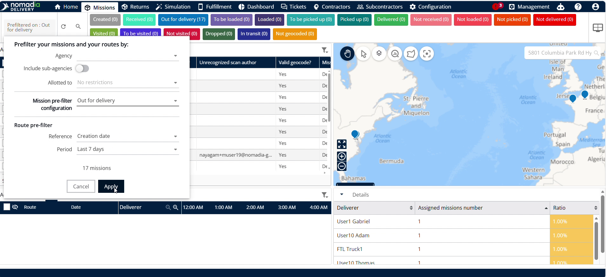

### How To: Create and Customize a Machine Pre-Filter

1. Open **Configuration** and click **Machine Pre-Filters**.

2. Click **Actions** and select **Add** to launch the editor.

3. Choose required status values from the **Status Field**.

4. Choose required machine categories from the **Machine Type Field**.

5. Click to add additional status conditions if needed.

6. Select **AND** or **OR** logic to connect your conditions.

7. Group conditions together if combining multiple filter rules.

8. Type a clear descriptive label in the **Query Name Field**.

9. Click **Save** to create the filter query.

### How To: Add Translations to a Pre-Filter Query

1. Click the **Translation Plus Symbol** next to the translation field.

2. Select your target language from the dropdown list.

3. Enter the query name in the selected language.

4. Click the **Delete Language Button** if you want to remove a language.

5. Click **Save** to update language translations.

### How To: Assign a Pre-Filter Query to a User

1. Navigate to **Configuration** and click **Manage Usage**.

2. Select the target user email address.

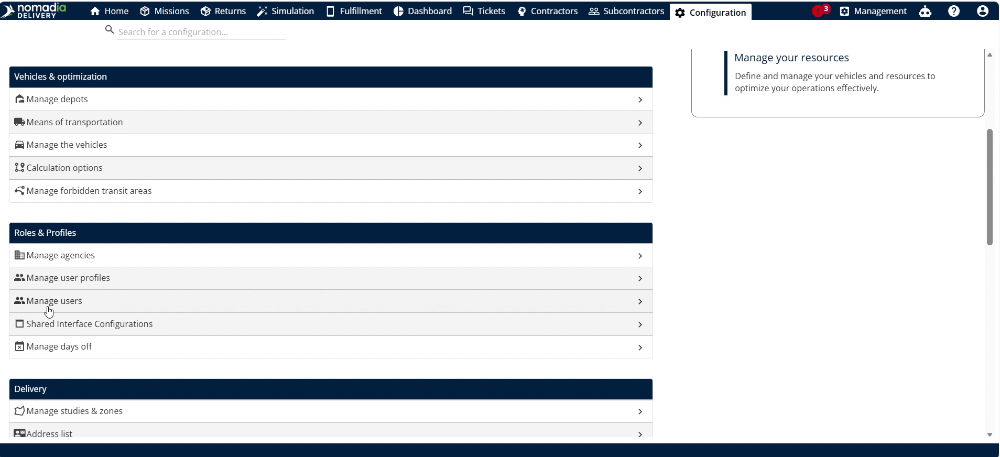

3. Locate the **Machine Pre-Filters** section.

4. Select the query name to assign, such as **Out for Delivery**.

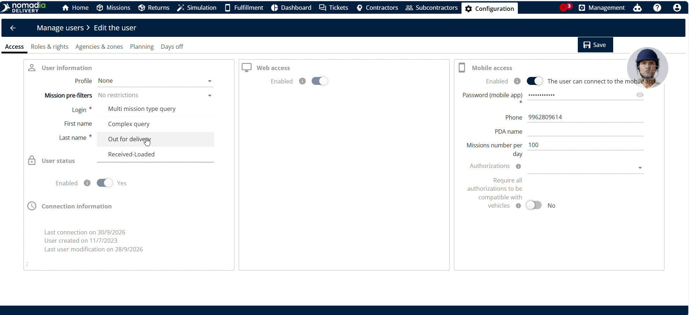

5. Click **Save** to apply the assignment.

6. Navigate to **Machines** in the main menu.

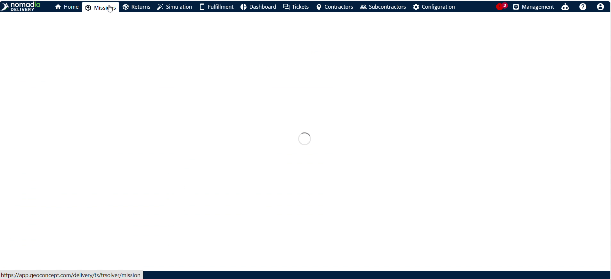

7. Click **Apply** to view assigned status machines only.

### How To: Remove an Assigned Pre-Filter from a User

1. Go to **Configuration** and select **Manage Usage**.

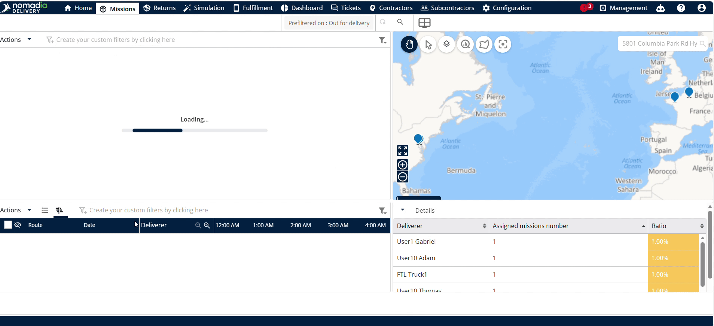

2. Click the user email address.

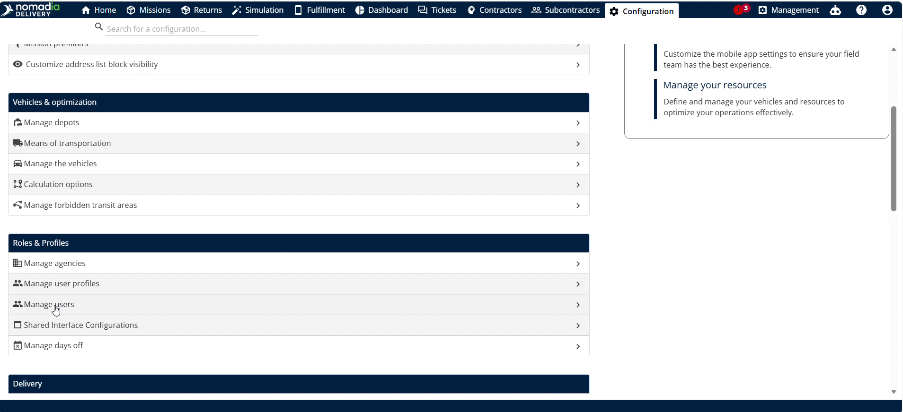

3. Clear the assigned query under **Machine Pre-Filters**.

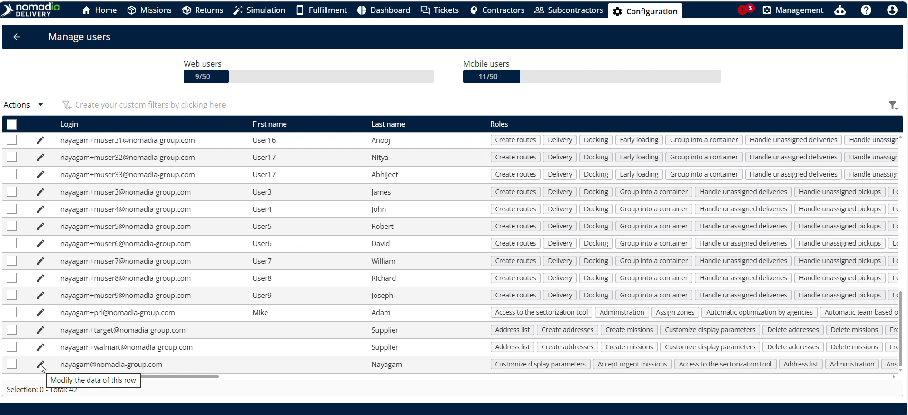

4. Click **Save** to update user profile settings.

5. Navigate to **Machines** and clear active filter selections.

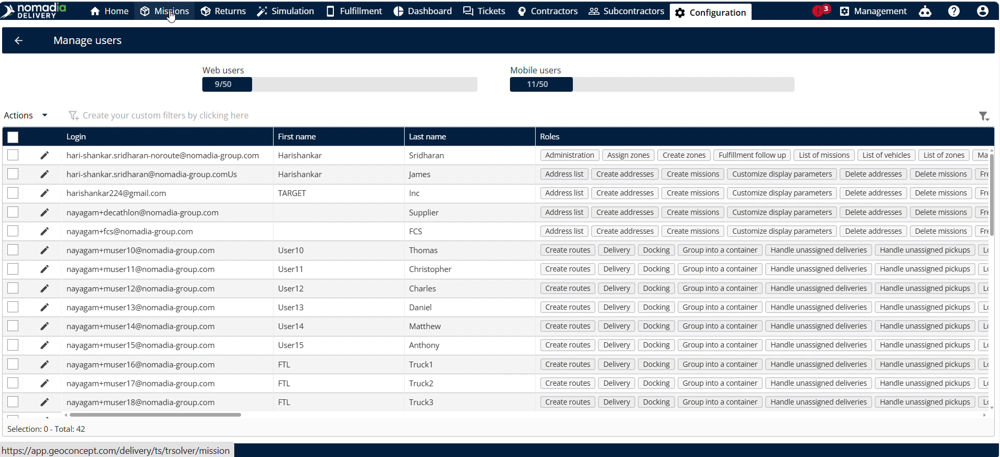

6. Click **Apply** to view all fleet machines again.

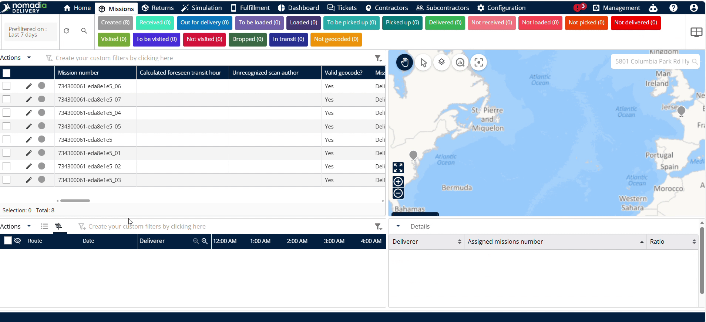

### Productivity Tips

- 💡 **Restricted Operational Focus**: Assigning specific pre-filters under Manage Usage narrows team member views to critical operational statuses like Out for Delivery.
- 💡 **Multi-Language Adaptability**: Adding language translations ensures international team members view filter query titles in their preferred language.
- ⚠️ **Hidden Fleet Visibility**: Leaving a pre-filter assigned under Manage Usage prevents dispatchers from viewing the full fleet until the assignment is removed.

---

🛠️ Would you like me to generate a tailored report, slide deck, or flashcard deck based on these machine configuration steps?

