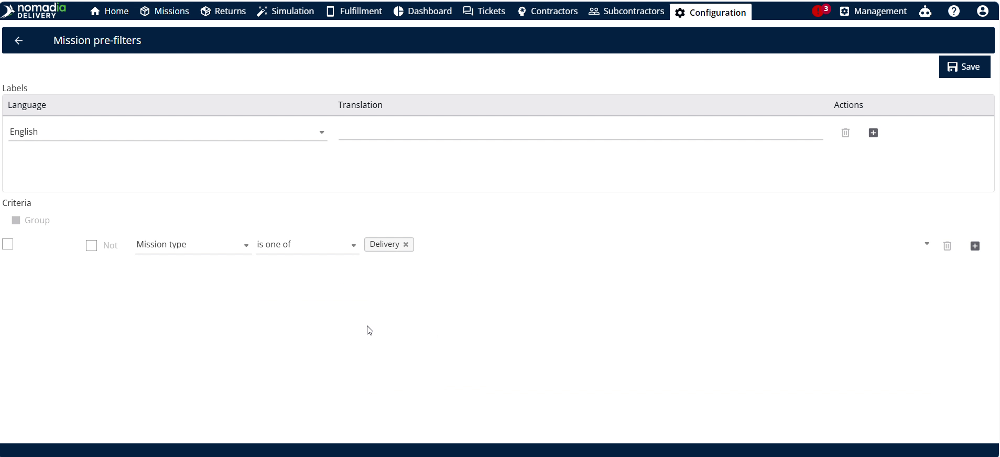
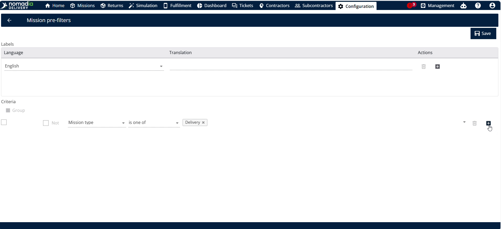
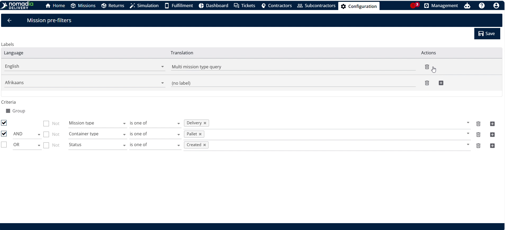
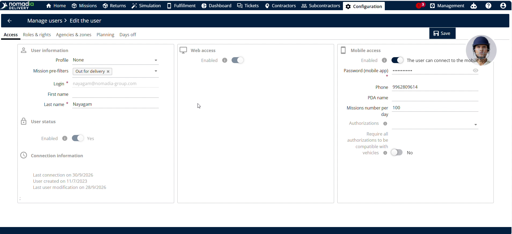
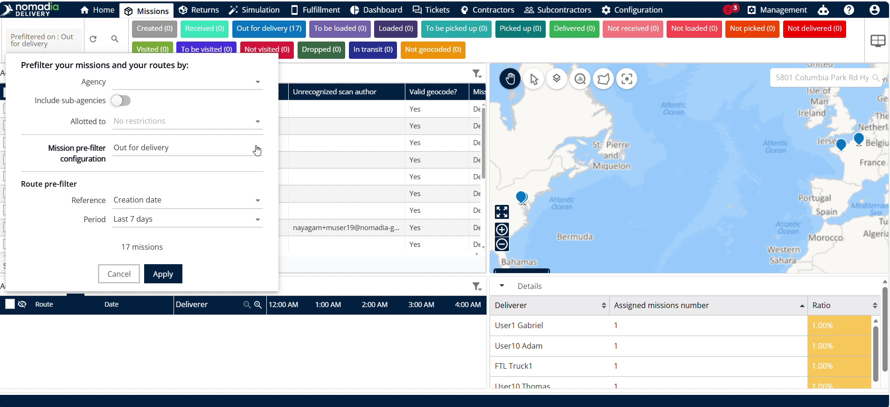

# Configure Mission Pre-filters

The **Configure Managed Mission Pre-Filters** feature creates custom filter rules based on mission status and type in **Nomadia Delivery**. You need this feature to control fleet visibility and focus workflows on specific operational tasks. By configuring pre-filters, you will streamline tracking and optimize mission management across your team.

#### Getting Started

Prerequisites and requirements:

* Access to **Nomadia Delivery** with administrative or dispatcher access.
* Active mission records configured in the system.
* Web browser connected to the SaaS platform.

Initial setup steps:

1. Navigate to **Configuration** in the main menu.
2. Select **Mission Pre-Filters** from the settings list.

3. Click **Actions** and select **Add** to open the filter configuration builder.

#### Feature Overview

* **Status Field**: Selects specific mission operational statuses for the query. It filters the fleet view to show relevant mission states.
* **Mission Type Field**: Specifies mission categories included in the filter. It restricts query results to designated mission types.
* **Logic Operator (AND/OR)**: Toggles conditional logic between filter rules. It defines whether all or any conditions must match.
* **Group Condition**: Combines multiple filter statements into a logical group. It allows complex nested filtering logic.
* **Query Name Field**: Accepts a custom text label for the filter query. It helps users identify saved filter configurations easily.
* **Translation Plus Symbol**: Opens translation entry fields for additional languages. It enables multi-language support for regional dispatchers.
* **Delete Language Button**: Removes an added language translation entry. It deletes unneeded language fields from the query.
* **Manage Usage Option**: Opens user access assignment settings for pre-filters. It controls which users receive restricted mission views.

#### How To: Create and Customize a Mission Pre-Filter

1. Open **Configuration** and click **Mission Pre-Filters**.

2. Click **Actions** and select **Add** to launch the editor.

3. Choose required status values from the **Status Field**.

4. Choose required machine categories from the **Mission Type Field**.

5. Click to add additional status conditions if needed.

6. Select **AND** or **OR** logic to connect your conditions.

7. Group conditions together if combining multiple filter rules.

8. Type a clear descriptive label in the **Query Name Field**.
9. Click **Save** to create the filter query.

#### How To: Add Translations to a Pre-Filter Query

1. Click the **Translation Plus Symbol** next to the translation field.

2. Select your target language from the dropdown list.

3. Enter the query name in the selected language.

4. Click the **Delete Language Button** if you want to remove a language.

5. Click **Save** to update language translations.

#### How To: Assign a Pre-Filter Query to a User

1. Navigate to **Configuration** and click **Manage users**.

2. Select the target user email address.

3. Locate the **Mission Pre-Filters** section.

4. Select the query name to assign, such as **Out for Delivery**.

5. Click **Save** to apply the assignment.

6. Navigate to **Missions** in the main menu.
7. Click **Apply** to view assigned status missions only.

#### How To: Remove an Assigned Pre-Filter from a User

1. Go to **Configuration** and select **Manage users**.
2. Click the user email address.
3. Clear the assigned query under **Mission Pre-Filters**.

4. Click **Save** to update user profile settings.

5. Navigate to **Missions** and clear active filter selections.

6. Click **Apply** to view all fleet missions again.

#### Productivity Tips

* 💡 **Multi-Language Adaptability**: Adding language translations ensures international team members view filter query titles in their preferred language.
* ⚠️ **Hidden Fleet Visibility**: Leaving a pre-filter assigned prevents dispatchers from viewing the full fleet until the assignment is removed.
