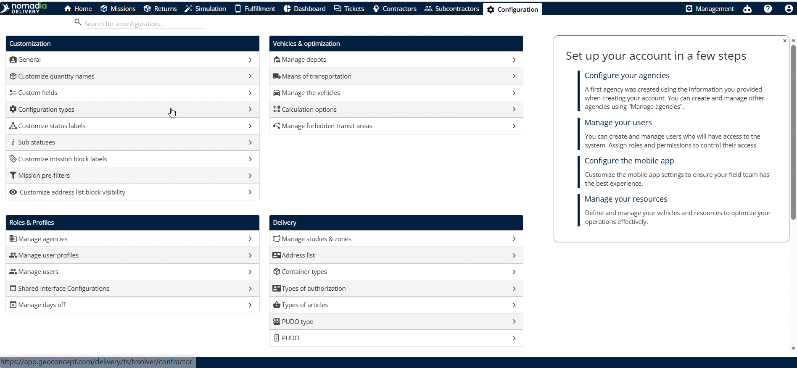
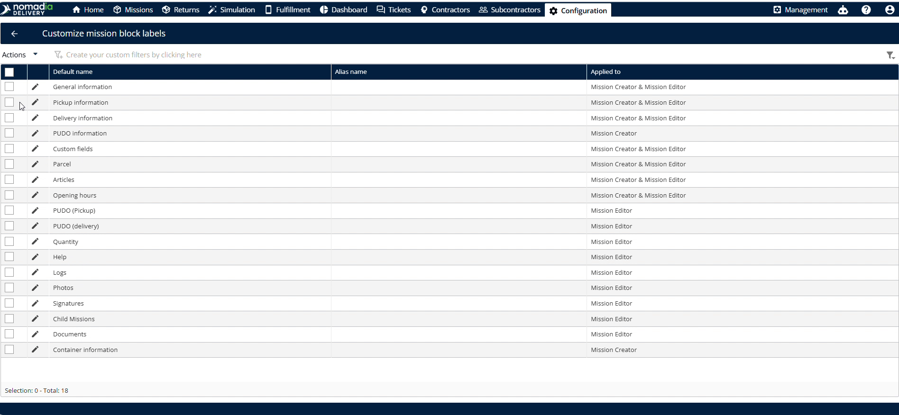
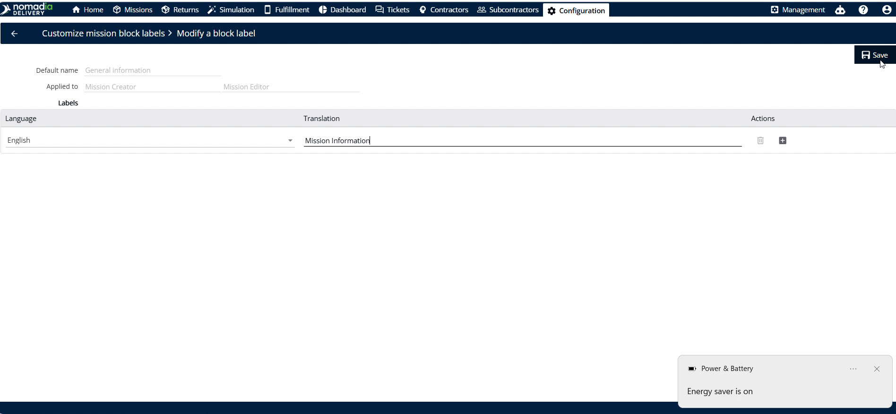
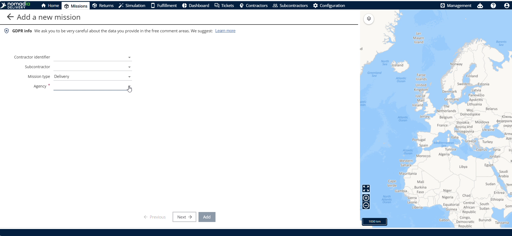
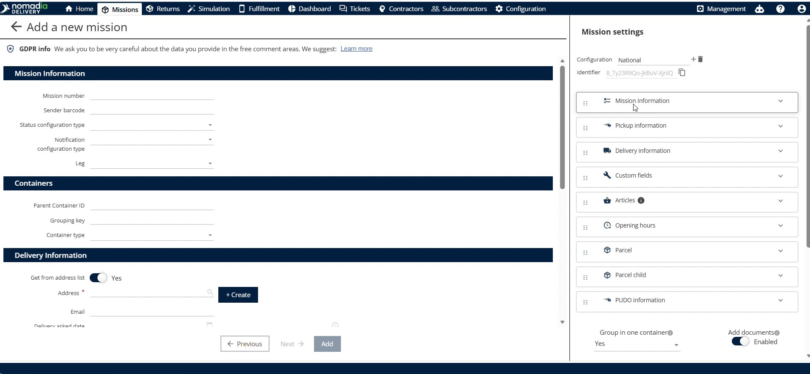
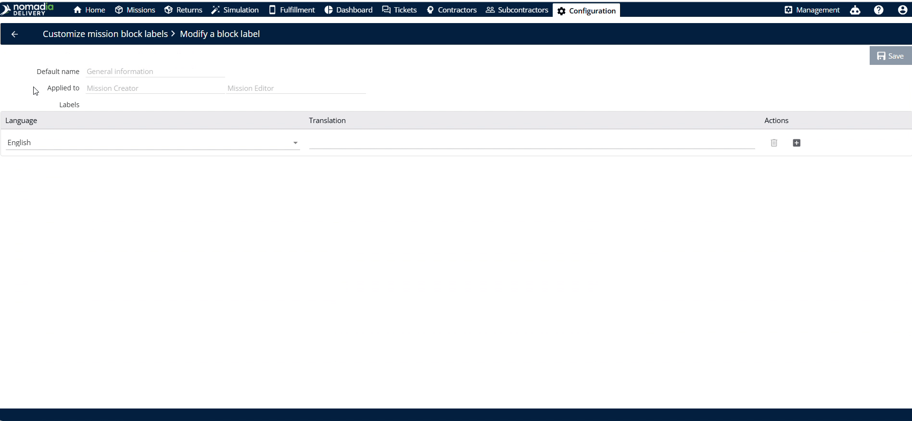
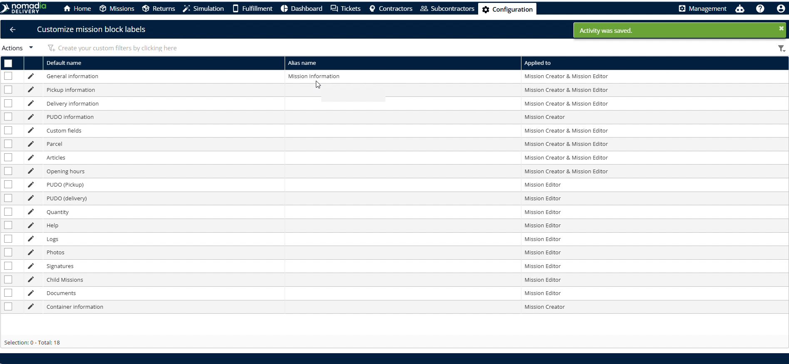
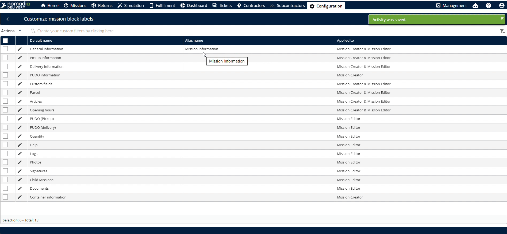
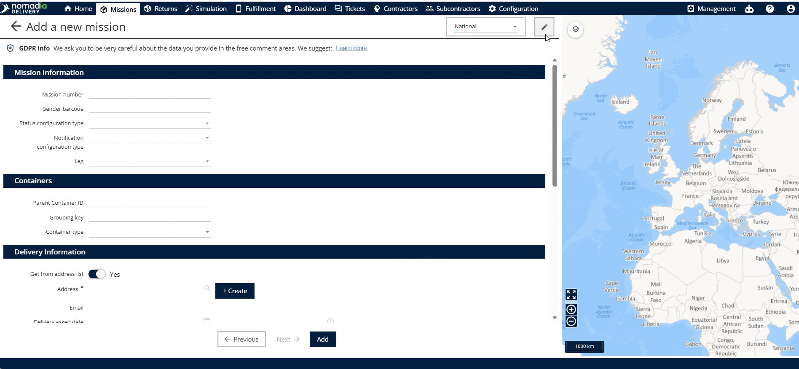

# customizemissionblocklabels
# customizemissionblocklabels

**Customized Machine Block Labels** allow dispatchers to modify default field labels within Nomadia Delivery. Customize predefined field names to align with your fleet operations and terminology. Achieve consistent label formatting across machine creation and editing interfaces.

### Getting Started

#### Prerequisites
- Access to **Nomadia Delivery** with administrative configuration privileges.
- Active connection to the **Configuration** module.

#### Initial Setup Steps
1. Navigate to **Configuration** in the main menu.

2. Select **Customization** from the options menu.

3. Click **Customized Machine Block Labels** to open label settings.

### Feature Overview

- **Predefined Information**: Displays default label fields available when creating or editing a machine.

- **General Information**: Allows users to enter custom label names for machine block fields.

- **Save**: Applies custom label changes to the machine creator and editor.

- **Machine Creator**: Displays customized labels when adding new machines.

- **Machine Editor**: Displays customized labels when editing existing machine entries.

### How To: Customize and Verify Block Labels

#### Task 1: Customizing Machine Block Labels
1. Click **General Information** in the customized block labels menu.

2. Enter new text in the label fields.

3. Click **Save** to apply your changes.

4. Confirm updated names appear in the list.

#### Task 2: Verifying Labels in Machine Creator
1. Click **Machine** in the main menu.

2. Click **Add** to open the machine creator.

3. Verify updated labels display in the form.

#### Task 3: Verifying Labels in Machine Editor
1. Select a machine and click **Edit**.

2. Verify updated labels display in the editor form.

3. Click **Go back** to exit the editor.

4. Click **Edit** again to re-verify custom labels.

### Productivity Tips

- 💡 **Automated Synchronization**: Updating predefined information automatically syncs label changes across both the machine creator and machine editor.
- ⚠️ **Variable Field Scope**: Avoid assuming all label updates appear everywhere, as certain predefined changes apply exclusively to the machine creator.

