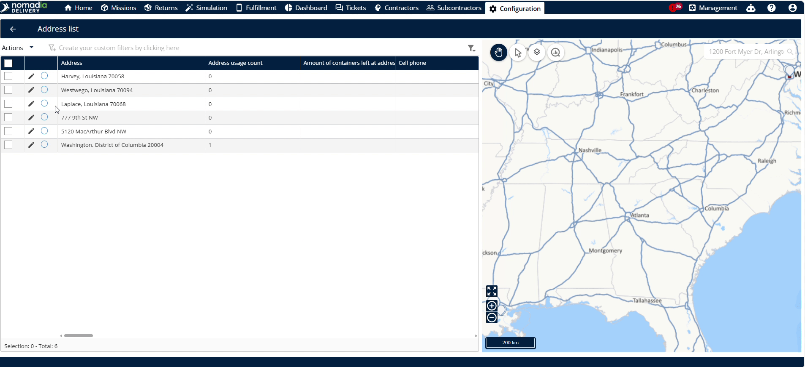
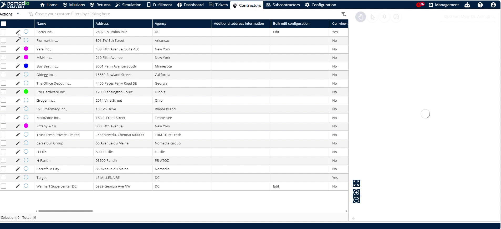
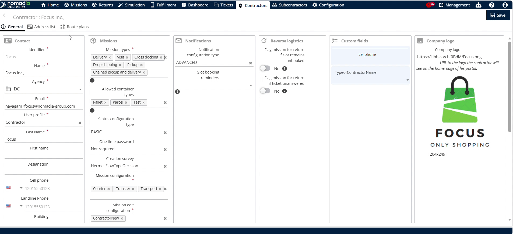
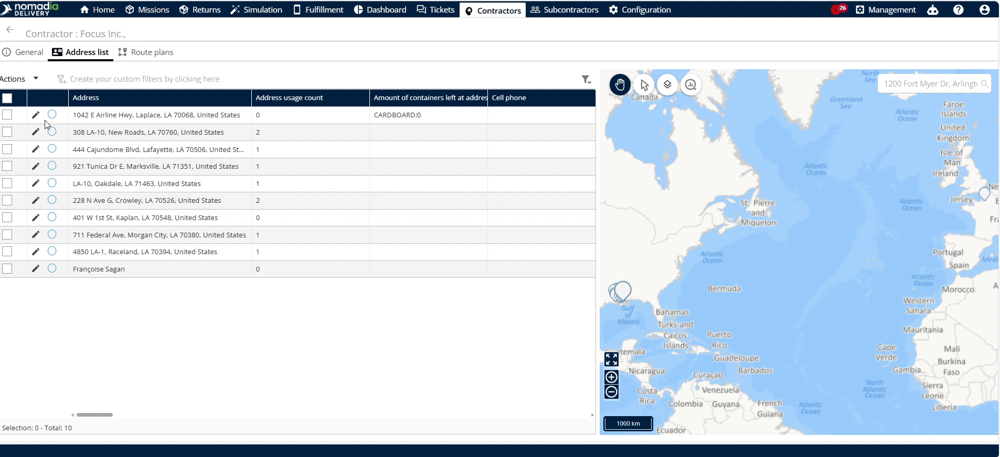

# Customize the Address Visibility

**Configure field visibility in your address lists** for different user groups. **Control which information is visible or editable** in global and contractor address lists. **Streamline your workspace** and ensure teams only see relevant data.

#### Getting Started

Prerequisites:

* Access to the **Configuration** menu.
* Administrative permissions to apply platform-wide settings.

Steps:

1. Navigate to the **Configuration** panel in the main menu.
2. Click on the **Customer addresses block visibility** option.

***

#### Feature Overview

* **Contractor address list**: Manage visibility settings specifically for contractor address lists.
* **Global address list**: Manage visibility settings for the global address list platform-wide.
* **Contact information**: Configure contact fields to be editable or mandatory.
* **General**: Toggle fields like the **Map** and **Opening hours** on or off.
* **Editable**: Allow users to edit field contents by checking this option.
* **Mandatory**: Force users to complete a field before saving changes.

#### How To: Customize Address Block Visibility

1. Navigate to **Configuration** and click **Customer addresses block visibility**.

2. Toggle settings for the **Contractor address list**, **Global address list**, or both.

3. Locate the **Contact information** section.
4. Select the checkbox to set fields to **Editable** by default.
5. Enable the checkbox to make fields **Mandatory**.

6. Locate the **General** section.
7. Disable the **Map** and **Opening hours** options.

8. Click **Save** to apply the changes platform-wide.

***

#### How To: Verify Global Address List Visibility

1. Navigate to the **Address list** menu.

2. Click the **Pencil icon** next to the address.

3. Confirm that the **Map** and **Opening hours** fields are hidden.

***

#### How To: Verify Contractor Address List Visibility

1. Navigate to the **Contractor** menu.

2. Click the **Pencil icon** next to the desired contractor.

3. Click the **Address list** tab.

4. Click the **Pencil icon** next to the contractor address.

5. Confirm that the **Map** and **Opening hours** fields are hidden.

<figure><figcaption></figcaption></figure>

#### Productivity Tips

* 💡 **Default Editability**: Checking a field option sets it to editable by default to save setup time.
* 💡 **Flexible Control**: Customize the global list, contractor list, or both simultaneously to suit your workflows.
* ⚠️ **Platform-Wide Impact**: Saving changes will apply them to all users across the platform immediately.
