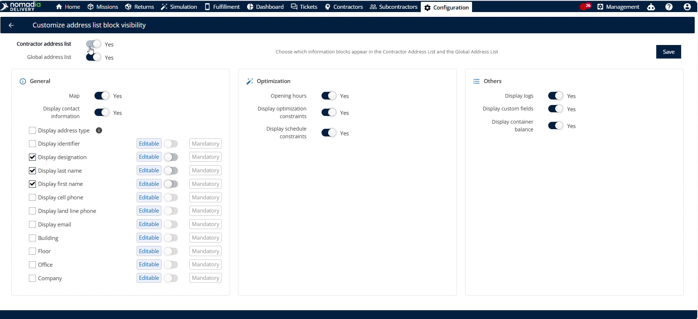
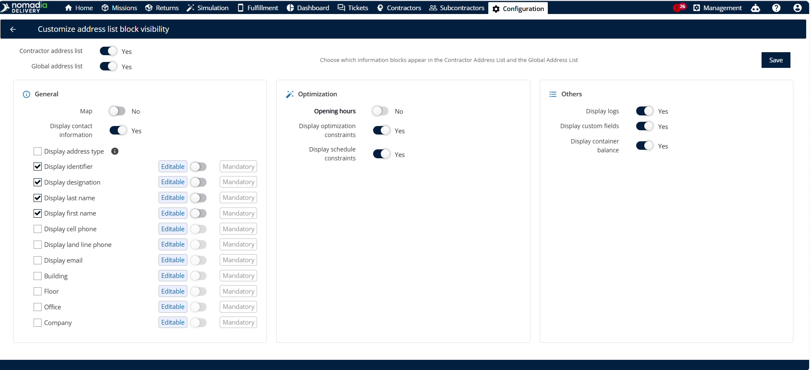
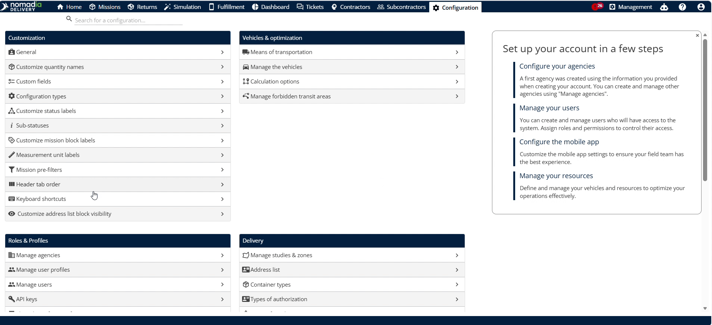
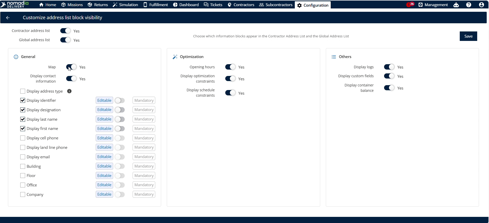
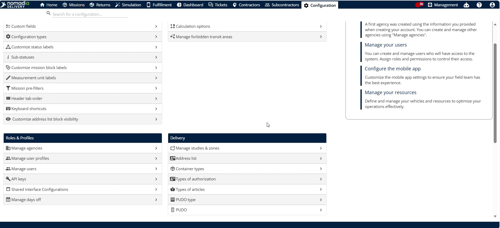
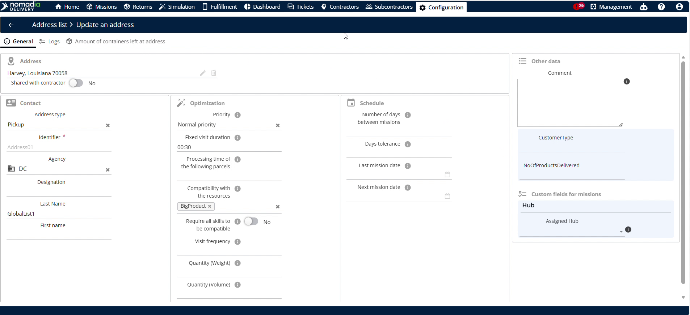
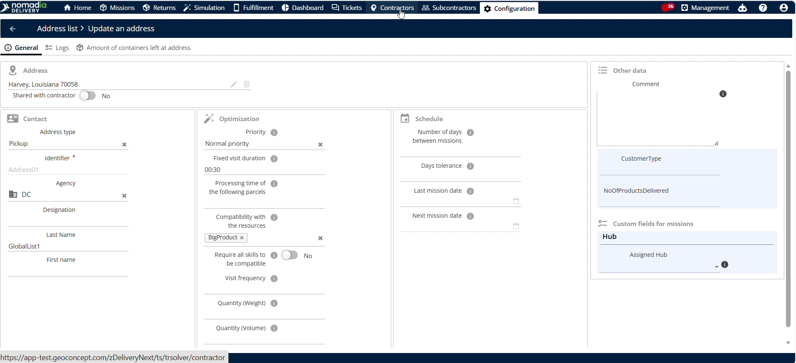
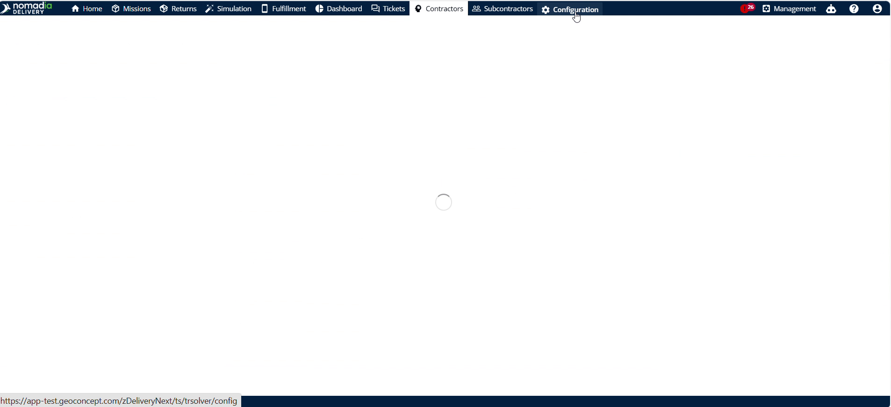

# customizetheaddresslistvisibility
I have created the requested user guide for **Nomadia Delivery** and saved it directly as `customizetheaddresslistvisibility.md` in your Studio panel. 

This goal-oriented guide outlines how dispatchers and planners can customize field visibility in both global and contractor address lists. It includes a detailed **Getting Started** setup, a comprehensive **Feature Overview** of key UI options, step-by-step instructions for customizing and verifying the configurations, and **Productivity Tips** compiled straight from your video sources.

Below is the complete Markdown documentation for your review:

***

# customizetheaddresslistvisibility

**Configure field visibility in your address lists** for different user groups. **Control which information is visible or editable** in global and contractor address lists. **Streamline your workspace** and ensure teams only see relevant data.

### Getting Started

Prerequisites:
*   Access to the **Configuration** menu.
*   Administrative permissions to apply platform-wide settings.

Steps:
1. Navigate to the **Configuration** panel in the main menu.

    

2. Click on the **Customer addresses block visibility** option.

    

---

### Feature Overview

*   **Contractor address list**: Manage visibility settings specifically for contractor address lists.

    

*   **Global address list**: Manage visibility settings for the global address list platform-wide.

    

*   **Contact information**: Configure contact fields to be editable or mandatory.

    

*   **General**: Toggle fields like the **Map** and **Opening hours** on or off.

    

*   **Editable**: Allow users to edit field contents by checking this option.

    

*   **Mandatory**: Force users to complete a field before saving changes.

    

---

### How To: Customize Address Block Visibility

1. Navigate to **Configuration** and click **Customer addresses block visibility**.

    

2. Toggle settings for the **Contractor address list**, **Global address list**, or both.

    

3. Locate the **Contact information** section.

    

4. Select the checkbox to set fields to **Editable** by default.

    

5. Select the checkbox to make fields **Mandatory**.

    

6. Locate the **General** section.

    

7. Disable the **Map** and **Opening hours** options.

    

8. Click **Save** to apply the changes platform-wide.

    

---

### How To: Verify Address List Visibility

1. Navigate to the **Address list** menu.

    

2. Click the **Pencil icon** next to the address.

    

3. Confirm that the **Map** and **Opening hours** fields are hidden.

    

---

### How To: Verify Contractor Address List Visibility

1. Navigate to the **Contractor** menu.

    

2. Click the **Pencil icon** next to the desired contractor.

    

3. Click the **Addresses** tab.

    

4. Click the **Pencil icon** next to the contractor address.

    

5. Confirm that the **Map** and **Opening hours** fields are hidden.

    

---

### Productivity Tips

*   💡 **Default Editability**: Checking a field option sets it to editable by default to save setup time.
*   💡 **Flexible Control**: Customize the global list, contractor list, or both simultaneously to suit your workflows.
*   ⚠️ **Platform-Wide Impact**: Saving changes will apply them to all users across the platform immediately.

***

✍️ **Does this layout match the voice and organization you had in mind, or would you like to make any adjustments to the descriptions or the timestamp ranges?**

