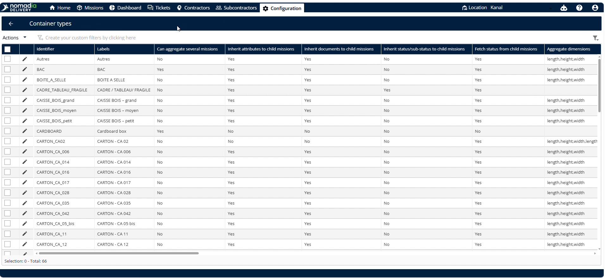

# Customize the Status Hierarchy

## customizethestatushierarchy

I have created the updated user guide **`customizethestatushierarchy-v2.md`** in your Studio panel. It provides step-by-step instructions on setting up priority hierarchies, defining interface fields, and verifying synchronization through linked child machines.

Here is the complete user guide:

## customizethestatushierarchy

This feature allows dispatchers to manage how status changes on child machines affect parent containers. It ensures accurate real-time tracking across your logistics operations. Customize status priorities easily to streamline container state synchronization.

#### Getting Started

Before you begin, ensure you meet the following prerequisites:

* Create a parent container in the system.
* Create a child container.

Follow these initial setup steps:

1. Navigate to the **Configuration** menu.

2. Select **Container types** (also referred to as container size).

3. Scroll down to select the correct **Identifier name** (or identified name).

4. Locate the **Fetch status from side missions** (or fetch status from side machines) option in the bottom right corner.

5. Check if the option is enabled.

6. Click on **Manage status hierarchy** (or manage status identity) once the option is enabled.

#### Feature Overview

* **Container types**: Selects the container category you want to configure.

* **Identifier name**: Specifies the unique name to identify the container type.

* **Fetch status from side missions**: Enables retrieving status updates from child machines.

* **Manage status hierarchy**: Opens the status prioritizer interface to arrange priorities.

#### How To: Customize Status Hierarchy

1. Open the status hierarchy configuration window.

2. Drag the desired status to the top priority position.

3. Click on **Done**.

4. Click **Save**.

5. Go to **Machines**.

6. Click any **Child machines** (individual machines connected to the parent container).

7. Change the status.

8. Click on Save.

9. Verify that the parent container status changes successfully.

#### Productivity Tips

* 💡 **Status Prioritization**: Drag any status to the top of the list to easily set its priority.
* ⚠️ **Enable Fetch Status**: Enable **Fetch status from side missions** first, or the **Manage status hierarchy** option will not be visible.

***

❓ Would you like me to make any specific styling adjustments to the formatting or add customized definitions for terms like "child machine"?
