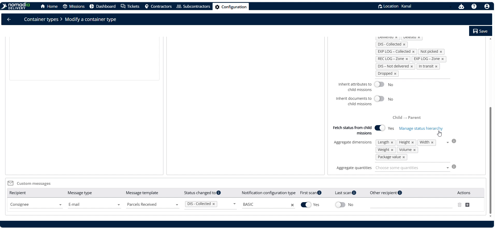
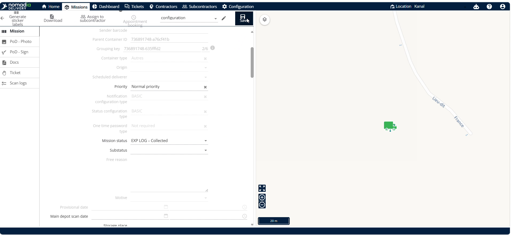
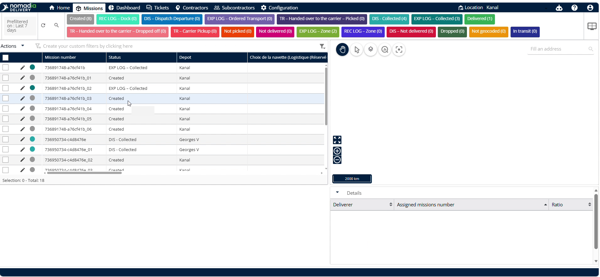

# customizethestatushierarchy
I have generated a clean, goal-oriented Markdown user guide for **customizethestatushierarchy** and saved it as `customizethestatushierarchy.md` in your Studio panel. It provides step-by-step instructions for managing container status priorities and verifying changes using child machines, with precise timestamps and placeholder visual references.

Here is the complete user guide content:

```markdown
# customizethestatushierarchy

The **customizethestatushierarchy** feature allows you to customize and manage status priorities for parent and child containers. Dispatchers and planners need this to ensure the most critical operational status of child machines is reflected at the parent container level. Setting these priorities helps you achieve real-time, accurate status tracking of your fleet and equipment.

### Getting Started

Prerequisites:
- A parent container (the primary shipping unit) must be created in the system.
- A child container (the individual device or machine inside the parent container) must be created in the system.

Steps:
1. Go to the **Configuration** menu.

   

2. Select the **Container Size**.

   

3. Verify **Fetch status from side machines** is enabled in the bottom right corner.

   

4. Click **Manage status identity**.

   

### Feature Overview

- **Container Size**: Dropdown to select the specific size configuration of your container.

  

- **Fetch status from side machines**: Checkbox in the bottom right corner that must be enabled to pull child status updates.

  

- **Manage status identity**: Button that displays the list of pre-configured statuses for priority customization.

  

- **Save**: Button to commit and persist status changes in the configuration or machine settings.

  

### How To: Customize Status Priority

1. Go to the **Configuration** menu.

   

2. Select the **Container Size**.

   

3. Verify **Fetch status from side machines** is enabled in the bottom right corner.

   

4. Click **Manage status identity**.

   

5. Drag the status to the top priority.

   

6. Click **Done**.

   

7. Click **Save**.

   

### How To: Verify Status Hierarchy with Child Machines

1. Go to the **Machines** section in the main navigation.

   

2. Click any child machine.

   

3. Change the status.

   

4. Click **Save**.

   

### Productivity Tips

- 💡 **Fetch Status Check**: Verify **Fetch status from side machines** is enabled. This unlocks the **Manage status identity** option.
- ⚠️ **Fetch Status Disabled**: Avoid leaving **Fetch status from side machines** disabled. If disabled, you cannot see or access the **Manage status identity** option.
```

🎧 I can create a short audio overview summarizing how container status hierarchies work if you'd like a quick way to listen to the setup details.

