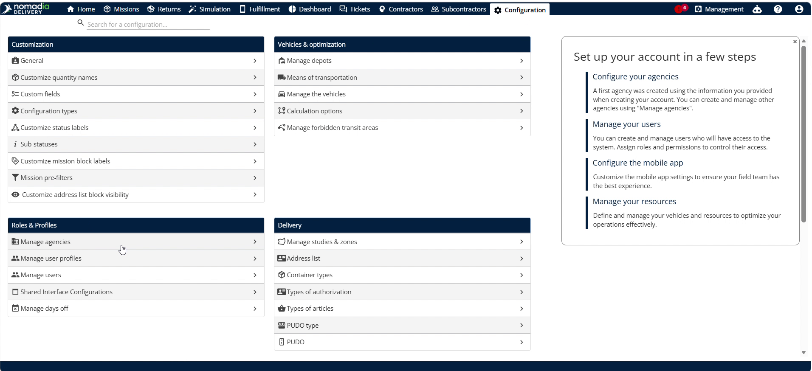
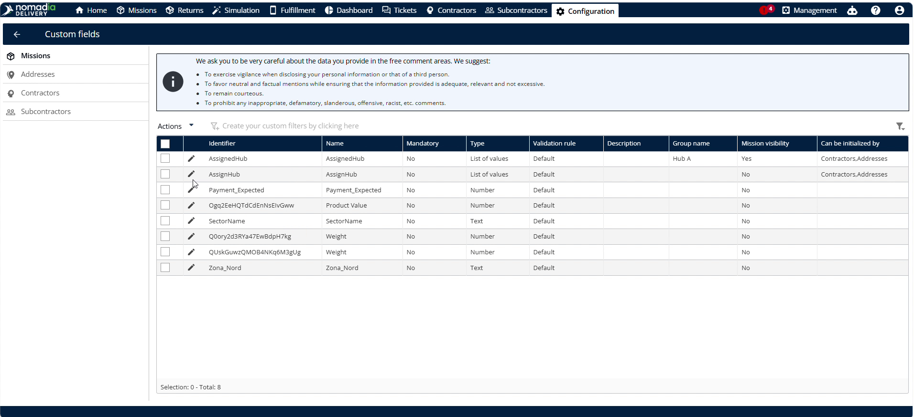
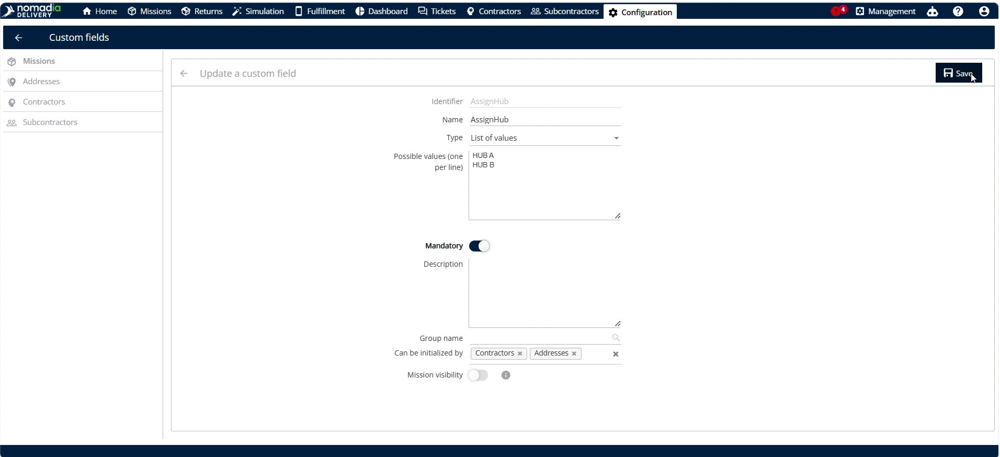
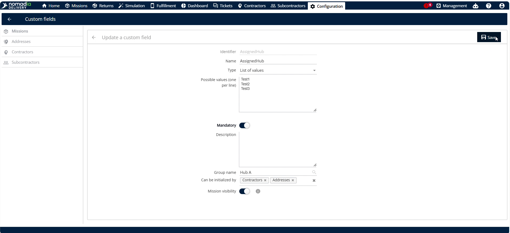
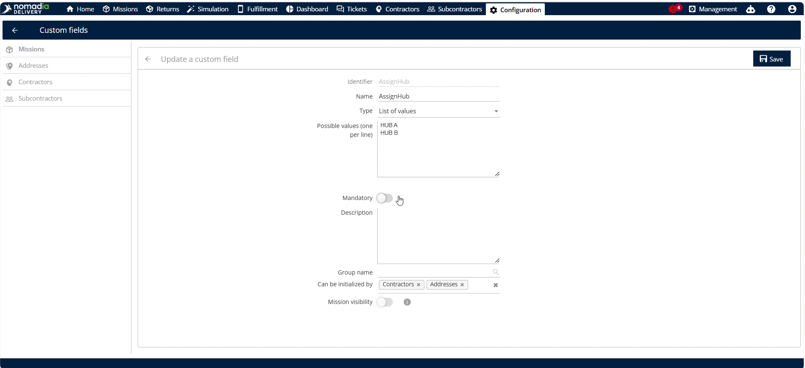
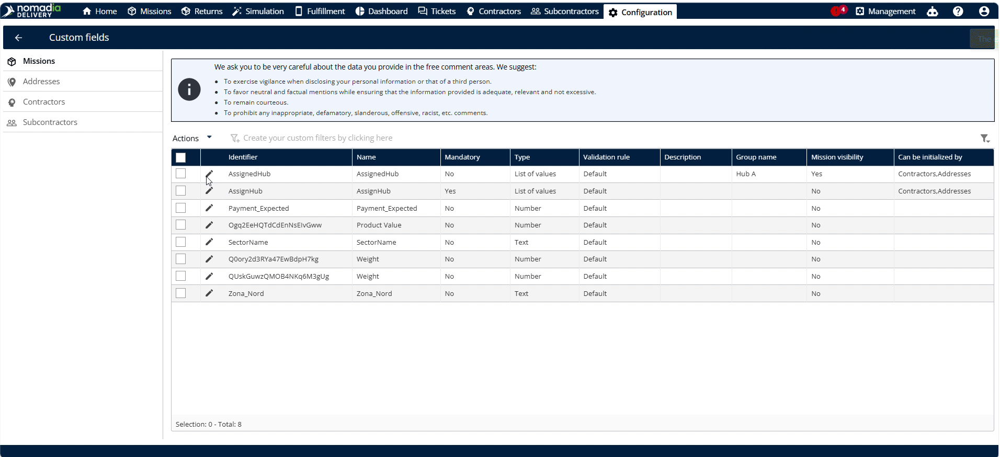
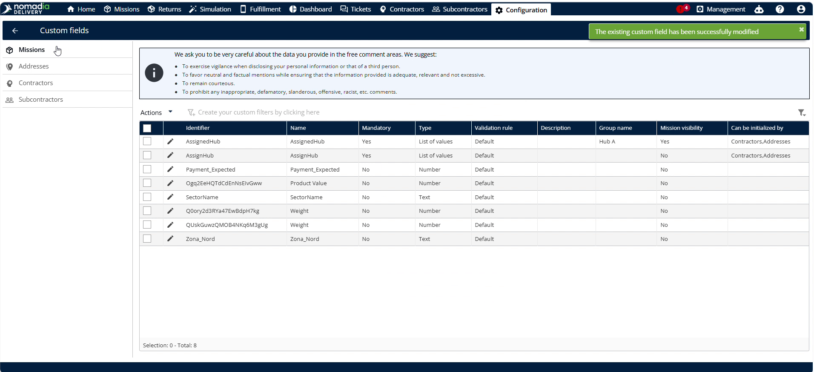
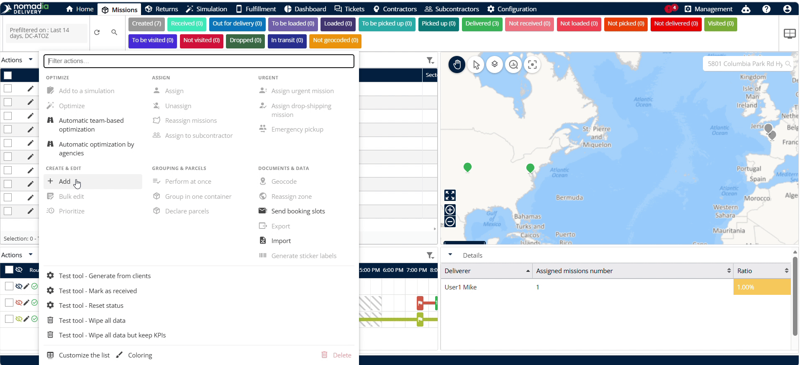
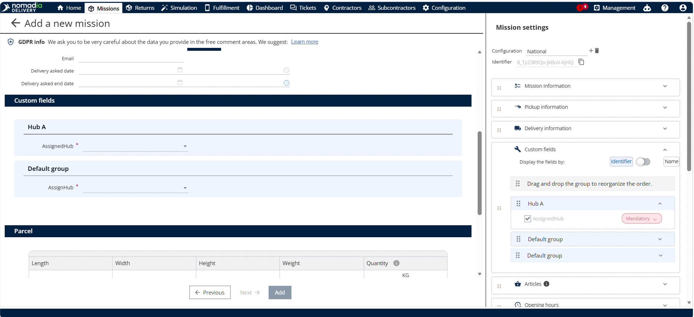

# customizethevalidationofmissionformfields
# customizethevalidationofmissionformfields

Customizing mandatory validation enforces required data entries on machine form fields in **Nomadia Delivery**. Dispatchers require mandatory fields to prevent incomplete machine form submissions during daily operations. Configure mandatory fields to ensure accurate field reporting and complete data compliance.

### Getting Started

Administrative requirements and setup steps:

- Administrative access to **Nomadia Delivery** configuration settings.
- Active machine form profile with field identifiers.

Initial setup steps:

1. Select **Configuration** from the main menu.

   

2. Click **Custom fields** to manage form fields.

   

### Feature Overview

Key user interface elements:

- **Configuration**: Opens global system preferences and customization options.

  

- **Custom fields**: Displays customizable form fields for machine profiles.

  

- **Identifier**: Represents a specific machine field selected for validation settings.

  

- **Mandatory**: Toggles required validation status to force data input before saving.

  

- **Assign Help**: Defines mandatory field assistance guidelines for field operators.

  

- **Machines**: Displays the fleet machinery database to test updated field validations.

  

### How To: Configure Mandatory Validation Rules

Configure mandatory validation for machine form fields:

1. Click **Configuration**.

   

2. Click **Custom fields**.

   

3. Select any **Identifier**.

   

4. Toggle **Mandatory** to enable mandatory field validation.

   

5. Click **Save**.

   

6. Select **Assign Help** and make it mandatory.

   

7. Click **Save**.

   

### How To: Apply Validation to Machine Records

Apply mandatory validation rules when editing machine profiles:

1. Navigate to **Machines**.

   

2. Click **Actions**.

   

3. Click **Add**.

   

4. Click **Agency**.

   

5. Click **Next**.

   

6. Select **Edit**.

   

7. Click **Copy**.

   

#### Troubleshooting

Troubleshoot form submission errors:

- **Cannot Save Machine Entry**: Unselected mandatory fields block submission. Select **Assign Help** before saving.

   

### Productivity Tips

Best practices and operational warnings:

- 💡 **Automatic Mandatory Updates**: Toggle mandatory field validation to update mandatory rules across machine forms instantly.
- ⚠️ **Unselected Mandatory Fields**: Do not leave mandatory fields unselected, or the system prevents saving the machine entry.

---

🛠️ I've also published this guide as `customizethevalidationofmissionformfields-user-guide.md` in your Studio panel. Would you like me to convert it into a printable PDF report or create flashcards to help train dispatchers on these validation workflows?

