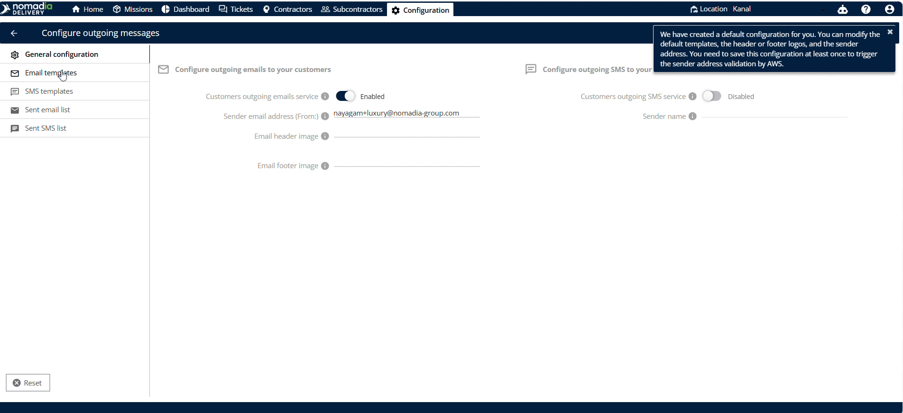
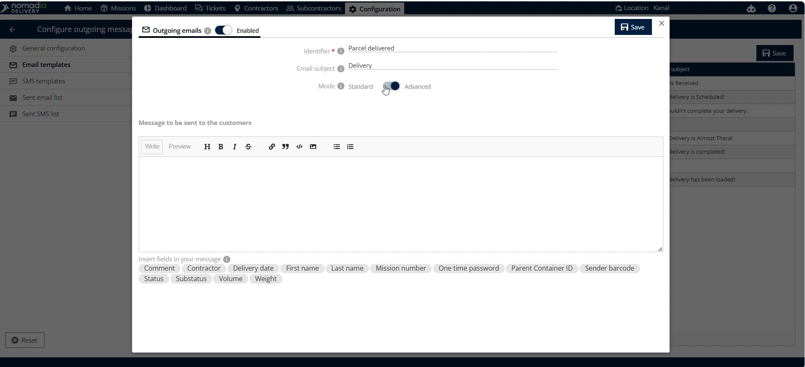
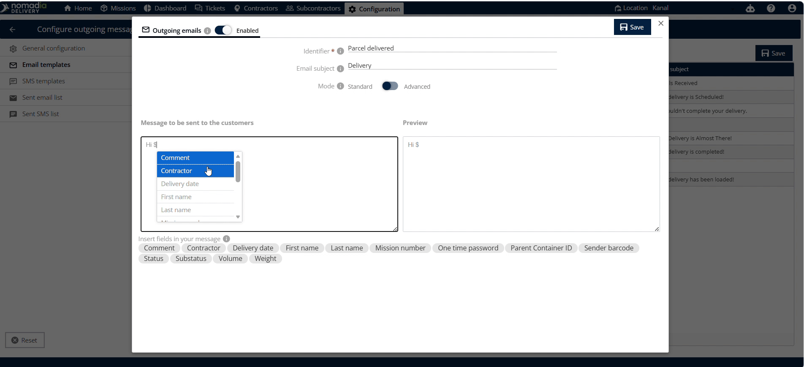

# custom Templates

## customtemplates

## customtemplates

**customtemplates** is a feature in **Nomadia Delivery** to customize customer notification emails. Custom templates provide clear, branded updates directly to your clients. This improves customer communication and streamlines your delivery operations.

#### Getting Started

Prerequisites & System Requirements:

* Active dispatcher or planner account in **Nomadia Delivery**.
* Web browser with an active internet connection.

Initial Setup Steps:

1. Go to **Configuration**.

2. Scroll down and click **Configure outgoing messages**.

3. Click **Email templates** on the left side of the screen.

#### Feature Overview

* **Email templates**: Left-side menu where all your configured templates are listed.

* **Actions**: Dropdown button that opens commands to manage your email templates.

* **Add**: Menu option to start creating a new email template.

* **Customer template**: Selection box used to choose the template type.

* **Identifier**: Text input field where you define a unique template name.

* **Email subject**: Text field where you enter the subject line for the email.

* **Standard mode to advanced**: Switch that toggles the editor interface between standard and advanced editing.

* **Message**: Text editor where you type the email body content.

* **Save**: Button at the top right corner that saves your new template.

#### How To: Configure a Custom Customer Email Template

1. Go to **Configuration**.

2. Scroll down and click **Configure outgoing messages**.

3. Click **Email templates** on the left side of the screen.

4. Click **Actions**.

5. Click **Add**.

6. Click **Customer template** to select your custom template.

7. Enter a unique template name in the **Identifier** field.

8. Enter your subject line in the **Email subject** field.

9. Toggle the mode switch from **Standard mode** to **Advanced mode** if desired.

10. Type your template text in the **Message** field.

11. Click **Save** in the top right corner to save your changes.

#### Productivity Tips

* 💡 **Mode Toggle**: Toggle **Standard mode** to **Advanced mode** if you want to use advanced editing options.

***

📄 I can compile this user guide into a clean, formatted PDF document if you would like to download and distribute it to your team.
