# declaringaparcelforacontainermission
# declaringaparcelforacontainermission

The parcel declaration feature allows dispatchers to define and assign parcel dimensions and container structures to container machines in Nomadia Delivery. This ensures accurate capacity planning and seamless logistics execution during container missions. Users can declare parcels when adding a new machine, editing an existing container, or directly from the action panel.

### Getting Started

Prerequisites and requirements:
- Access to the **Machine** module in Nomadia Delivery.
- An active container machine configuration.
- Parcel dimensions including length, width, height, and weight.

Setup steps:
1. Navigate to the **Machine** menu.

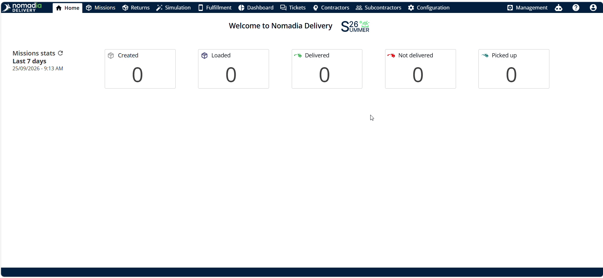

2. Click on **Actions** to open machine settings.

### Feature Overview

- **Actions Menu**: Displays machine configuration tools including machine creation and parcel declaration.

- **Add Button**: Launches the creation interface for adding a new container machine.

- **Agency Field**: Sets the managing organizational unit for the machine.

- **Machine Type Field**: Specifies the category and operational model of the container machine.

- **Container Type Selector**: Sets the container format for parcel generation.

- **Address Field**: Assigns the operational location for the container machine.

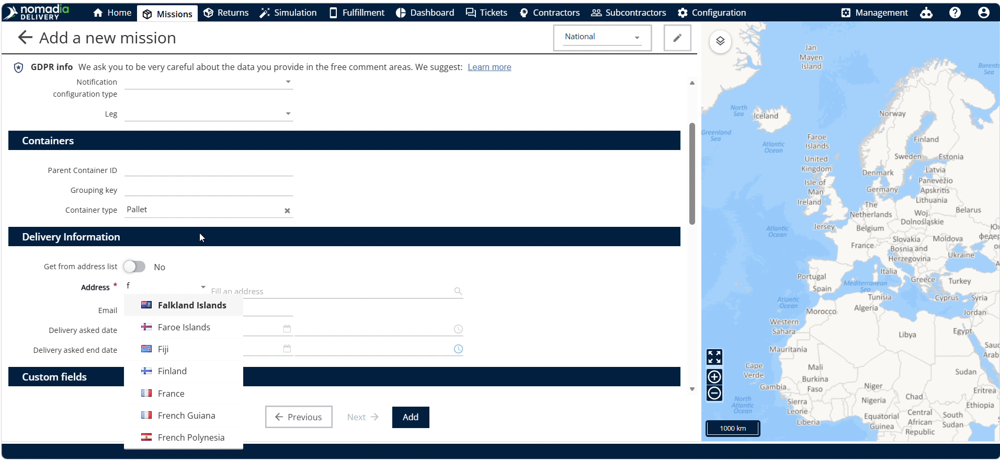

- **Parcel Section**: Collects length, width, height, and weight values for declared parcels.

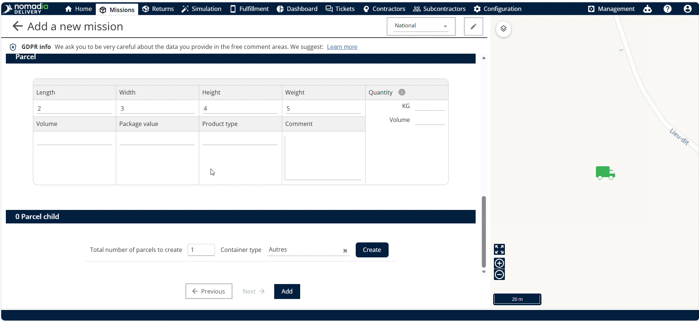

- **Parcel Size Section**: Defines the total number of child parcels to generate.

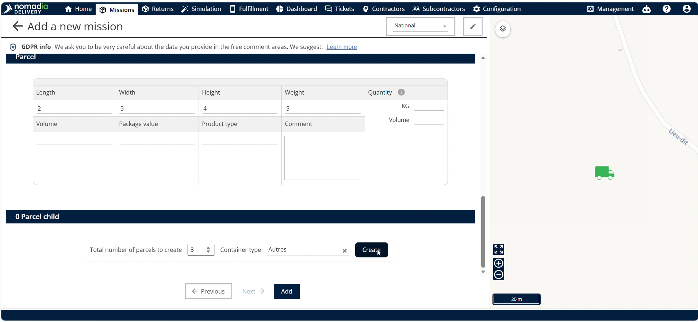

- **Edit Button**: Opens configuration parameters for existing containers.

- **Declare Parcel Option**: Directly opens the parcel creation tool from the action panel.

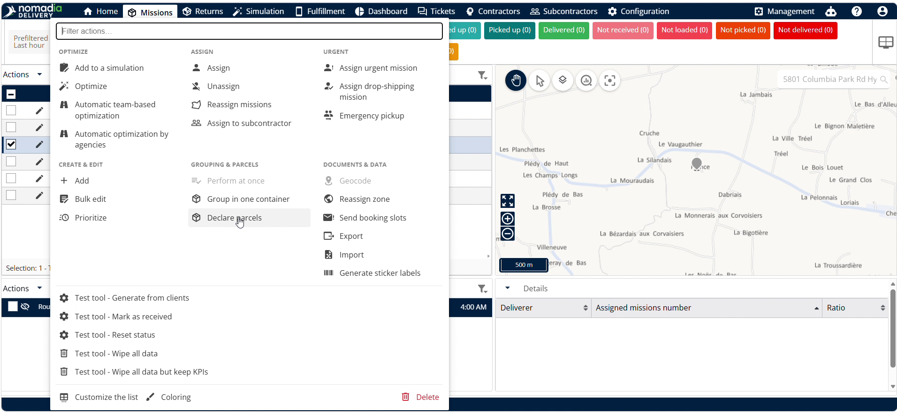

- **Validate Button**: Saves configurations and generates requested containers.

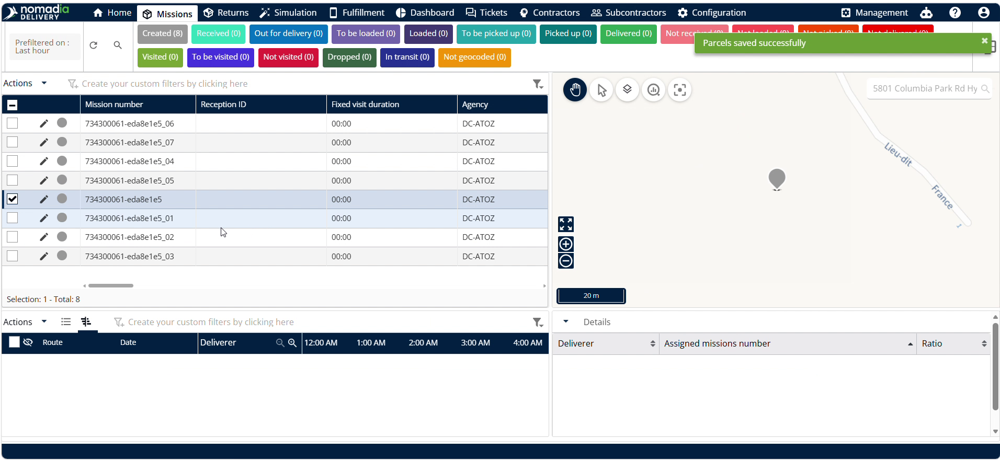

### How To: Declare a Parcel While Adding a Machine

1. Open the **Machine** menu.

2. Click on **Add**.

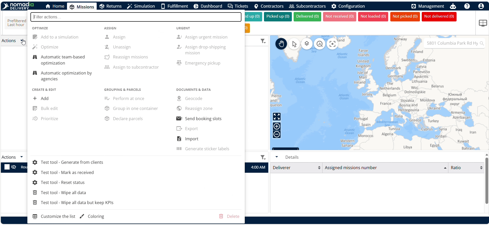

3. Select the **Agency** and **Machine Type**.

4. Click on **Next**.

5. Select the **Container Type**.

6. Select the **Address**.

7. Select the required **Custom Fields**.

8. Enter length, width, height, and weight in the **Parcel Section**.

9. Select the total number of parcels to create in the **Parcel Size Section**.

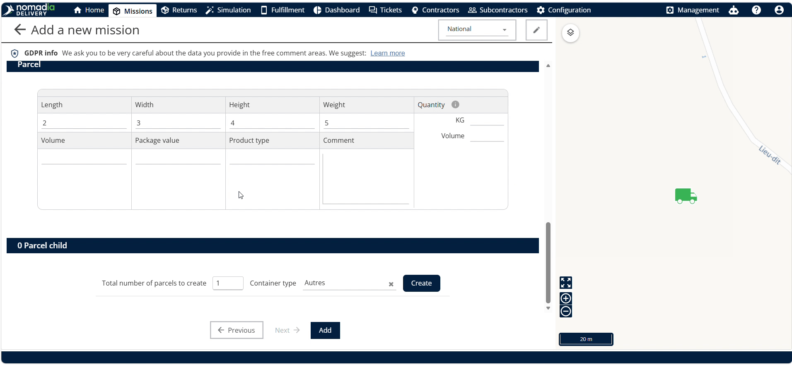

10. Click on **Create**.

11. Click on **Add** to finish creating the parent and child containers.

### How To: Declare a Parcel While Editing a Container

1. Click on the **Edit Button** for the target container.

2. Click on the **Container Type Palette**.

3. Set the total number of parcels to create.

4. Click on **Create**.

5. Click on **Validate** to save the declared containers.

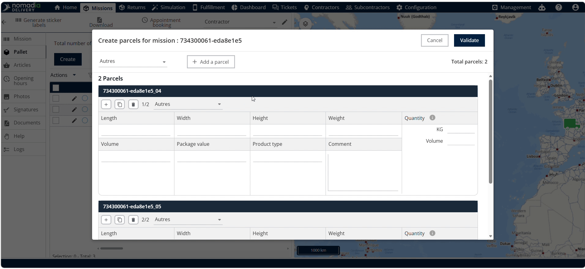

### How To: Declare a Parcel from the Action Panel

1. Select the parent container and machine, then click on **Actions**.

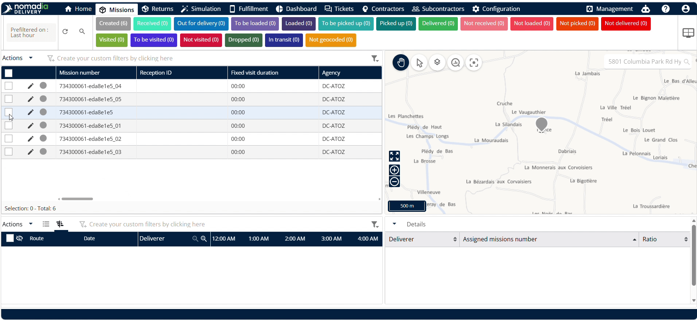

2. Click on **Declare Parcel**.

3. Choose the **Container Type**.

4. Click to add a parcel.

5. Click on **Validate** to confirm.

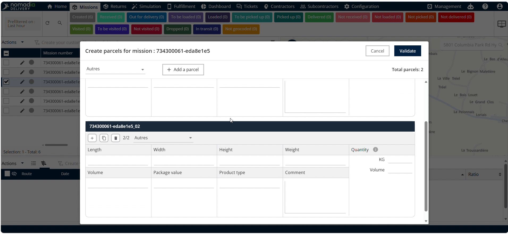

### Productivity Tips

- 💡 **Parent and Child Structure**: Generating multiple parcels automatically links child containers to one parent container for simplified mission organization.
- 💡 **Action Panel Convenience**: Add extra parcels directly from the action panel without re-entering the machine creation workflow.

---

📦 Would you like me to generate a downloadable PDF or report version of this User Guide for your team?

