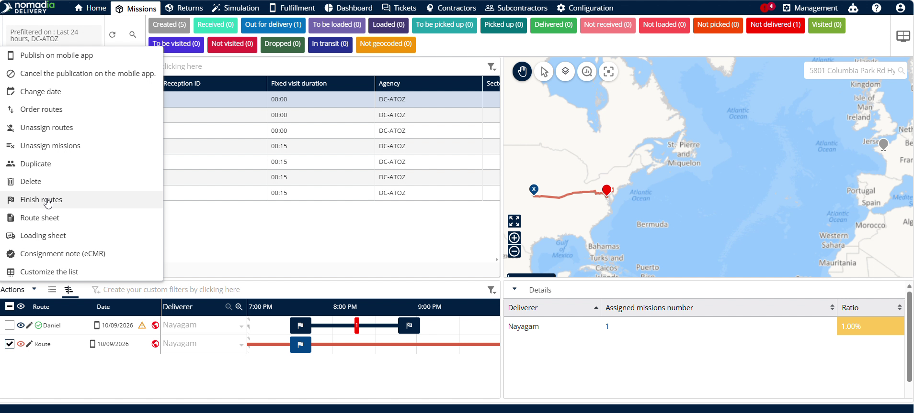

# Finish the Route

The **Finish the Route** feature lets dispatchers' complete delivery routes from the back office. Use this feature when a deliverer forgets to finish their route after loading. You will achieve accurate real-time route statuses across your fleet.

#### Getting Started

* **Back Office Access**: Active account in the Nomadia Delivery back office.
* **Assigned Route**: A route assigned and published to a deliverer.

1. Log into the **Back Office** system.

2. Confirm the driver has completed loading their assigned route.

#### Feature Overview

* **Deliverer**: Selects the target driver profile from the back-office dashboard.
* **Actions**: Opens administrative options for the selected deliverer.
* **Finish the Route**: Initiates manual route closure from the back office.

#### How To: Finish a Route

1. Select the **Deliverer** in the back office navigation menu.

2. Click **Actions** next to the selected deliverer.

3. Click **Finish the Route** in the dropdown list.

4. Click **Yes** on the pop-up asking "Do you really want to finish the route?".

#### Productivity Tips

* 💡 **Remote Route Closure**: Finish open routes directly from the back office when drivers forget to complete them after loading.
* ⚠️ **Unclosed Routes**: Avoid leaving completed routes open in the system to prevent inaccurate route status tracking.
