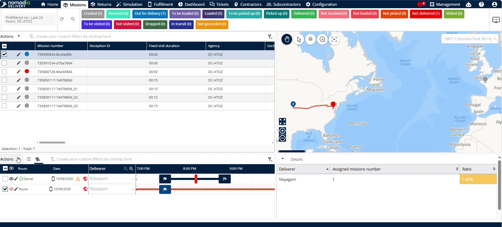
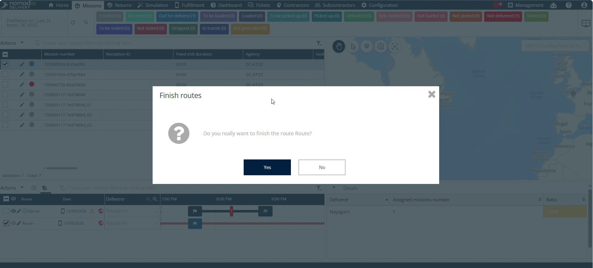
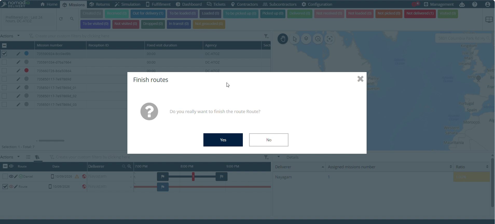

# finishtheroute
# finishtheroute

The **Finish the Route** feature lets dispatchers complete delivery routes from the back office. Use this feature when a deliverer forgets to finish their route after loading. You will achieve accurate real-time route statuses across your fleet.

### Getting Started

- **Back Office Access**: Active account in the Nomadia Delivery back office.
- **Assigned Route**: A route assigned and published to a deliverer.

1. Log into the **Back Office** system.

2. Confirm the driver has completed loading their assigned route.

### Feature Overview

- **Deliverer**: Selects the target driver profile from the back office dashboard.

- **Actions**: Opens administrative options for the selected deliverer.

- **Finish the Route**: Initiates manual route closure from the back office.

- **Yes**: Confirms the route completion request in the pop-up window.

### How To: Finish a Route

1. Click **Deliverer** in the back office navigation menu.

2. Click **Actions** next to the selected deliverer.

3. Click **Finish the Route** in the dropdown list.

4. Click **Yes** on the pop-up asking "Do you really want to finish the route?".

### Productivity Tips

- 💡 **Remote Route Closure**: Finish open routes directly from the back office when drivers forget to complete them after loading.
- ⚠️ **Unclosed Routes**: Avoid leaving completed routes open in the system to prevent inaccurate route status tracking.

---

💡 *Would you like me to generate a PDF or slide presentation version of this user guide for your team?*

