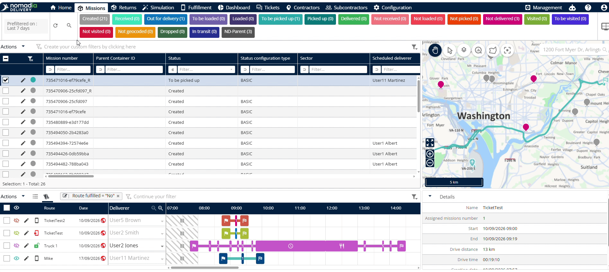
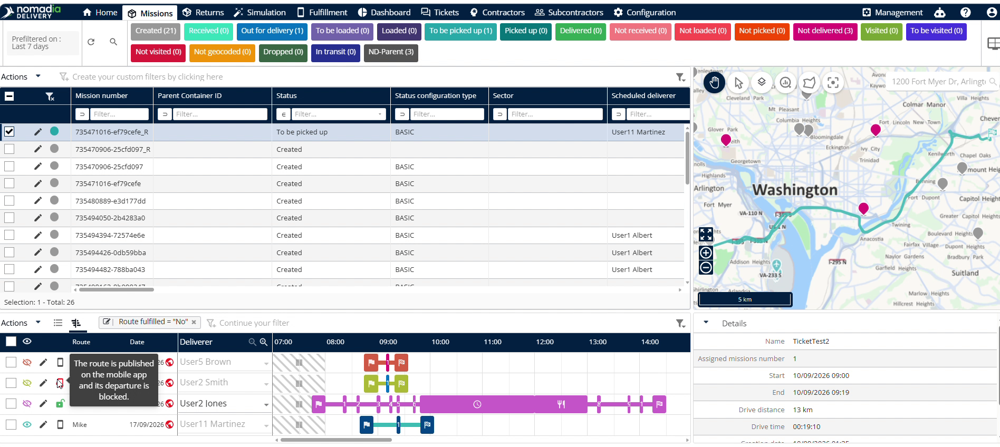
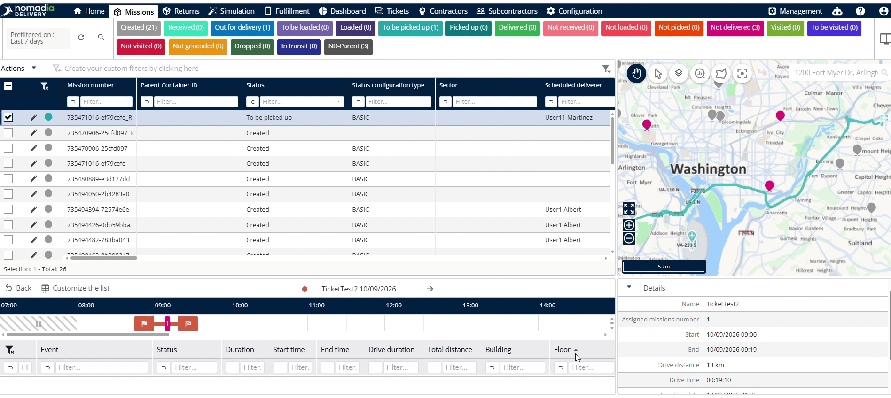

# ganttview
# ganttview

The **Gantt view** displays complete route information within Nomadia Delivery. Access this feature to manage driver schedules and monitor active deliveries efficiently. Use this interface to inspect route progress and view assigned delivery paths.

### Getting Started

Prerequisites:
- Active user account for **Nomadia Delivery**.
- System permissions to access the **Machines** section.

Initial setup steps:
1. Log into **Nomadia Delivery**.

2. Navigate to the **Machines** section.

3. Scroll down to locate the **Route** section.

### Feature Overview

- **Route Selector**: Allows selection of a specific route to execute management actions.

- **Eye Icon**: Opens the map view to display the selected route geographically.

- **Edit Icon**: Opens the route editor to modify existing route settings.

- **Publish Symbol**: Indicates that the selected route is published.

- **Block Symbol**: Displays alongside the publish symbol when a published route is blocked.

- **Green Button Symbol**: Displays as a green button when a route is granted.

- **Route Name**: Displays the designated name of the route.

- **Route Date**: Displays the scheduled date for route execution.

- **Deliverer Name**: Displays the name of the deliverer assigned to the route.

- **Start and End Time**: Shows the scheduled start time and end time for the route.

- **Route Type**: Identifies the specific classification type of the route.

- **Back Button**: Returns the view to the main route list.

### How To: View a Route on the Map

1. Select the desired route from the **Route** list.

2. Click the **Eye Icon** next to the route.

3. View the full route layout on the map.

### How To: Edit a Route

1. Select the target route in the **Route** section.

2. Click the **Edit Icon**.

3. Modify the necessary route details.

### How To: Inspect Route Details

1. Click on the specific route entry.

2. Review event status, duration, start time, end time, drive duration, total distance, building, and floor details.

3. Click the **Back Button** to return to the route list.

### Productivity Tips

- 💡 **Granted Route Identification**: Look for the green button symbol to instantly verify that a route has been granted.
- ⚠️ **Blocked Route Warning**: Avoid dispatching routes that display a block symbol alongside the publish symbol.

---

🗺️ Would you like me to turn this user guide into a PDF document or slide deck presentation for your dispatch team?

