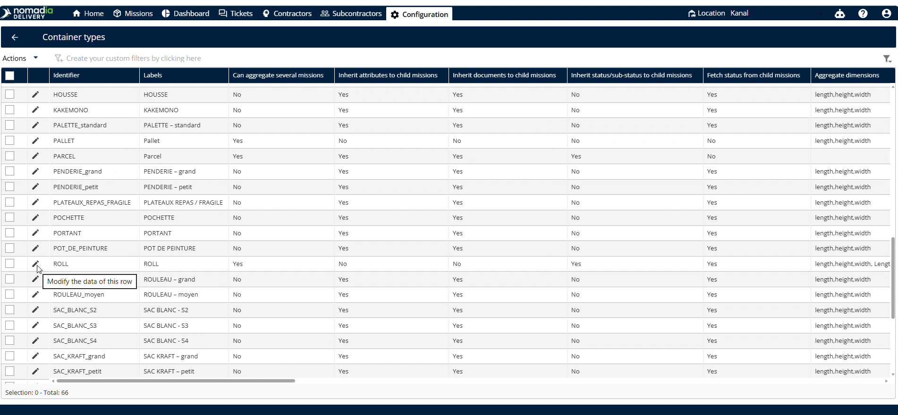
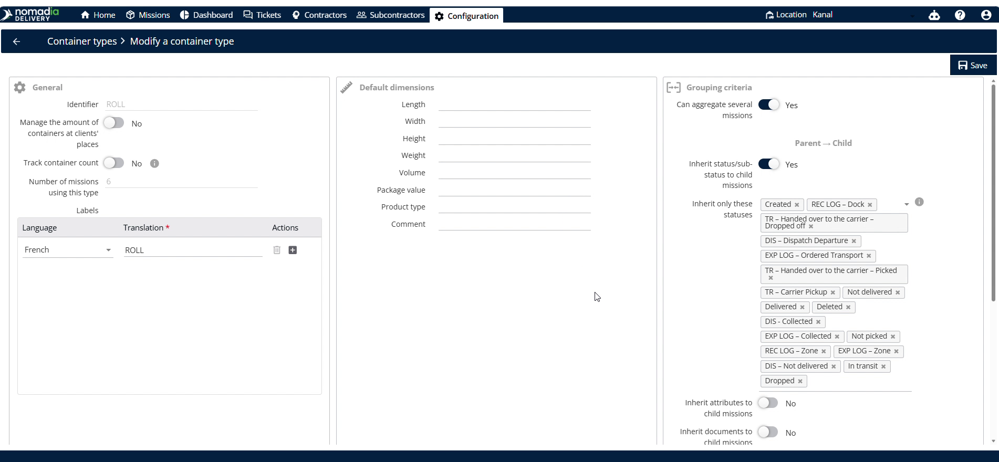
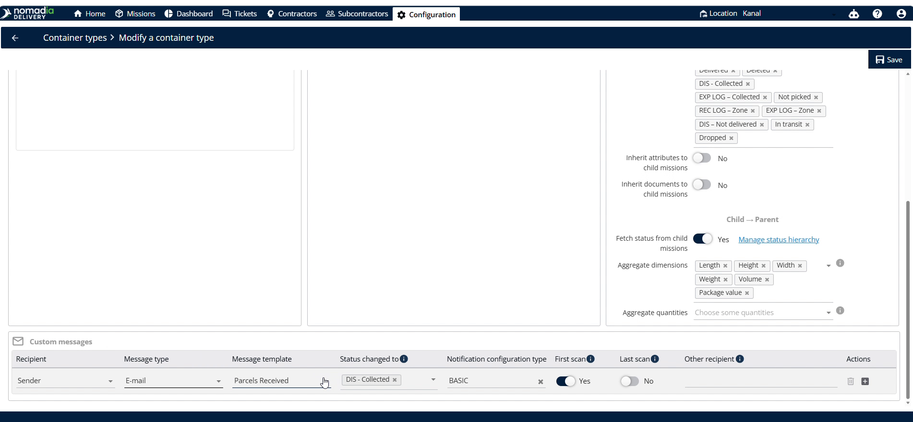
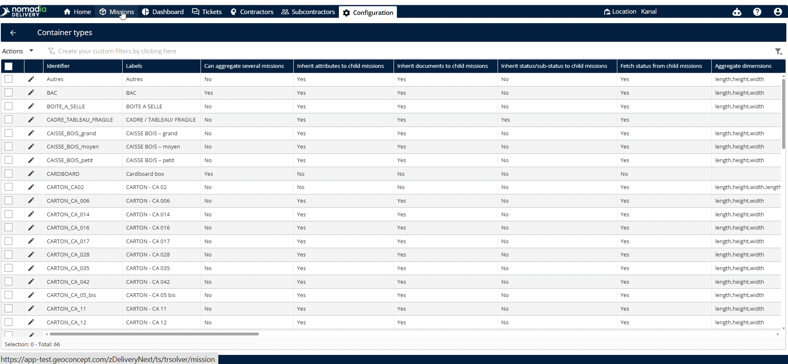
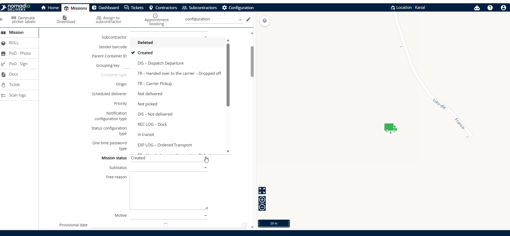
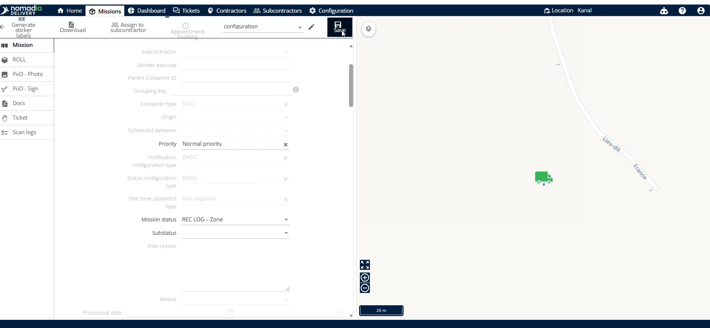

# groupnotificationsforthecontainermissions
Here is the comprehensive user guide for configuring and triggering group notifications in **Nomadia Delivery**.

***

# groupnotificationsforthecontainermissions

Group notifications for container missions aggregate alerts for several machines simultaneously. Dispatchers use this feature to streamline communications with contractors or other recipients during missions. This setup ensures automated, reliable status updates are delivered directly to stakeholders based on scanning milestones.

### Getting Started

To use this feature, make sure the following requirements are met:
* Set child-parent container and child container relationships.
* Verify that a contractor or contract is set up for each machine.

Follow these initial steps to access the settings:

1. Navigate to the **Configuration** screen.

2. Select **Container Types**.

3. Scroll down to find the correct identifier.

4. Enable the **Can Aggregate Several Machines** toggle.

---

### Feature Overview

* **Can Aggregate Several Machines**: Combines notifications for multiple machines. This allows sending unified group updates.

  

* **Customer Messages**: Section containing recipient and message configurations. This controls your notification preferences.

  

* **Recipient**: Selects the recipient for notifications. This defines who receives the alerts.

  

* **Message Type**: Selects the notification channel. You can choose either SMS or email.

  

* **Message Template**: Selects a pre-created message layout. This formats your notification text.

  

* **Status**: Field to select the target status for triggering the message. This defines the status transition.

  

* **Notification Configuration Type**: Determines whether to send notifications after the first or last scan. This customizes alert timing.

  

* **Other Recipient Email**: Input field to add extra email addresses. This sends notifications to additional stakeholders.

  

* **Save Button**: Commits all your selected configuration changes. This stores your active preferences.

  

---

### How To: Configure Group Notifications

1. Scroll down to the **Customer Messages** section.

2. Select a **Recipient**.

3. Choose SMS or email in **Message Type**.

4. Select your pre-created **Message Template**.

5. Choose the target status to change to in **Status**.

6. Select the **Notification Configuration Type**.

7. Enter additional emails in **Other Recipient Email**.

8. Click **Save** to complete setup.

---

### How To: Trigger Group Notifications

1. Go to the **Machines** screen.

2. Click the **Pencil Icon** (or **Printer Icon**) next to your container type.

3. Change the status from **Created** to a different status.

4. Click **Save** to send the notification.

---

### Productivity Tips

* **Child-Parent Relationships**: Pre-configuring child-parent relationships ensures grouped notifications work correctly.
* **Missing Contracts**: Avoid editing machine status before sending contracts as notifications will fail to deliver.
* **Scan Timing Selection**: Choosing first or last scan delivery optimizes the notification timing based on customer needs.
* **Save Action**: Avoid leaving the machine page without saving or the status change will not trigger notifications.

***

🎧 This guide covers the complete configuration workflow — let me know if you would like me to generate an audio overview summarizing these notification setup steps for you or your team!

