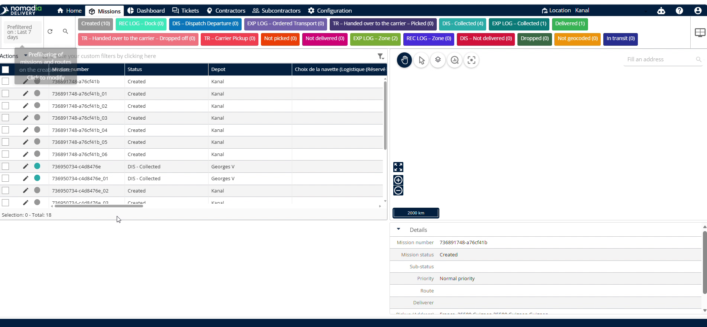
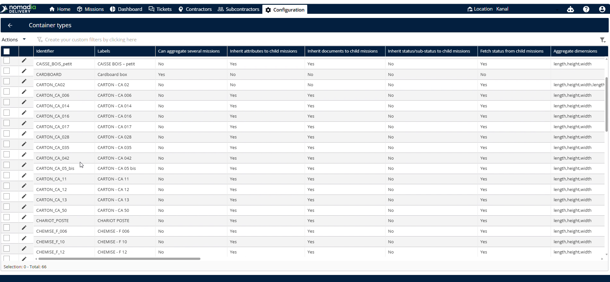
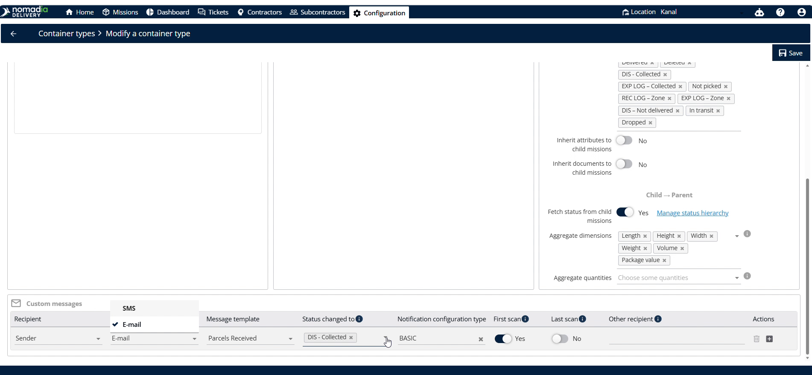
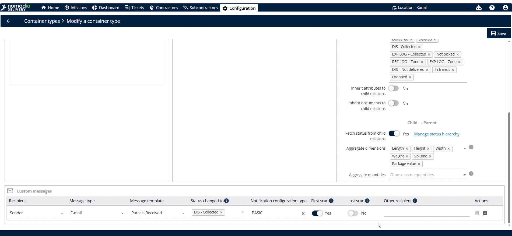

# Group notifications for container missions

Group notifications for container missions aggregate alerts for several missions simultaneously. Dispatchers use this feature to streamline communications with contractors or other recipients during missions. This setup ensures automated, reliable status updates are delivered directly to stakeholders based on scanning milestones.

#### Getting Started

To use this feature, make sure the following requirements are met:

* Set child-parent container and child container relationships.
* Verify that a contractor or contract is set up for each mission.

Follow these initial steps to access the settings:

1. Navigate to the **Configuration** screen.

2. Select **Container Types**.

3. Scroll down to find the correct identifier.

4. Enable the **Can Aggregate Several Missions** toggle.

***

#### Feature Overview

* **Can Aggregate Several Missions**: Combines notifications for multiple missions. This allows sending unified group updates.
* **Customer Messages**: Section containing recipient and message configurations. This controls your notification preferences.
* **Recipient**: Selects the recipient for notifications. This defines who receives the alerts.
* **Message Type**: Selects the notification channel. You can choose either SMS or email.
* **Message Template**: Selects a pre-created message layout. This formats your notification text.
* **Status**: Field to select the target status for triggering the message. This defines the status transition.
* **Notification Configuration Type**: Determines whether to send notifications after the first or last scan. This customizes alert timing.
* **Other Recipient Email**: Input field to add extra email addresses. This sends notifications to additional stakeholders.

#### How To: Configure Group Notifications

1. Scroll down to the **Customer Messages** section.

2. Select a **Recipient**.

3. Choose SMS or email in **Message Type**.

4. Select your pre-created **Message Template**.

5. Choose the target status to change to in **Status**.

6. Select the **Notification Configuration Type**.

7. Enter additional emails in **Other Recipient Email**.

8. Click **Save** to complete setup.

***

#### How To: Trigger Group Notifications

1. Go to the **Missions** screen.

2. Click the **Pencil Icon** next to your container type.

3. Change the status from **Created** to a different status.
4. Click **Save** to send the notification.

Contractor will receive the notification email successfully.&#x20;

<figure><figcaption></figcaption></figure>

***

#### Productivity Tips

* **Child-Parent Relationships**: Pre-configuring child-parent relationships ensures grouped notifications work correctly.
* **Scan Timing Selection**: Choosing first or last scan delivery optimizes the notification timing based on customer needs.
* **Save Action**: Avoid leaving the mission page without saving or the status change will not trigger notifications.

