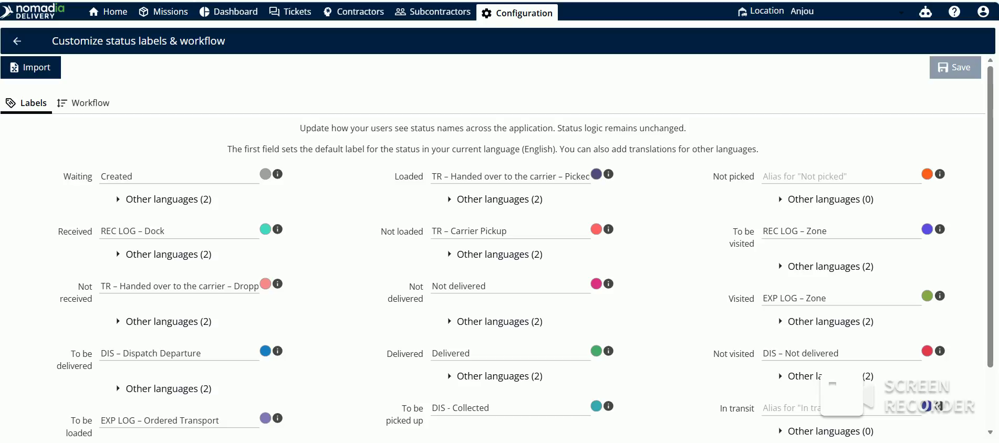
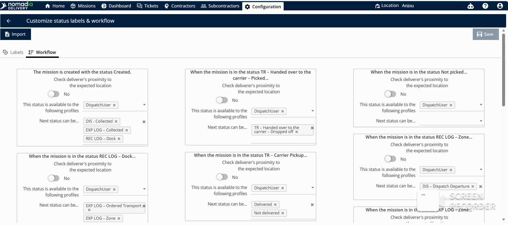
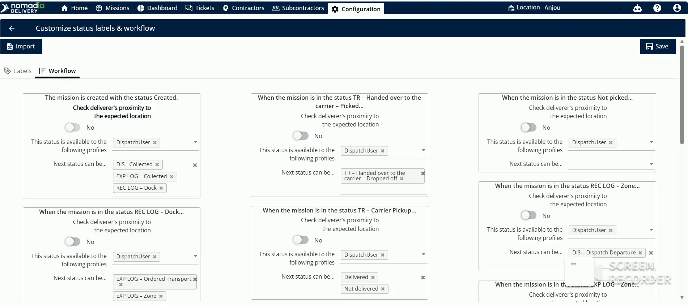
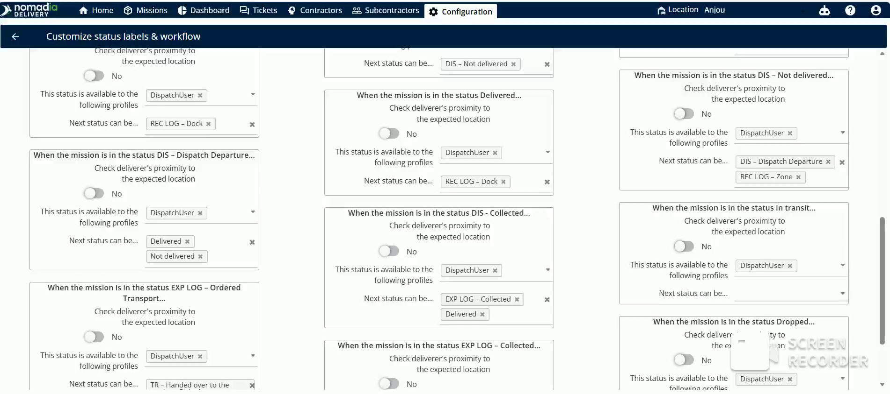
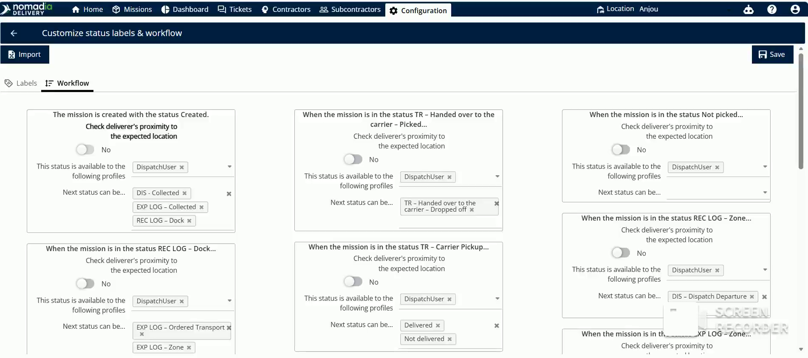

# customizeworkflow
# customizeworkflow

The customized workflow feature allows you to define how mission statuses progress and who can change them. Dispatchers use this to control the delivery process and ensure accountability. You will achieve a structured, secure, and geographically verified delivery pipeline.

### Getting Started

*   Access to the **Configuration** page.
*   Administrative permissions to modify system tables.

1.  Open the **Configuration** page.
2.  Click on **Customize Status Tables and Workflow**.

    

3.  Click the **Workflow** tab.

    

### Feature Overview

*   **Workflow Mapping**: Define which status can be changed to a specific next status.
    

*   **Proximity Toggle**: Check if a deliverer is at the expected location by toggling **Yes** or **No**.
    

*   **Profile Definition**: Restrict specific status changes to authorized roles, such as a **Dispatch User**.
    

### How To: Customize a Mission Workflow

1.  Select a starting status in the workflow grid, such as **Created**.

    

2.  Assign a user role from the **Profile** dropdown to control who can change the status.

    

3.  Select which target statuses the mission can transition to, such as **DAIS collected** or **EXP log collected**.

    

4.  Configure the next transition, such as allowing a **Dispatch User** to scan a mission and change it to **Delivered**.

    

5.  Click on **Save** to modify the changes.

    

### Productivity Tips

*   ⚠️ **Unsaved Changes**: Always click the Save button after making adjustments to ensure the mission workflow updates.

