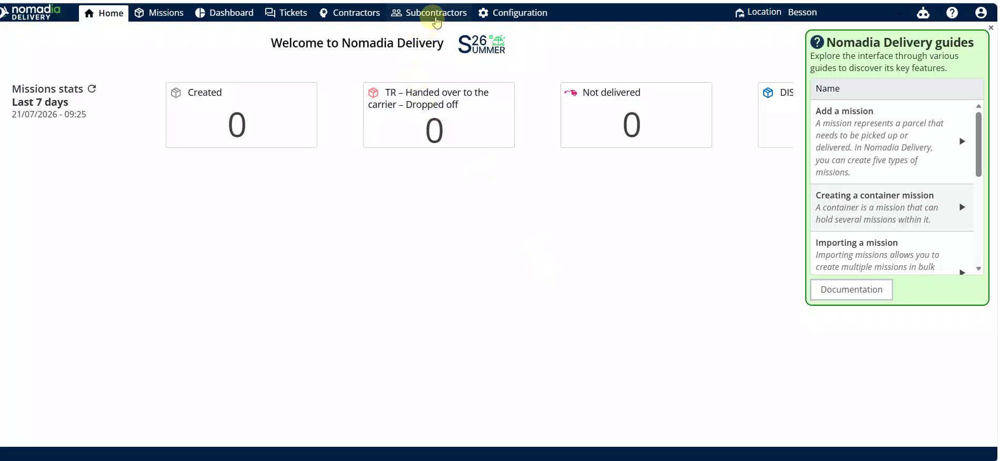
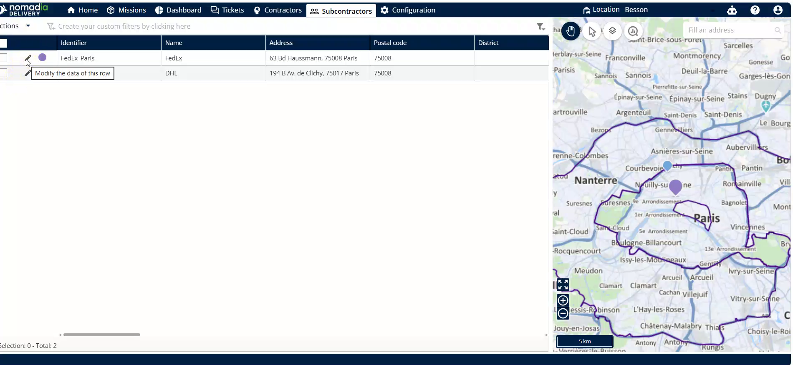
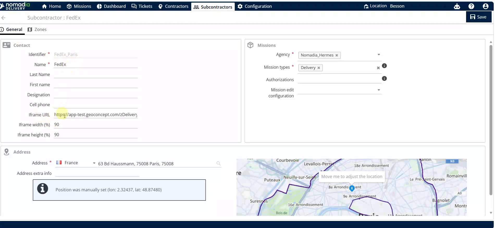
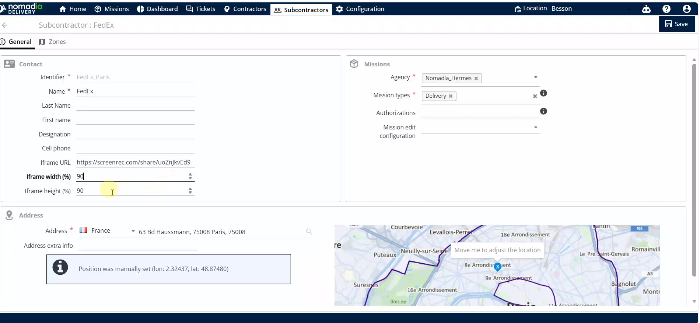
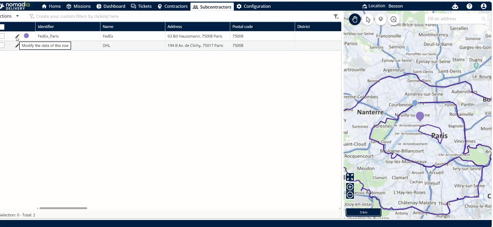
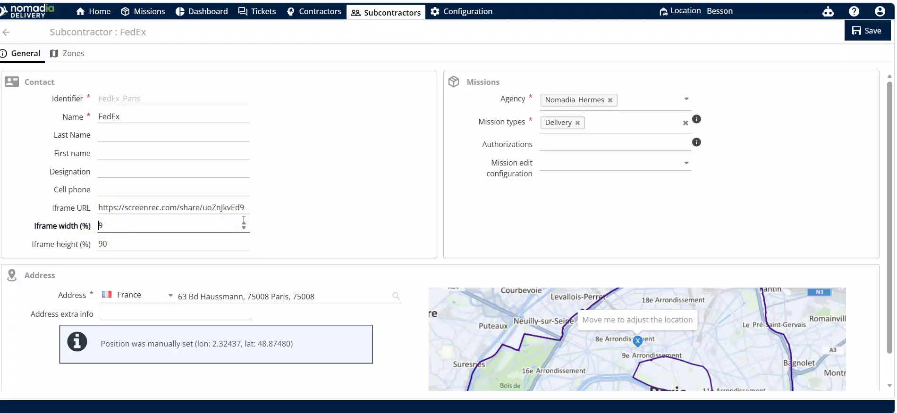

# iframeconfiguration
# iframeconfiguration

Configure iFrame settings for subcontractors within Nomadia Delivery to embed external mission data. This feature allows you to customize the display of external URLs for specific users. You will achieve a personalized viewing experience for each subcontractor profile.

### Getting Started

*   Access to the Nomadia Delivery dashboard.
*   A valid machine URL or mission ID.

1. Navigate to the **Subcontractors** menu.

2. Locate the list of users on the screen.

### Feature Overview

*   **Pencil icon**: Opens the editing interface for a selected subcontractor.

*   **iFrame URL**: Field used to input the machine URL or mission ID.

*   **iFrame width**: Sets the horizontal dimension of the embedded frame.

*   **iFrame height**: Sets the vertical dimension of the embedded frame.

*   **Save**: Commits the configuration changes to the subcontractor profile.

### How To: Configure Subcontractor iFrame

1. Go to **Subcontractors**.

2. Click the **pencil icon** next to the user.

3. Replace the existing URL with your machine URL or mission ID.

4. Set the **iFrame width** value.

5. Set the **iFrame height** value.

6. Click on **save** to save the modifications.

### Productivity Tips

- 💡 **Modification Confirmation**: Verify the configuration by waiting for the "existing subcontractor has been modified" pop-up.

