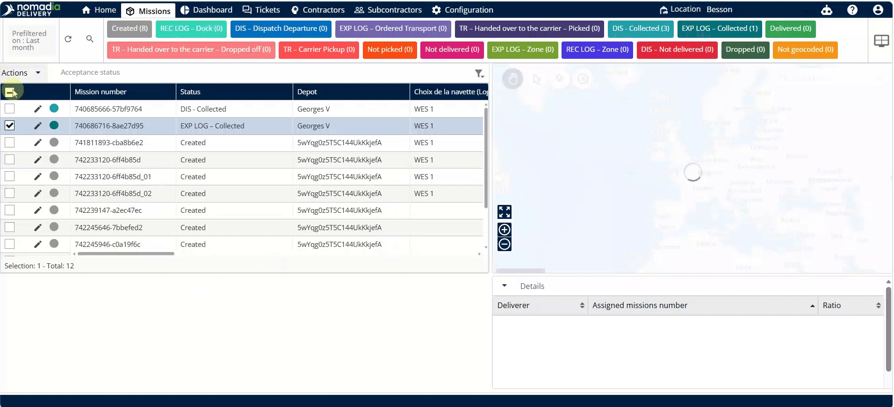
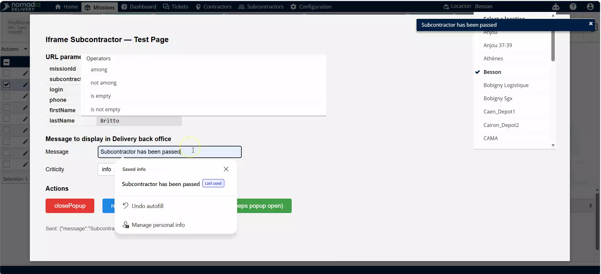
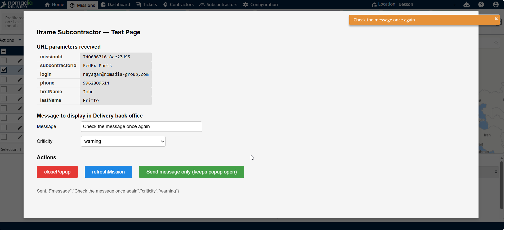
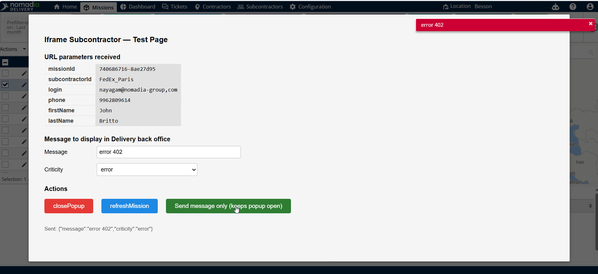

# Interacting with Iframe

This feature allows you to communicate directly with subcontractors through an integrated external interface. You can send specific status updates and messages without leaving the main application. This ensures seamless data passing between your system and the subcontractor's external portal.

#### Getting Started

* Access to the **Missions** page.
* A pre-configured subcontractor URL set in your system settings.
* Navigate to the **Missions** page.
* Select the desired **Mission** from the list.
* Click on **Actions**.
* Click on **Assign to subcontractor**.

#### Feature Overview

* **Message field**: Use this area to type custom instructions or status updates.
* **Actions**: Selectable status categories like **Info**, **Warning**, **Error**, or **Success**.
* **Send Message**: Submits your data and triggers a confirmation popup in the interface.

#### How To: Send Status Communications

**Sending an Info Update**

1. Type your message in the **Message field**.
2. Select the **Info** status.
3. Click **Send Message**.
4. Review the "subcontractor has been passed" popup.

**Sending a Warning**

1. Edit the existing text in the **Message field**.
2. Change the status to **Warning**.
3. Click **Send message only**.
4. Review the "Check the email once again" popup.

<figure><figcaption></figcaption></figure>

**Sending an Error**&#x20;

1. Enter the required details in the **Message field**.
2. Select the **Error** status.
3. Click **Send message only**.
4. Review the Error message popup.

<figure><figcaption></figcaption></figure>

**Finalizing a Successful Assignment**

1. Select the **Success** status.
2. Edit the final **Message**.
3. Click **Send message only**.
4. Review the "subcontractor has been successful" popup.

**Exiting the Interface**

1. Refresh the page once tasks are complete.
2. Close the popup.

#### Productivity Tips

* 💡 **Return to Missions**: Closing the final popup automatically returns you to the **Missions** page.
* ⚠️ **Confirm Action**: Always click **Send Message** to trigger the required status popup and ensure the update is processed.
