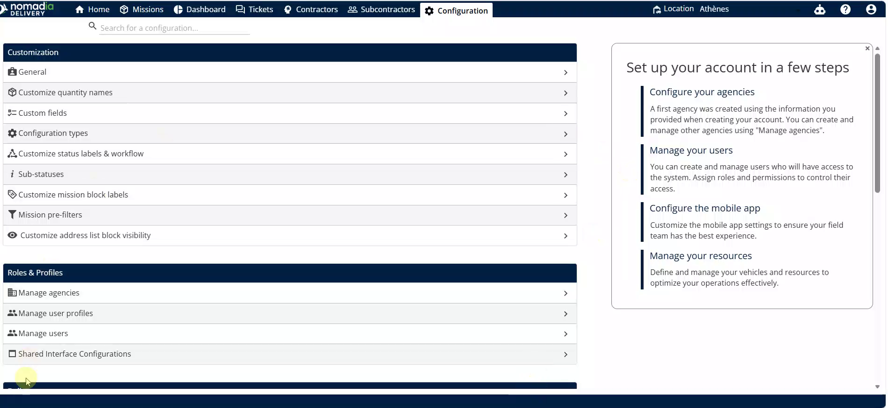
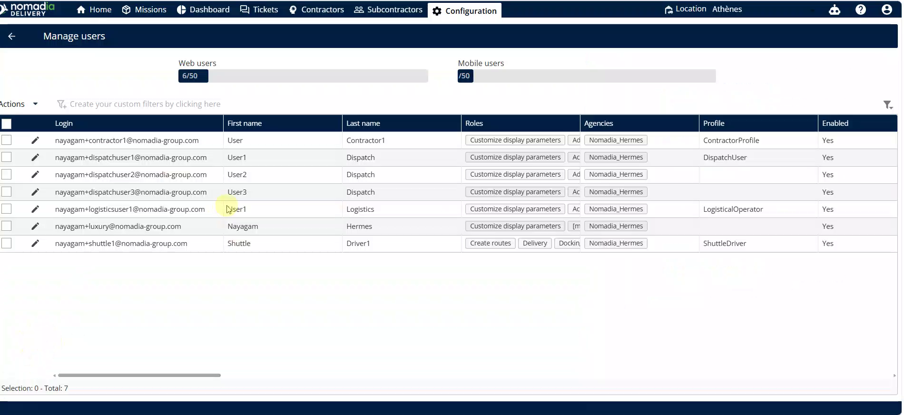
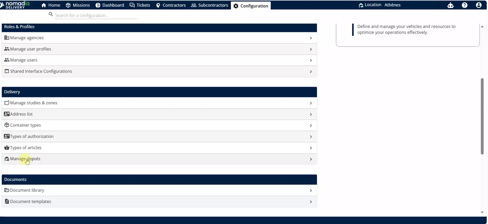
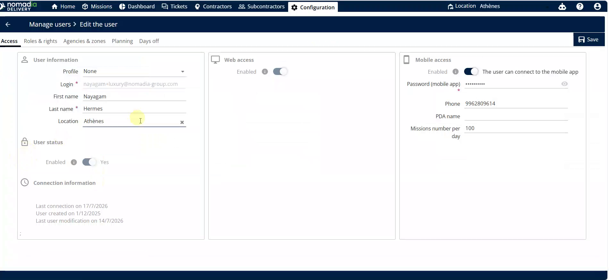
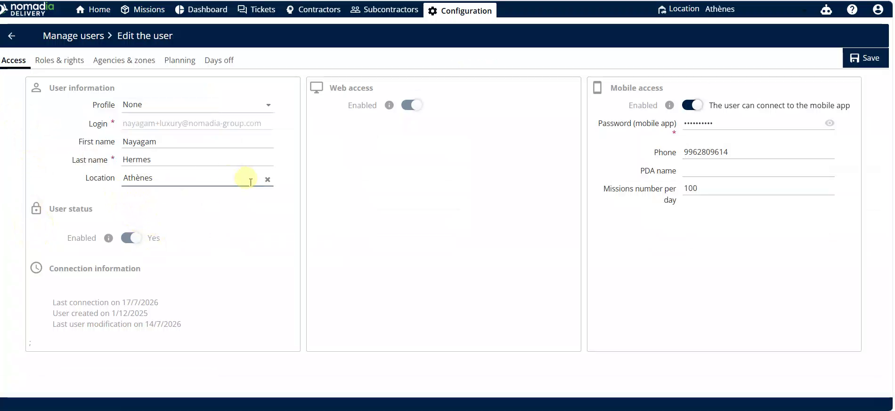
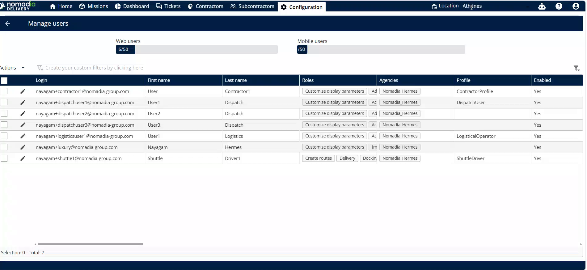
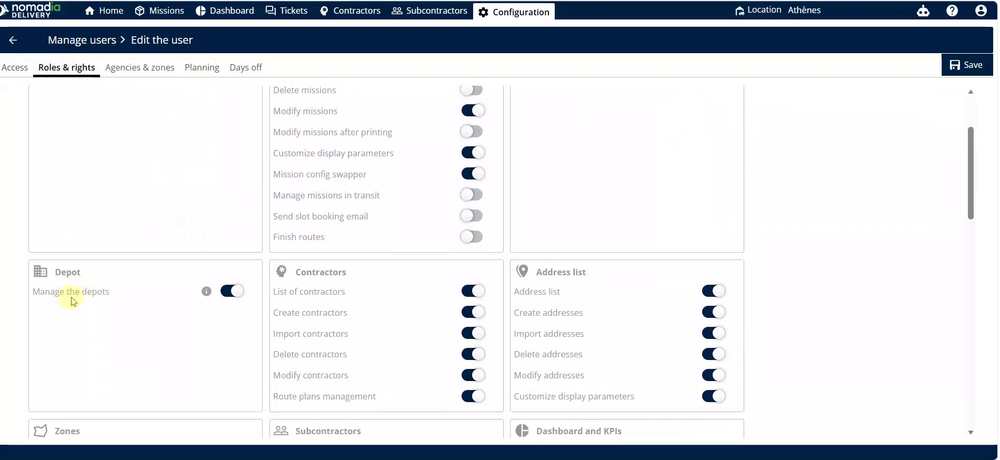
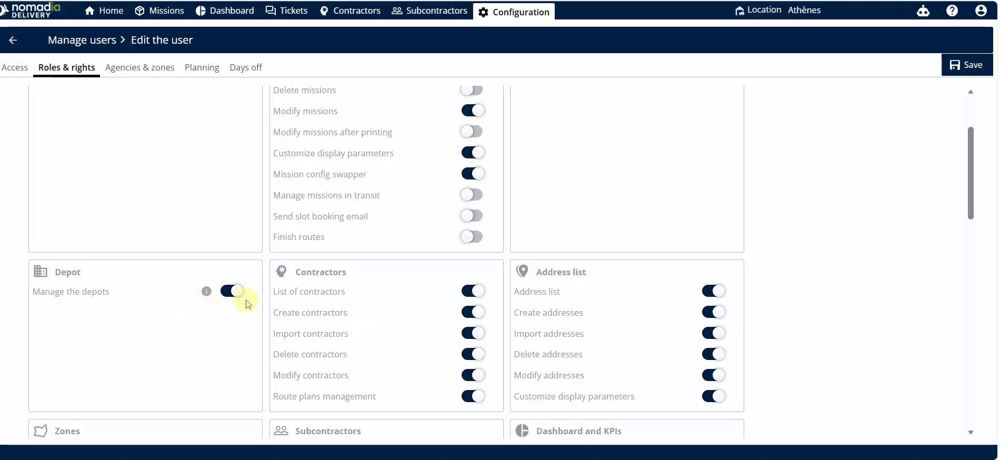
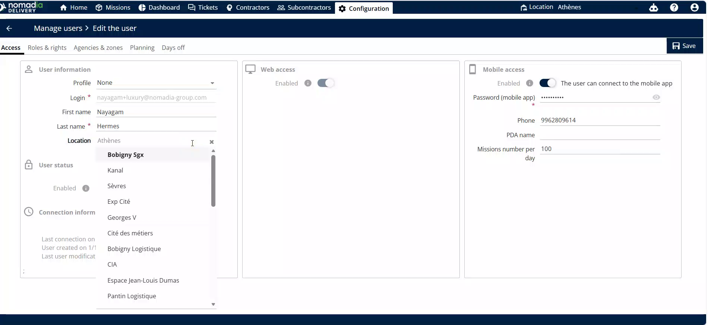

# managethedepots
# managethedepots

Manage Depots allows you to control building access and visibility for your team. This feature ensures dispatchers and employees see only the relevant locations for their daily operations. You will achieve a streamlined workflow by mapping specific buildings to the right users.

### Getting Started

Prerequisites and initial setup steps:
*   Administrative access to the **Configuration** page.
*   Active user accounts created in the system.

1. Open the **Configuration** page.

2. Select **Manage Users**.

### Feature Overview

*   **Manage the Reports**: This option under the **Delivery** section allows you to view and organize building assignments.

*   **Roles and Rights**: A sub-menu within a user profile where you toggle specific feature permissions.

*   **Location Dropdown**: A selection menu in the user profile used to map a specific building to an employee.

*   **Quick Access Building Selector**: A tool in the top right corner for rapid building switching.

### How To: Enable Depot Management

1. Navigate to the **Configuration** page and click **Manage Users**.

2. Click on a specific **User**.

3. Select **Roles and Rights**.

4. Enable the **Manage the Reports** option.

5. Click the **Left Arrow** to return to the main menu.

### How To: Map a Building to a User

1. Select **Manage Users** and click on the desired **User**.

2. Locate the **Location Dropdown** menu.

3. Select the building from the list.

4. Refresh the page to confirm the mapping reflects in the **Manage Users** table.

### Productivity Tips

*   💡 **Quick Access**: Use the top right corner selector to switch buildings instantly without entering user settings.
*   ⚠️ **Mobile Sync**: Changes made in the mobile application will automatically update the back office settings.

