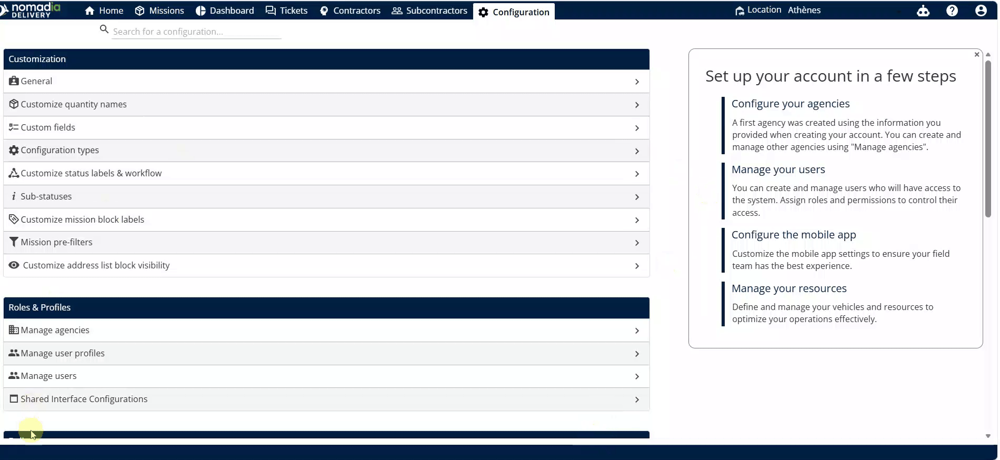
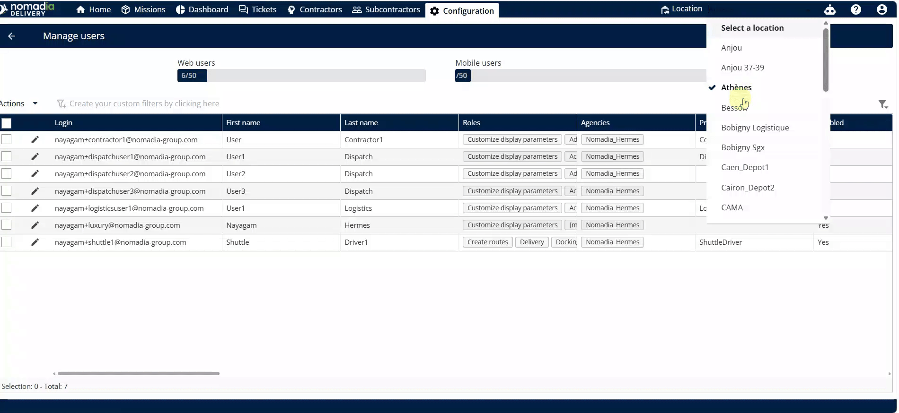

# Manage the Depots / Buildings

Manage Depots / Buildings allows you to control building access and visibility for your team. This feature ensures dispatchers and employees see only the relevant locations for their daily operations. You will achieve a streamlined workflow by mapping specific buildings to the right users.

#### Getting Started

Prerequisites and initial setup steps:

* Administrative access to the **Configuration** page.
* Active user accounts created in the system.
* Open the **Configuration** page.
* Select **Manage Users**.

#### Feature Overview

* **Manage the Depots /** **Buildings**: This option under the **Delivery** section allows you to view and organize building assignments.
* **Roles and Rights**: A sub-menu within a user profile where you toggle specific feature permissions.
* **Location Dropdown**: A selection menu in the user profile used to map a specific building to an employee.
* **Quick Access Building Selector**: A tool in the top right corner for rapid building switching.

#### How To: Enable Depot / Building Management

1. Navigate to the **Configuration** page and click **Manage Users**.

2. Click on a specific **User**.
3. Select **Roles and Rights**.
4. Enable the **Manage the Depots** option.

5. Click the **Left Arrow** to return to the main menu.

#### How To: Map a Building to a User

1. Select **Manage Users** and click on the desired **User**.
2. Locate the **Location Dropdown** menu.

3. Select the building from the list.
4. Refresh the page to confirm the mapping reflects in the **Manage Users** table.

#### Productivity Tips

* 💡 **Quick Access**: Use the top right corner selector to switch buildings instantly without entering user settings.
* ⚠️ **Mobile Sync**: Changes made in the mobile application will automatically update the back office settings.
