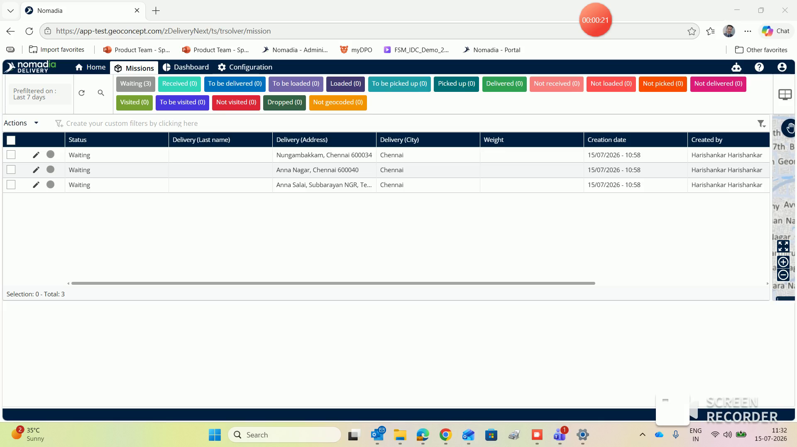
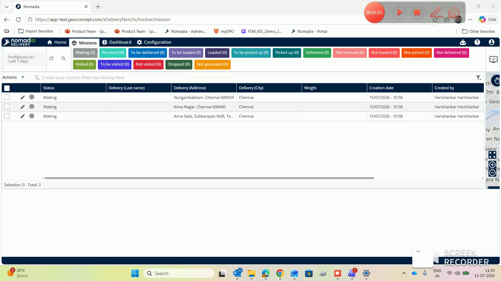
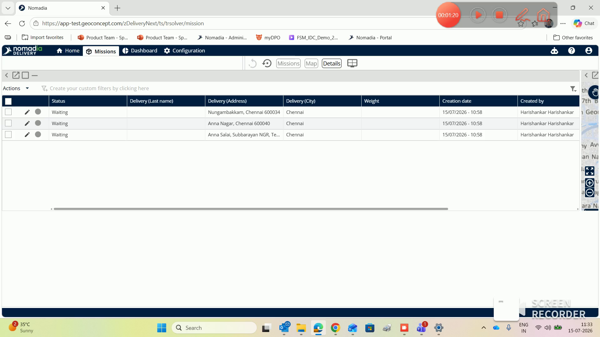
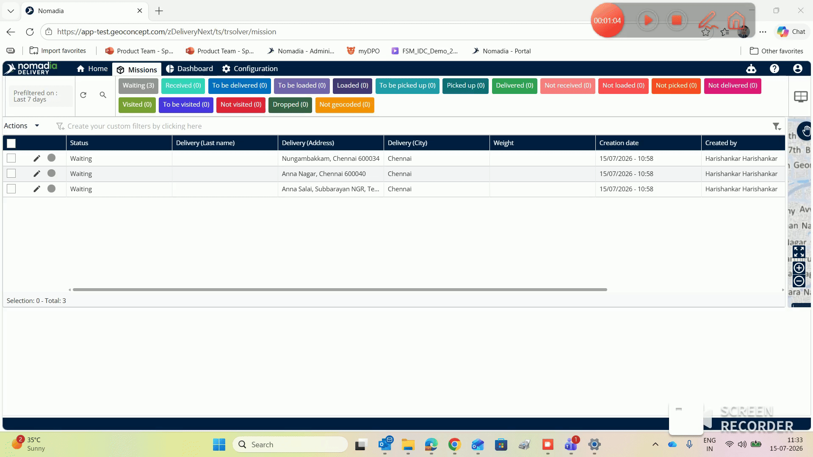

# noroute
# noroute

No-Route mode is designed for companies that prioritize machine management and traceability over complex route optimization. This mode simplifies the user interface by automatically hiding all features related to route planning. You will achieve a more efficient workflow focused entirely on monitoring delivery missions and machines.

### Getting Started

*   Active **Nomadia Delivery** account.
*   User profile configured for No-Route access.

1. Sign in using your No-Route account credentials.

2. Verify the navigation bar shows only essential modules.

### Feature Overview

*   **Home**: Access the starting interface designed for daily operations.

*   **Machines**: View and manage delivery missions while tracking machine locations.

*   **Dashboard**: Monitor operational performance data and mission status.

*   **Configuration**: Manage system settings and operational profiles.

*   **Missions Tab**: Open the machine table to view delivery data.

*   **Maps Tab**: Visualize the real-time geographic locations of your missions.

*   **Details Tab**: Review specific information regarding a selected mission or machine.

### How To: Track Missions

1. Select the **Machines** module from the main navigation menu.

2. Click the **Maps** tab to visualize machine locations.

3. Tap the **Details** tab to inspect mission-specific data.

### Productivity Tips

*   💡 **Operational Efficiency**: Hiding route planning features provides a cleaner interface to focus on mission monitoring.
*   ⚠️ **Feature Limitations**: Avoid seeking **Road Simulation** or **Fulfillment** tabs, as these are exclusive to route optimization accounts.

