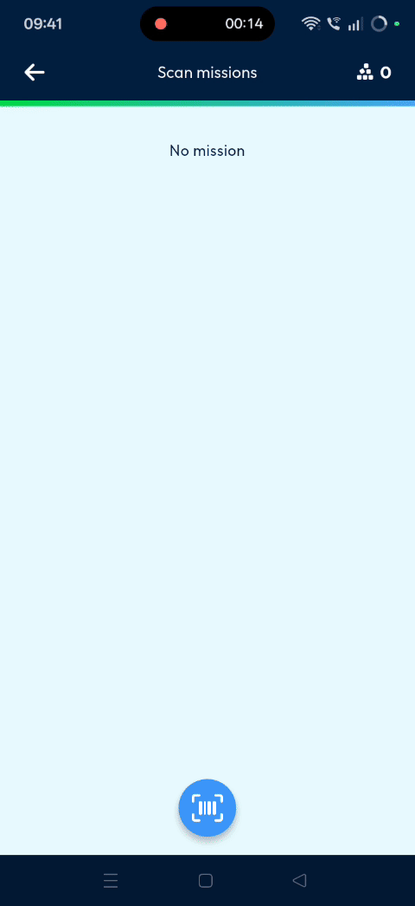
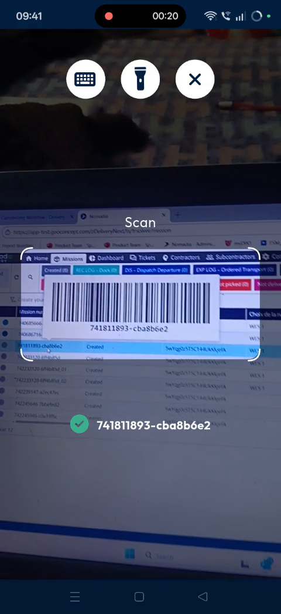
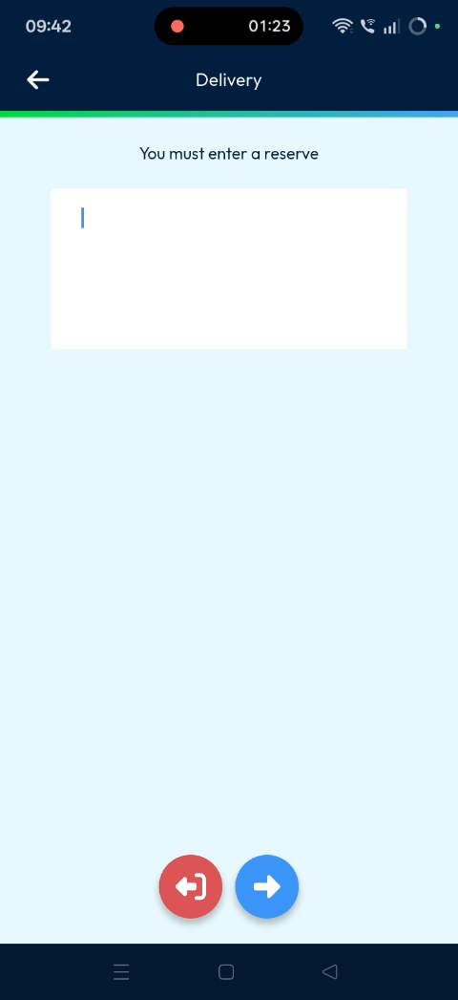
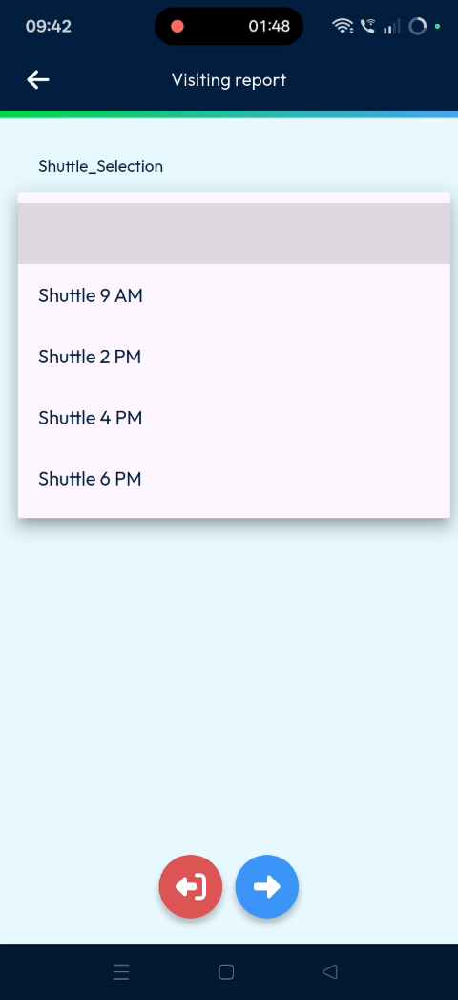
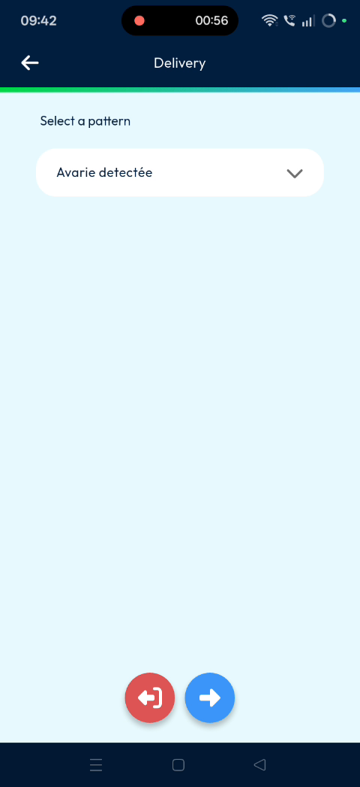
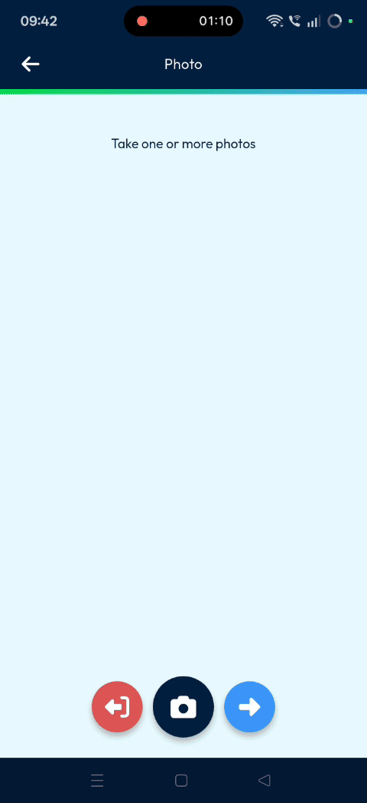
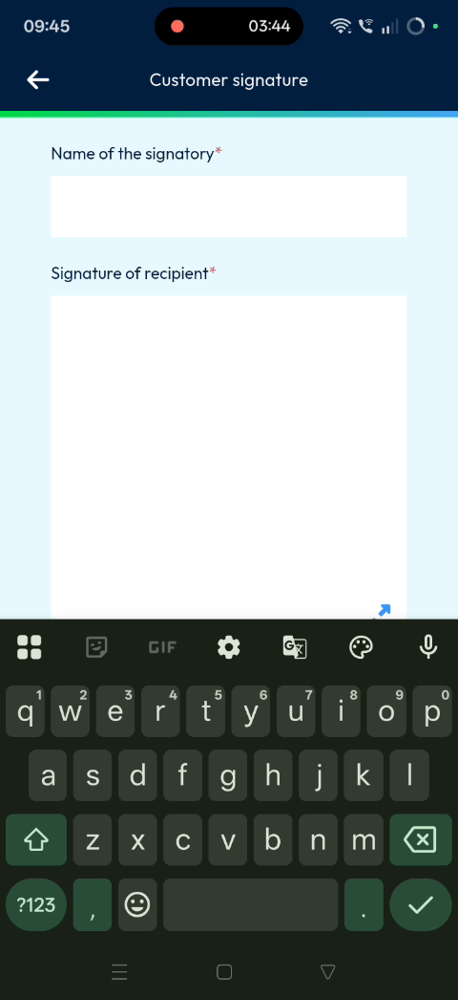
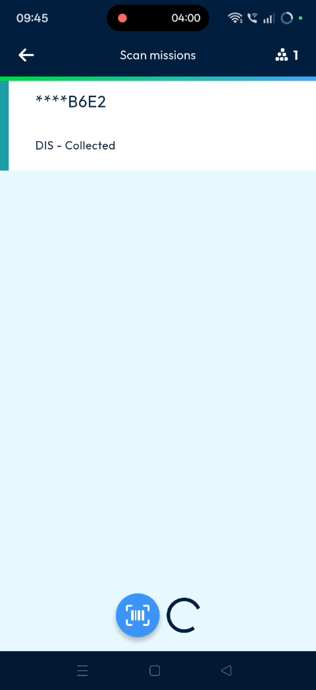

# statuschange
# statuschange

Update the status of parcels and machines to maintain real-time tracking for the back office. This feature allows you to move items through collection and delivery workflows efficiently. You will achieve full visibility and process continuity by accurately recording each stage of the logistics cycle,.

### Getting Started

Prerequisites:
*   Active dispatch user login credentials,.
*   Access to the device's camera for barcode scanning,.

1. Tap on **Scan**,.

2. Open the **Barcode scanner** and scan the item,.

3. Tap the **Tick mark** to log in as a dispatch user,.

### Feature Overview

*   **DA is collected**: Toggle this switch to record that a parcel has been collected.

*   **Delivered**: Toggle this switch to mark an item as successfully delivered,.

*   **Reserve name**: Enter the name of the recipient or the person handling the item,.

*   **Shuttle**: Select the specific shuttle or timing for the delivery reservation,,.

### How To: Update Status to Collected

1. Toggle the **DA is collected** option.

2. Select the appropriate **Pattern**,.

3. Tap the **Right arrow**,.

4. Take a snap of the parcel,.

5. Tap the **Right arrow**,.

6. Enter the **Reserve name**,.

7. Tap the **Right arrow** to set the **Shuttle** selection timing,.

8. Tap the **Right arrow** and then the **Tick mark**,.

9. Tap **Confirm** on the validation pop-up,.

### How To: Update Status to Delivered

1. Scan the same machine and tap the **Tick mark**,.

2. Toggle the **Delivered** status,.

3. Toggle the **Confirm** button,.

4. Take a snap of the item,.

5. Tap the **Tick mark**,.

6. Enter the **Reserve name** and tap the **Right arrow**,.

7. Select the **Shuttle** and tap the **Right arrow**,.

8. Obtain the signature of the recipient on the screen,.

9. Tap the **Tick mark**,.

10. Tap **Confirm** on the validation pop-up,,.

### Productivity Tips

*   💡 **Dispatcher Privileges**: Logging in as a dispatcher allows you to change multiple statuses like collected and delivered,.
*   💡 **Workflow Automation**: Completing a status change automatically triggers the next step in the delivery workflow,.
*   ⚠️ **Login Required**: You must be logged in as a dispatch user to ensure status changes sync with the back office,.

