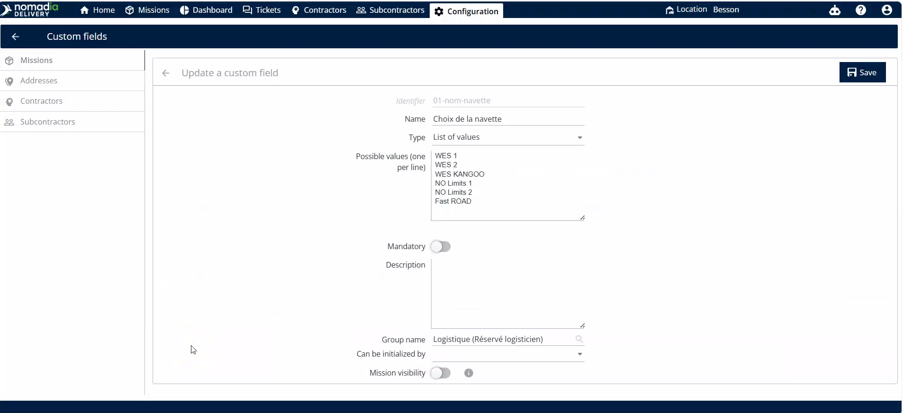
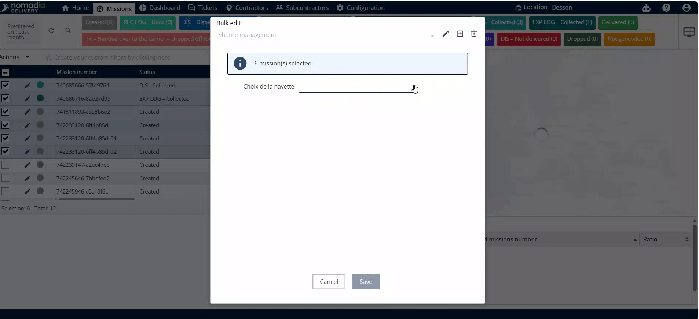
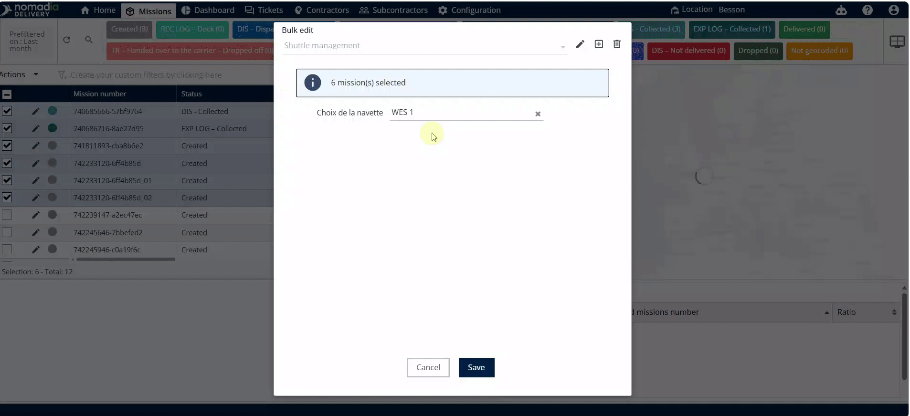

# Shuttle Management

Shuttle management allows you to organize and name your transportation fleet resources. Use this feature to customize shuttle identifiers and assign them to specific missions. This ensures accurate tracking and planning for your logistics operations.

#### Getting Started

* Access to the **Nomadia Delivery** dashboard.
* Administrative permissions to edit **Custom Fields** and **Missions**.
* Log in to your account and navigate to the **Configuration** menu.

#### Feature Overview

* **Configuration**: The main menu for system-level settings and data structure.
* **Custom Fields**: A section to define and edit specific data labels like shuttle names.
* **Pencil Icon**: The edit button used to modify the names of existing shuttles.
* **Missions**: The module where all fleet units and hardware are listed and managed.
* **Actions**: A button that opens a menu of mass-management tools for selected items.
* **Bulk Edit**: A tool to apply the same change to multiple machines simultaneously.

#### How To: Update Shuttle Names

1. Go to **Configuration**.

2. Click **Custom Fields**.
3. Click the **Pencil Icon** next to the shuttle field name.

4. Modify the list of shuttle names as needed.
5. Click on **Save**.

#### How To: Assign Shuttles to Missions

1. Go to **Missions**.
2. Select the checkbox for the missions you want to update.

3. Click on **Actions**.
4. Click on **Bulk Edit**.

5. Click the drop-down menu next to **Shuttle Names**.

7. Select one shuttle name from the list.
8. Click on **Save**.

#### Productivity Tips

* 💡 **Bulk Updates**: Save time by using the **Bulk Edit** feature to assign the same shuttle to multiple machines at once.
