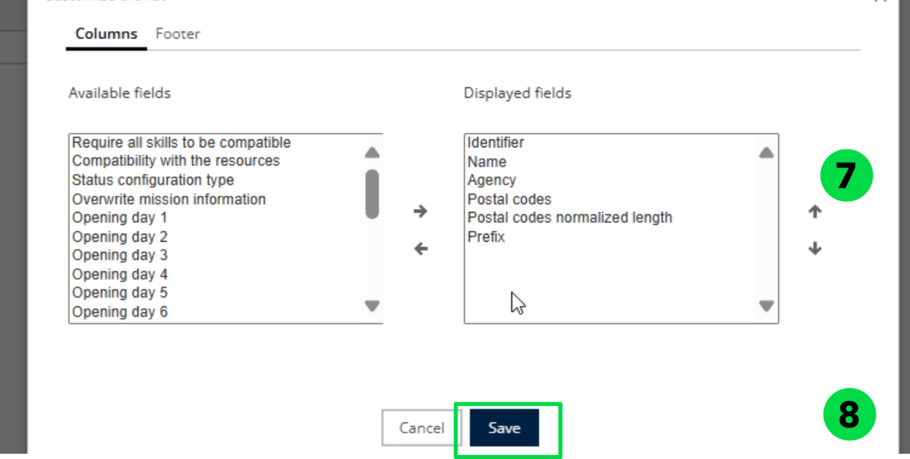
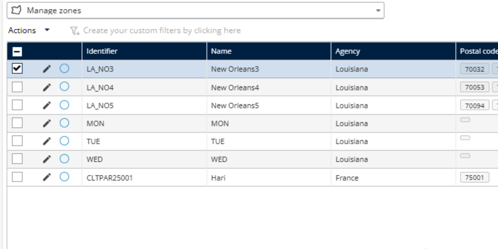

# Customize Zones Table

1. Click on Configuration Tab
2. Click on Manage studies and zones
3. The available missions are displayed in a list.
4. Select a Mission
5. Click the Actions dropdown menu.
6. Click on Customize Limit

7. Choose which fields you want to display on the table.

**Note**: Avoid selecting too many fields at once, as it may become difficult to read or

navigate.

8. Click on Save

The selected fields have been displayed on the table.

