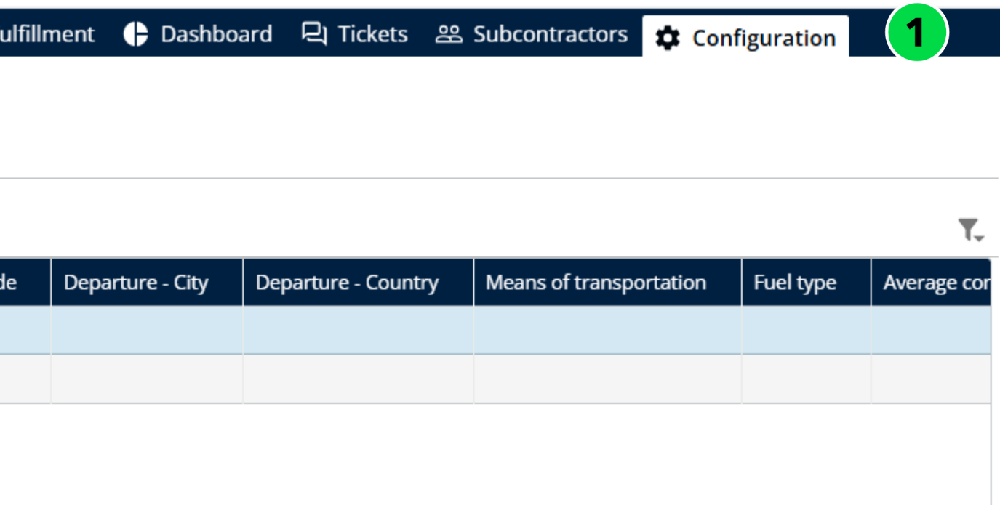
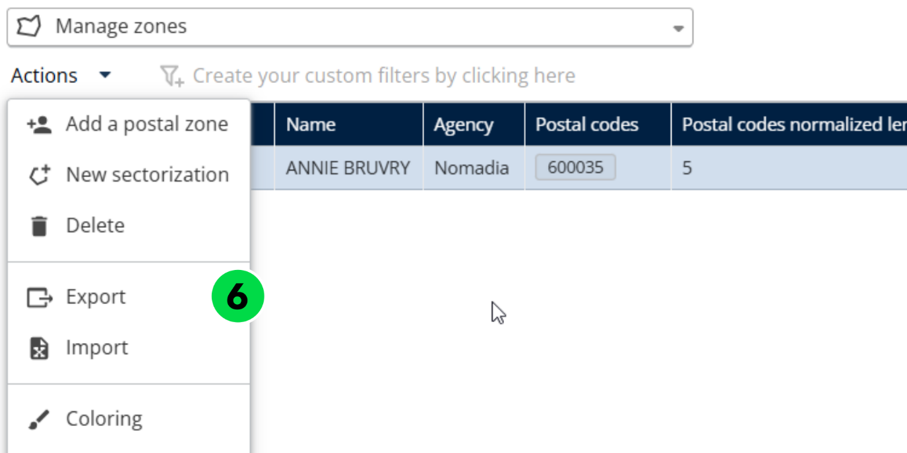
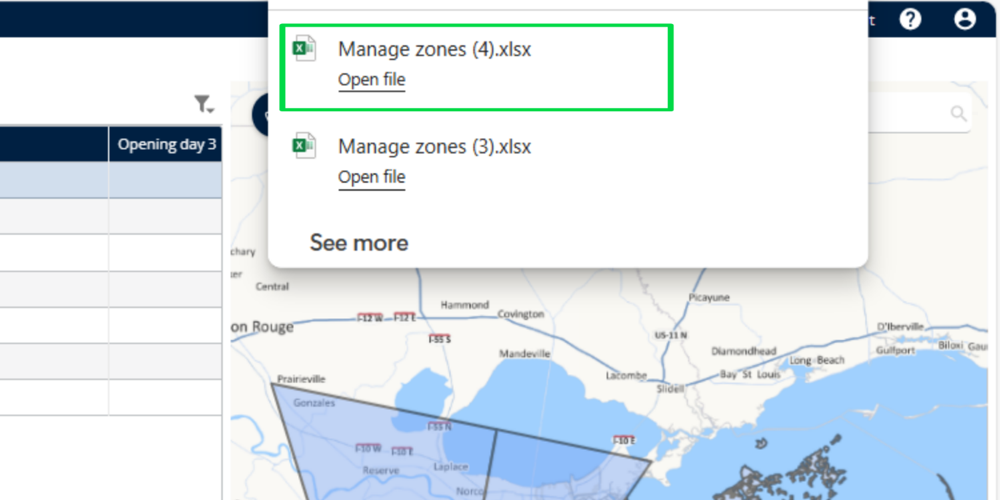
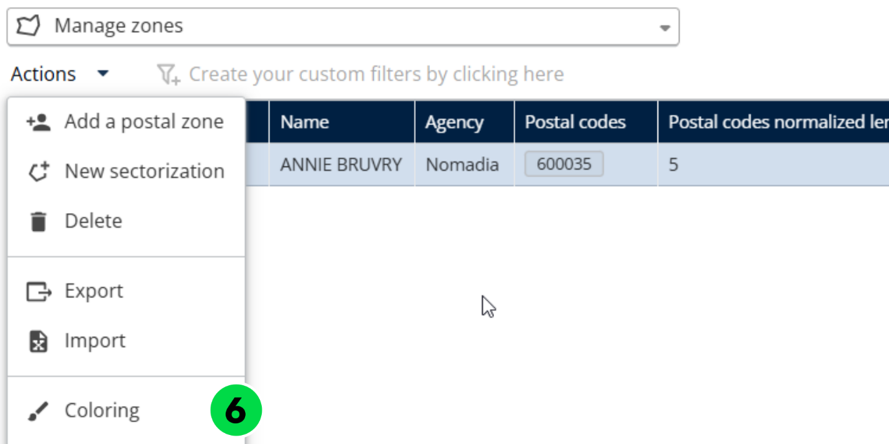
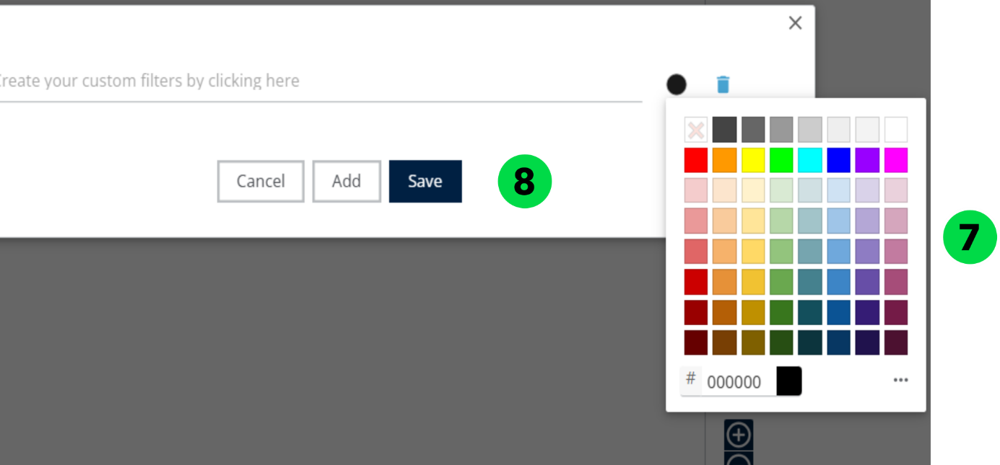
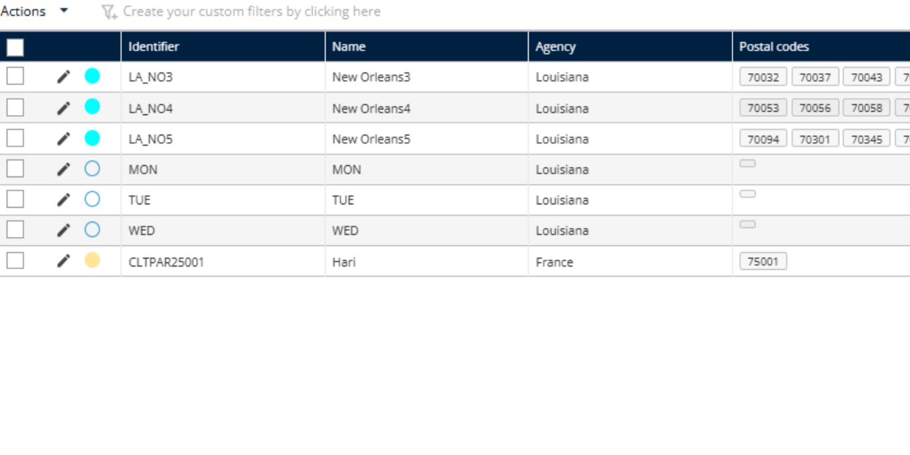

# Manage Postal Zones

The Manage Postal Zones feature allows administrators and logistics managers to define and manage geographical delivery zones based on postal codes. These zones are essential for organizing deliveries, assigning resources, and optimizing routes within specific areas

#### Import Postal Zones

1. Click on Configuration Tab

2. Click on Configuration Menu
3. Under My data section, click on Manage Zones

.png>)

4. Click the Actions dropdown menu.
5. Click on Import

.png>)

6. Click on Browse File to upload the file that contains the zone data.

.png>)

7. Select a valid Zone file from your local system.

.png>)

Postal Zones will be imported successfully.

.png>)

#### Add a Postal Zone

1. Click on Configuration Tab
2. Click on Configuration Menu
3. Under My data section, click on Manage Zones
4. Click the Actions dropdown menu.
5. Click on Add a Postal Zone.

.png>)

6. Fill in the required fields: Code, Name, and Prefix.

**Note**: The Prefix is used to standardize postal codes to a fixed length of 6 digits. In regions where postal codes are shorter (e.g., 5 digits in some areas of France), the system automatically adds the defined prefix to reach the required length.

.png>)

7. Click on Save

.png>)

Postal Zones will be added successfully

.png>)

#### Delete a Postal Zone

1. Click on Configuration Tab
2. Click on Configuration Menu
3. Under My data section, click on Manage Zones
4. Select a Zone

.png>)

5. Click the Actions dropdown menu.
6. Click on Delete

.png>)

7. You will see a confirmation pop-up message stating: "Are you sure you want to delete this zone?"
8. Click on Yes

.png>)

Postal Zone will be deleted successfully

.png>)

#### Export a Postal Zone

1. Click on Configuration Tab
2. Click on Configuration Menu
3. Under My data section, click on Manage Zones
4. Select a Zone
5. Click the Actions dropdown menu.
6. Click on Export

Postal Zone will be exported successfully

#### Color a Postal Zone

Apply conditions based on zone attributes such as type of mission (Delivery, Pickup), Zone priority, Assigned deliverer, Postal code prefix, etc.

1. Click on Configuration Tab
2. Click on Configuration Menu
3. Under My data section, click on Manage Zones
4. Select a Zone
5. Click the Actions dropdown menu.
6. Click on Coloring

7. Choose a Color
8. Click on Save

The selected color has been applied successfully.

