# parenttochildinheritance
Here is the complete user guide for the **parenttochildinheritance** feature in **Nomadia Delivery**, tailored for transport dispatchers and planners. This document is fully formatted, verified against the video source, and ready for use.

***

# parenttochildinheritance

The **parenttochildinheritance** feature automatically synchronizes settings from a parent container to its child containers. This eliminates the need to manually update each individual child container. Enable this to save time and ensure data consistency across your fleet.

### Getting Started

Prerequisites and system requirements:
* Active account in **Nomadia Delivery** with **Configuration** panel access.
* Parent and child containers configured with correct identifiers.

Steps:
1. Navigate to the **Configuration** menu.

   

2. Click on **Container Types**.

### Feature Overview

* **Inherit sub status to child machines**: This toggle switch automatically passes parent container status to child containers.

  

* **Palette**: This icon opens configuration options for a specific container type.

  

* **Pencil icon**: This edit button opens the configuration mode for a machine.

  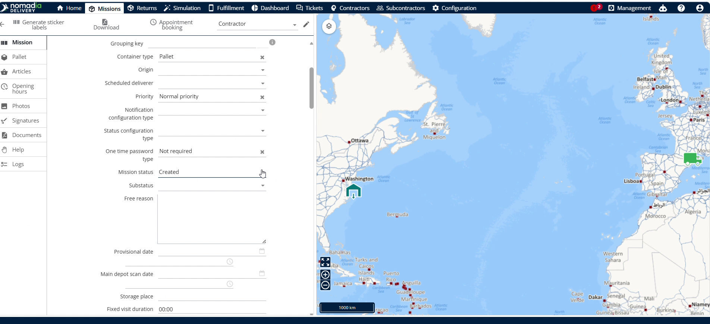

* **Inherit attributes to child machines**: This setting automatically copies parent details to child containers.

  

* **Inherit documents to child machines**: This option automatically shares parent documents with child containers.

  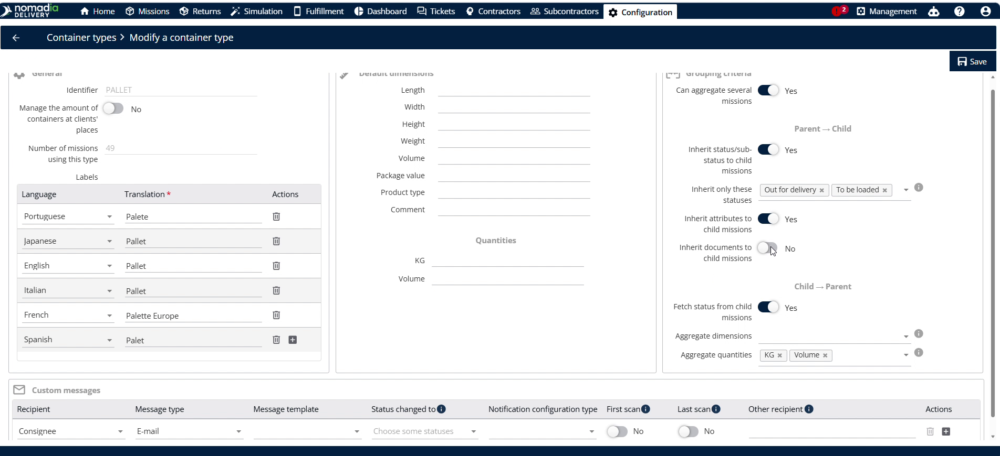

### How To: Enable and Inherit Machine Sub Statuses

1. Navigate to the **Configuration** menu.

   

2. Click on **Container Types**.
3. Scroll down to see the correct identifier.
4. Click the **Palette** icon.

   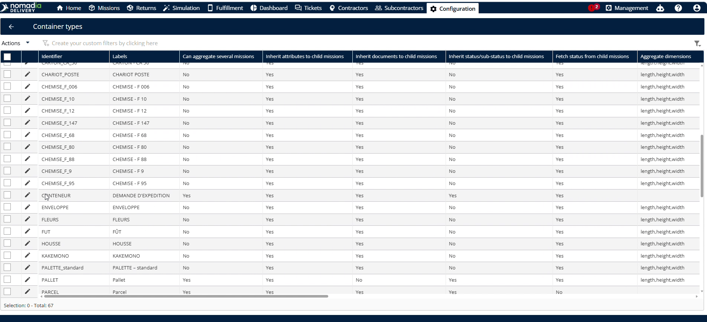

5. Toggle **Inherit sub status to child machines** to **Yes**.

   

6. Click on the **Save** button.

   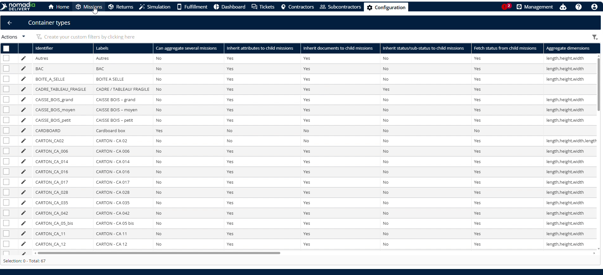

7. Go to **Machines**.
8. Click the **Pencil icon** next to the parent container machine number.

   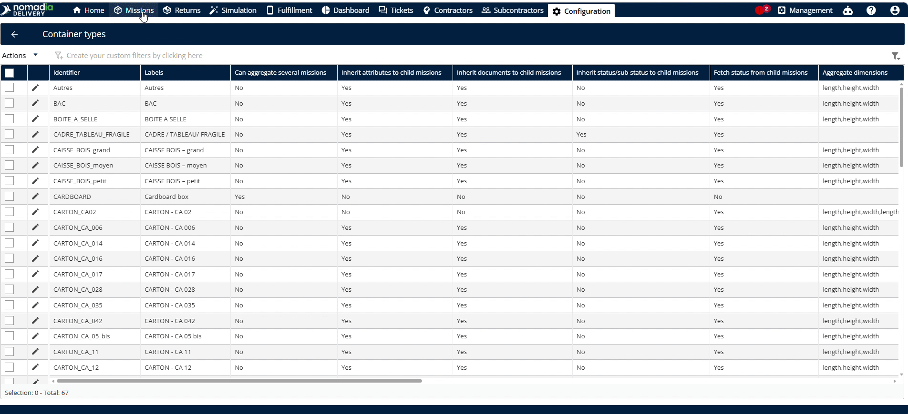

9. Change the **Machine status**.

   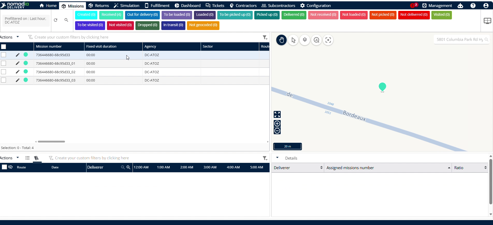

10. Click on **Save**.

    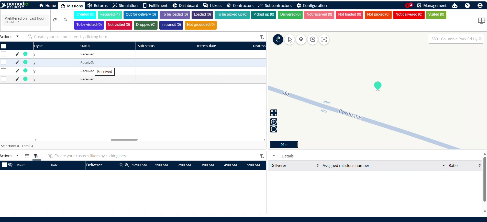

### How To: Select and Inherit Custom Machine Statuses

1. Go to **Configuration**.
2. Click **Container Types**.
3. Scroll down to see the current identifier.

   

4. Select specific child status options like **Out for delivery** and **To be loaded**.

   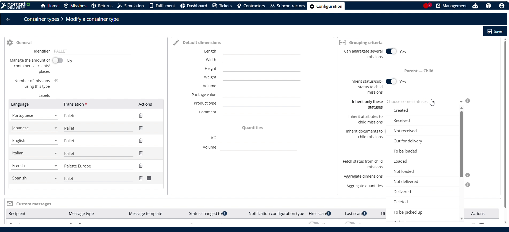

5. Click the **Save button**.

   

6. Go to **Machines**.
7. Click the **Parent container**.

   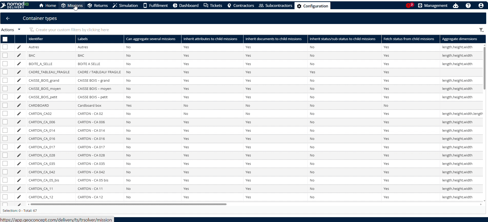

8. Select the status configured in container types, such as **Out for delivery**.

   

9. Click on **Save**.

   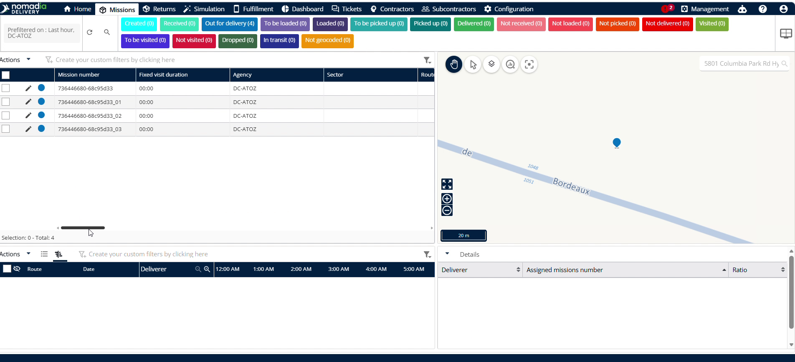

### How To: Inherit Attributes to Child Containers

1. Navigate to **Configuration**.
2. Click on **Container Types**.
3. Toggle **Inherit attributes to child machines** to enable it.

   

4. Click on **Save**.

   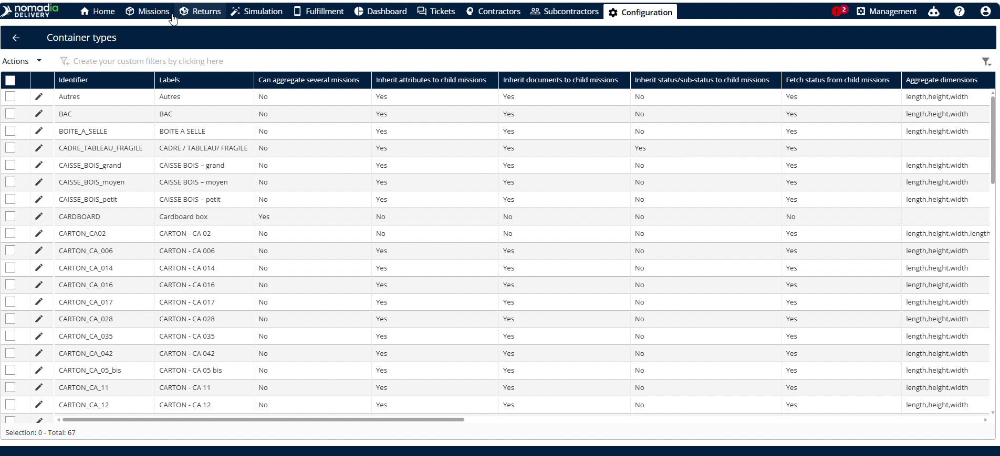

5. Go to **Machines**.
6. Click the **Parent container**.

   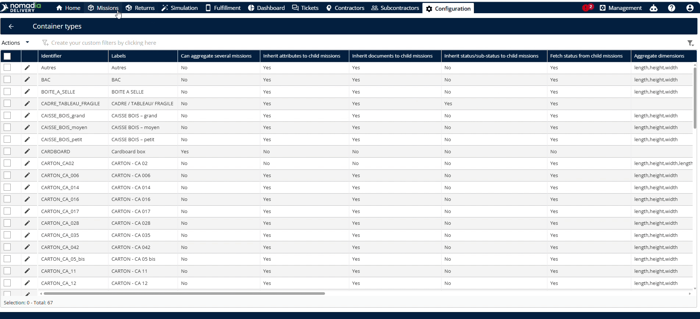

7. Correct the **Address** if the address is wrong.

   

8. Click on **Save**.

   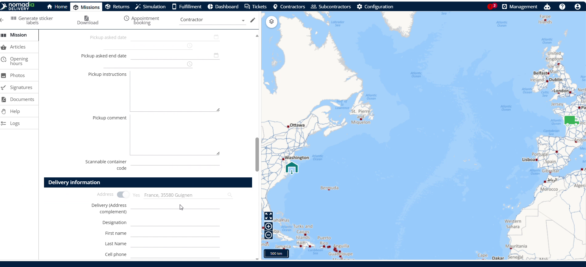

### How To: Inherit Documents to Child Containers

1. Navigate to **Configuration**.
2. Click on **Container Types**.
3. Toggle **Inherit documents to child machines** to enable it.

   

4. Click on **Save**.

   

5. Go to **Machines**.
6. Click the **Parent container**.

   

7. Click **Browse the computer**.
8. Select the **PDF** file.

   

9. Click the **Save button**.

   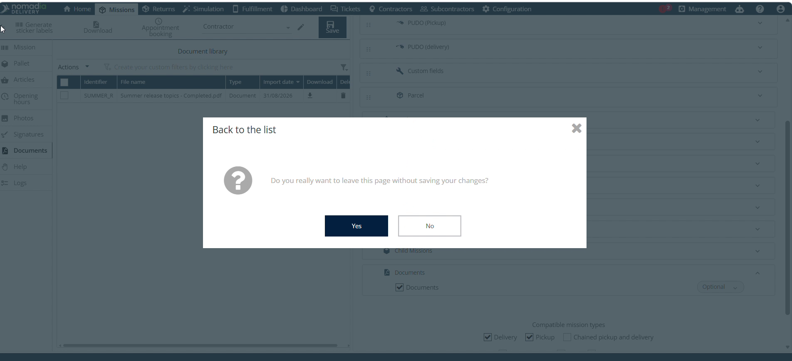

#### Troubleshooting: Unsaved Changes Warning

If you attempt to go back without saving after uploading documents, a pop-up window will display.

1. Click **No** on the pop-up window to stay on the page.

   

2. Click the **Save button** to complete the upload.

   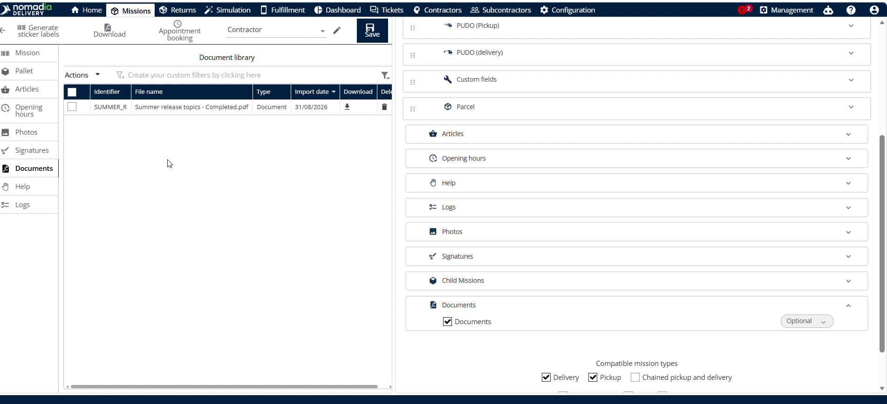

### Productivity Tips

* 💡 **Automatic Syncing**: Updating parent container status, address, or documents automatically updates child containers.
* ⚠️ **Avoid Unsaved Documents**: Do not click the back button before saving uploaded PDF files to prevent data loss.

***

✏️ **Would you like me to make any adjustments to this guide, such as modifying the target file parameters or changing the screenshot layout?**

