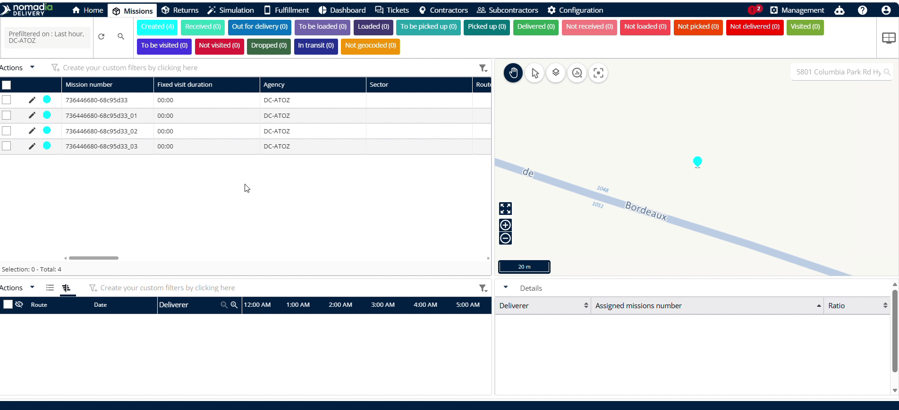
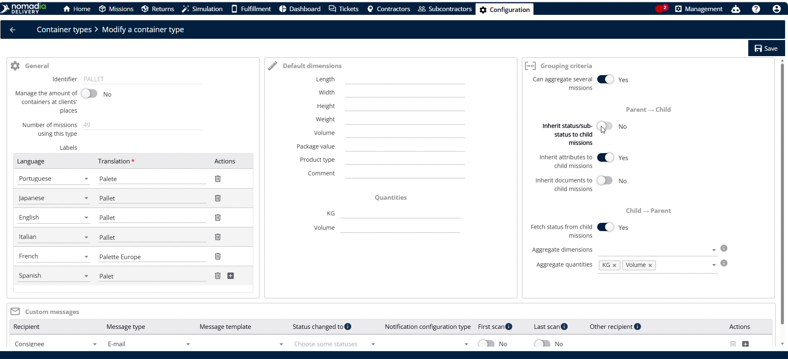
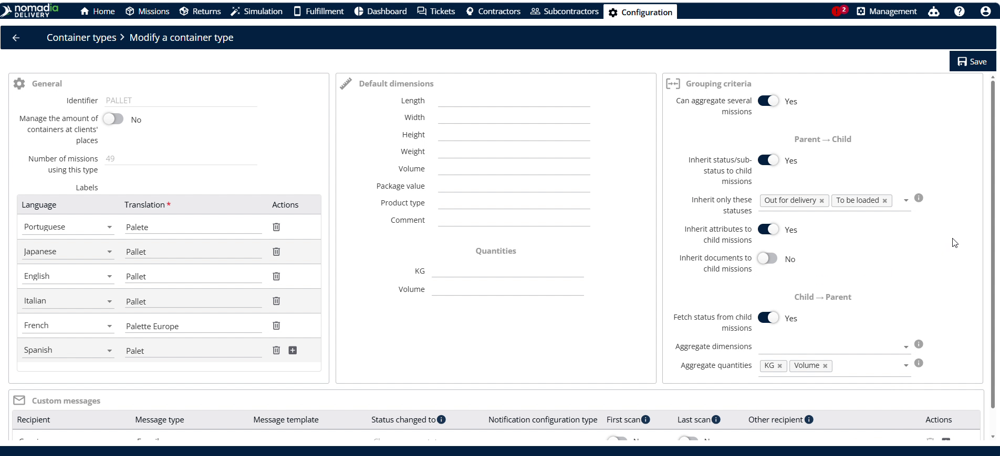
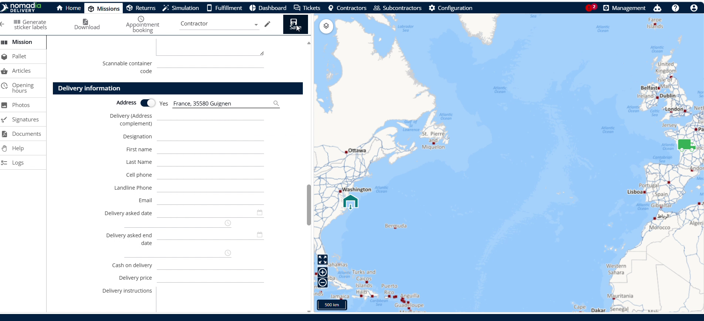
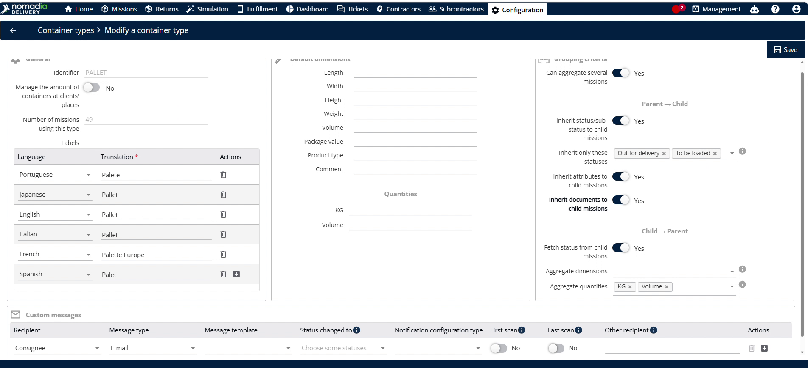
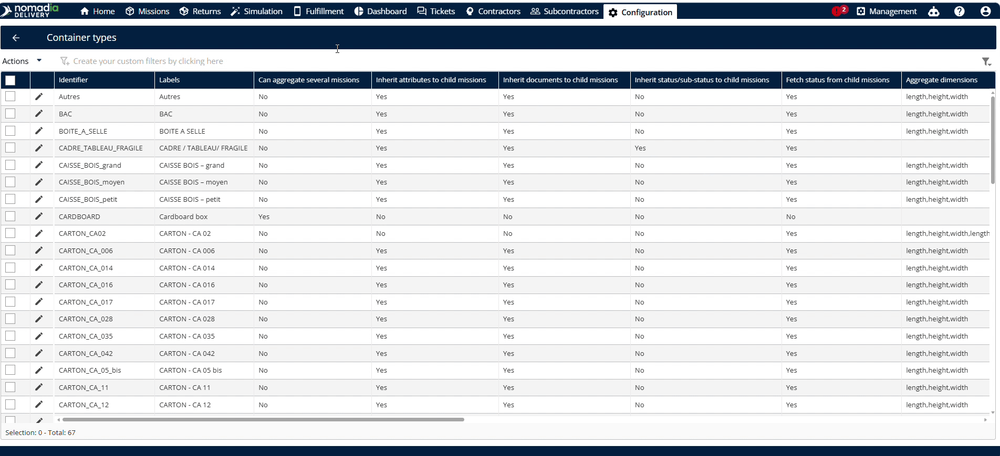
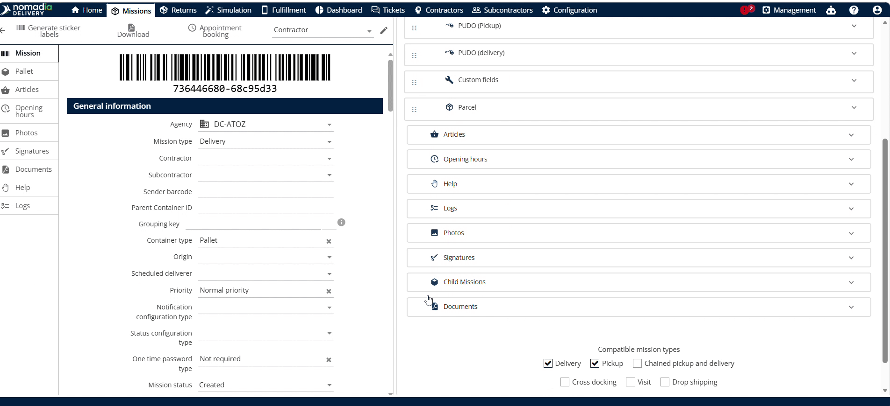

# Parent to Child Inheritance

The **Parent to Child Inheritance** feature automatically synchronizes settings from a parent container to its child containers. This eliminates the need to manually update each individual child container. Enable this to save time and ensure data consistency across your fleet.

#### Getting Started

Prerequisites and system requirements:

* Active account in **Nomadia Delivery** with **Configuration** panel access.
* Parent and child containers configured with correct identifiers.

Steps:

1. Navigate to the **Configuration** menu.
2. Click on **Container Types**.

#### Feature Overview

* **Inherit sub status to child missions:** This toggle switch automatically passes parent container status to child containers.
* **Pallet:** This icon opens configuration options for a specific container type.
* **Pencil icon**: This edit button opens the configuration mode for a mission.
* **Inherit attributes to child missions:** This setting automatically copies parent details to child containers.
* **Inherit documents to child missions**: This option automatically shares parent documents with child containers.

#### How To: Enable and Inherit Mission Sub Statuses

1. Navigate to the **Configuration** menu.

2. Click on **Container Types**.
3. Scroll down to see the correct identifier.
4. Click the **Pallet** icon.
5. Toggle **Inherit sub status to child missions** to **Yes**.
6. Click on the **Save** button.

4. Go to **Missions**.
5. Click the **Pencil icon** next to the parent container mission.
6. Change the **Mission status**.
7. Click on **Save**.

The status has been updated for all child missions.

#### How To: Select and Inherit Custom Mission Statuses

1. Go to **Configuration**.
2. Click **Container Types**.
3. Scroll down to see the current identifier.
4. Select specific child status options like **Out for delivery** and **To be loaded**.

5. Click the **Save button**.

6. Go to **Missions**.
7. Click the **Parent container**.
8. Select the status configured in container types, such as **Out for delivery**.

9. Click on **Save**.

The status has been updated for all child missions.

#### How To: Inherit Attributes to Child Containers

1. Navigate to **Configuration**.
2. Click on **Container Types**.
3. Toggle **Inherit attributes to child missions** to enable it.
4. Click on **Save**.

5. Go to **Missions**.
6. Click the **Parent container**.
7. Correct the **Address,** if the address is wrong.
8. Click on **Save**.

The status has been updated for all child missions.

<figure><figcaption></figcaption></figure>

#### How To: Inherit Documents to Child Containers

1. Navigate to **Configuration**.
2. Click on **Container Types**.
3. Toggle **Inherit documents to child missions** to enable it.

4. Click on **Save**.

5. Go to **Missions**.
6. Click the **Parent container**.

7. Click **Browse the computer**.
8. Select the **PDF** file.

**Troubleshooting: Unsaved Changes Warning**

If you attempt to go back without saving after uploading documents, a pop-up window will display.

9. Click **No** on the pop-up window to stay on the page.

10. Click the **Save button** to complete the upload.

The document will be reflected in the child container.

<figure><figcaption></figcaption></figure>

#### Productivity Tips

* 💡 **Automatic Syncing**: Updating parent container status, address, or documents automatically updates child containers.
* ⚠️ **Avoid Unsaved Documents**: Do not click the back button before saving uploaded PDF files to prevent data loss.
