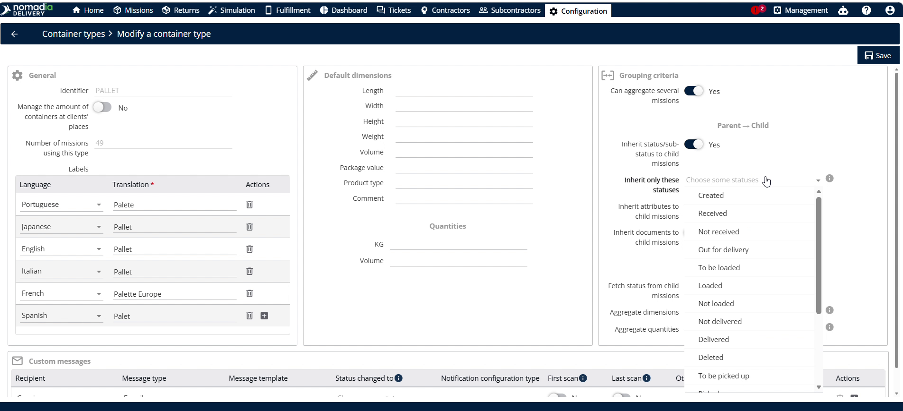
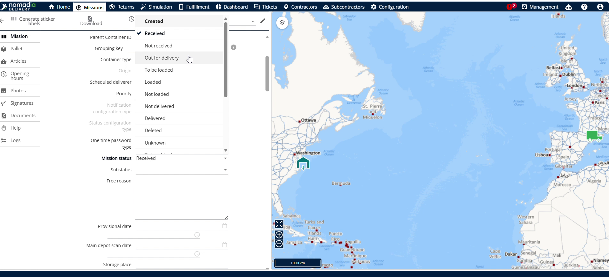
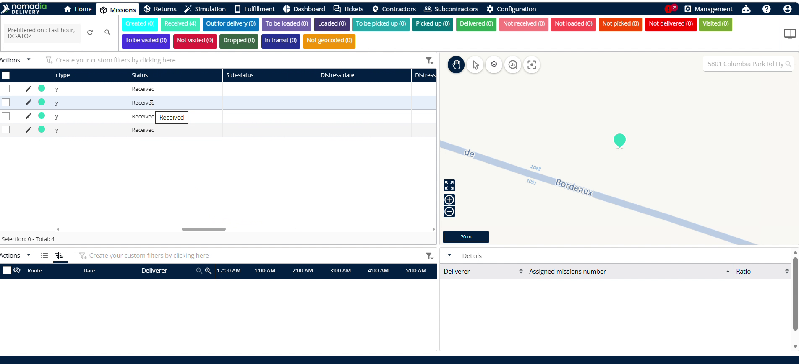
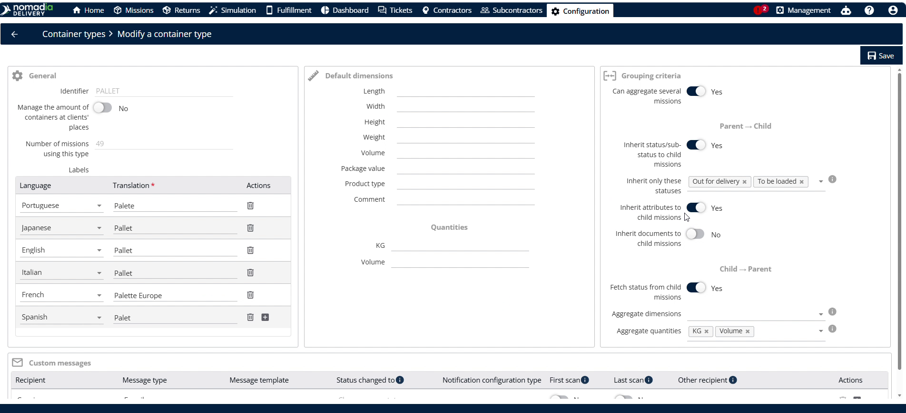
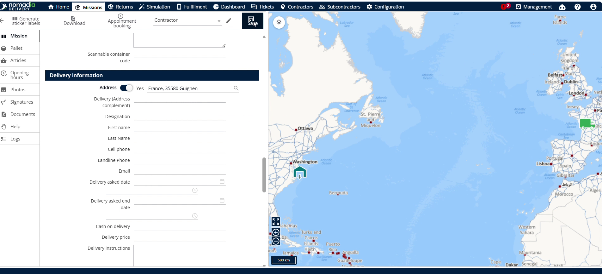
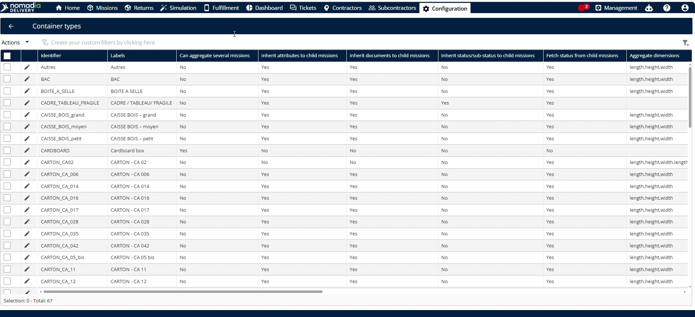

# Parent to Child Inheritance

The **Parent to Child Inheritance** feature automatically synchronizes settings from a parent container to its child containers. This eliminates the need to manually update each individual child container. Enable this to save time and ensure data consistency across your fleet.

#### Getting Started

Prerequisites and system requirements:

* Active account in **Nomadia Delivery** with **Configuration** panel access.
* Parent and child containers configured with correct identifiers.

Steps:

1. Navigate to the **Configuration** menu.
2. Click on **Container Types**.

#### Feature Overview

* **Inherit sub status to child missions:** This toggle switch automatically passes parent container status to child containers.
* **Sub status inheritance:** Sub statuses can be inherited by child containers in the same way as statuses.
* **Pallet and Pencil icons:** The pallet icon opens configuration options for a specific container type, and the pencil icon opens the configuration mode for a mission.
* **Inherit attributes to child missions:** This setting automatically copies parent details to child containers.
* **Inherit documents to child missions**: This option automatically shares parent documents with child containers.

#### How To: Status/sub-status

1. Navigate to the **Configuration** menu.

2. Click on **Container Types**.
3. Scroll down to see the correct identifier.
4. Edit any container type from the list.
5. Toggle **Inherit sub status to child missions** to **Yes**.
6. Select the status that needs to be inherited, such as **Out for delivery** and **To be loaded**.

7. Click on the **Save** button.

8. Go to **Missions**.
9. Click the **Pencil icon** next to the parent container mission.
10. Change the **Mission status** to the status configured in container types, such as **Out for delivery**.

11. Click on **Save**.

The status has been updated for all child missions.

#### How To: Inherit Attributes to Child Containers

1. Navigate to **Configuration**.
2. Click on **Container Types**.
3. Toggle **Inherit attributes to child missions** to enable it.
4. Click on **Save**.

5. Go to **Missions**.
6. Click the **Parent container**.
7. Correct the **Address,** if the address is wrong.
8. Click on **Save**.

Only the address has been updated for all child missions. The status is not updated when attributes are inherited.

<figure><figcaption></figcaption></figure>

#### How To: Inherit Documents to Child Containers

1. Navigate to **Configuration**.
2. Click on **Container Types**.
3. Toggle **Inherit documents to child missions** to enable it.

4. Click on **Save**.

5. Go to **Missions**.
6. Click the **Parent container**.

7. Click **Browse the computer**.
8. Select the **PDF** file.

9. Click the **Save button** to complete the upload.

The document will be reflected in the child container.

<figure><figcaption></figcaption></figure>

#### Productivity Tips

* 💡 **Automatic Syncing**: Updating parent container status, sub-status, address, or documents automatically updates child containers.
