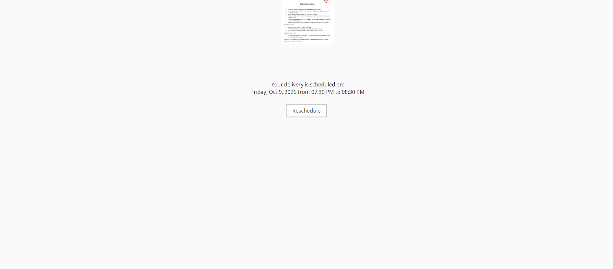
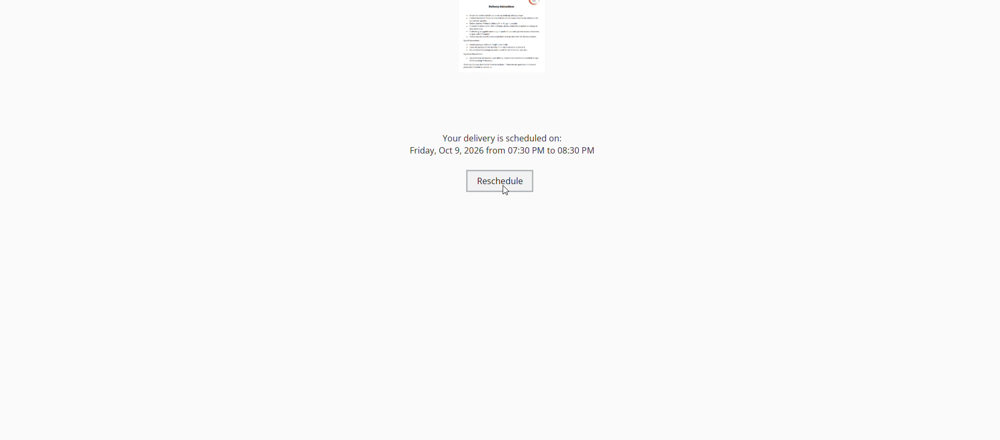
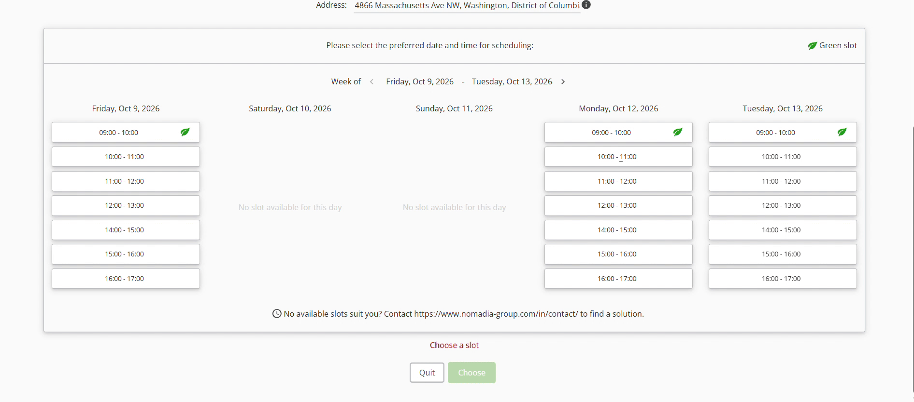

# prebookingtheslotmultipletimes
# prebookingtheslotmultipletimes

Nomadia Delivery allows dispatchers to pre-book and reschedule time slots multiple times using the original booking link. This feature simplifies scheduling changes without requiring new booking link creation. Users can quickly update delivery timings to ensure seamless operational planning.

### Getting Started

Prerequisites:
- Active access to the Nomadia Delivery platform.
- An existing slot booking scheduled for a delivery.
- Access to the original booking link received during first confirmation.

Initial Setup Steps:
1. Locate the initial confirmation message containing the **Booking Link**.

2. Click the **Booking Link** to open the schedule management page.

3. View the landing page displaying your currently scheduled date and timing details.

### Feature Overview

- **Booking Link**: Re-opens the scheduling page using the original link sent during initial slot booking.

- **Scheduled Date and Timing**: Shows the current confirmed date and time slot for the delivery.

- **Reschedule Option**: Opens available alternative time slots for rebooking.

- **Available Date and Timings**: Displays selectable date and time options for pre-booking.

- **Choose / Book Button**: Confirms and saves the selected time slot.

### How To: Reschedule a Pre-Booked Slot

1. Click the original **Booking Link** received when booking the first slot.

2. Confirm your current slot details under **Scheduled Date and Timing**.

3. Click the **Reschedule Option** located below the current schedule details.

4. Review the list of **Available Date and Timings**.

5. Select your preferred timing and click **Choose** to book the slot.

### Productivity Tips

- 💡 **Reuse Original Booking Links**: Re-open the same booking link received during initial reservation to quickly change slot timings without generating new requests.

---

📅 *Would you like me to create a downloadable PDF user guide or slide presentation based on this workflow?*

