# receptionmanagement
# receptionmanagement

The **reception management** feature allows dispatchers to manage, verify, and track container deliveries from the field. Enable this feature to automatically receive complete reports and monitor scan logs in real-time. This ensures accurate inventory management and maintains clear communication with your contractors.

### Getting Started

Ensure you have the following system requirements and configurations set up:
- Access to the **Nomadia Delivery** back-office portal.
- A registered contractor email address to receive automatic reports.
- The mobile application installed on field devices.

Follow these steps for initial setup:

1. Navigate to the **Configuration** menu in the portal.

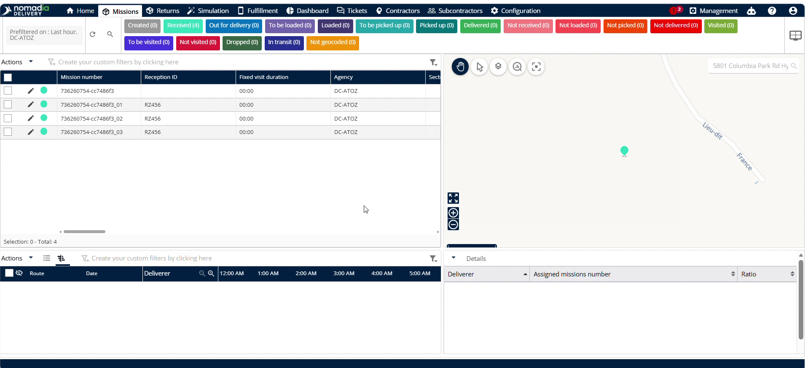

2. Click **Configure the mobile app**.

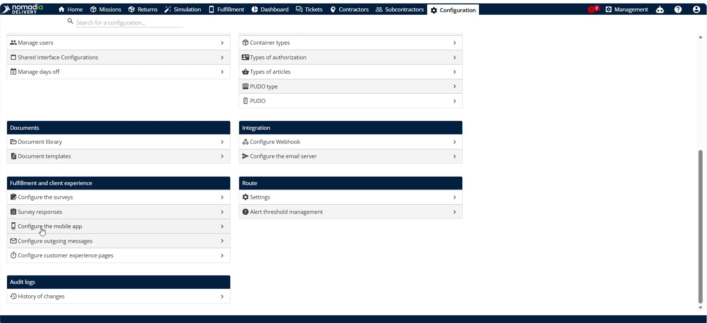

3. Enable the **Ask for reception ID** and **Send reception report** toggles under the **Reception** column.

4. Click **Save** to apply the configuration.

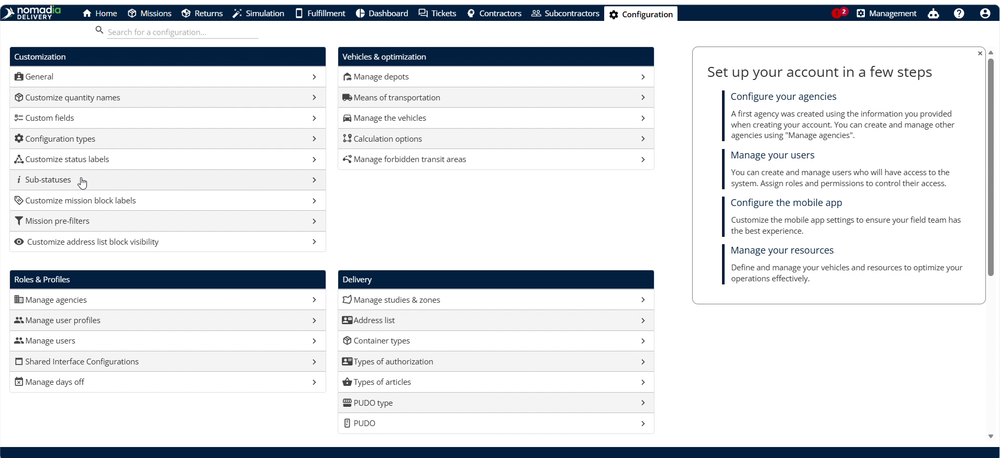

5. Go to the **Sub Status** menu and click the **pencil icon** next to the **Received** sub-status.

6. Enable the **Scan all the items in the container** toggle.

7. Click **Save** to update the sub-status rules.

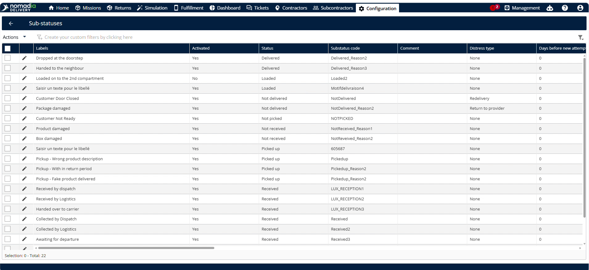

### Feature Overview

The following UI elements control your reception tracking workflow:

* **Configure the mobile app**: Opens the mobile settings panel to customize field worker workflows.

* **Ask for reception ID**: Prompts drivers for a reception identifier to ensure all received shipments are uniquely tracked.

* **Send reception report**: Automatically emails receiving summaries to contractors to replace manual delivery reports.

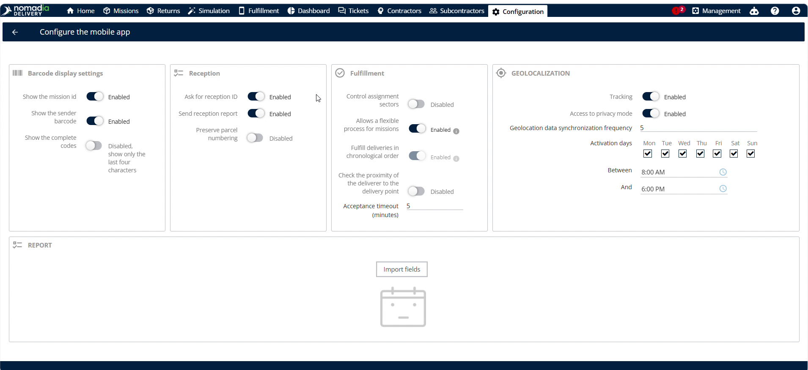

* **Scan all the items in the container**: Forces drivers to scan every package to prevent missed or incorrect deliveries.

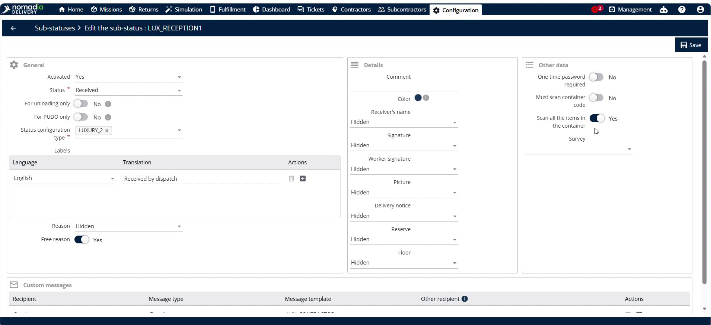

* **Customize the list**: Adjusts columns in the back-office view to select displayed columns.

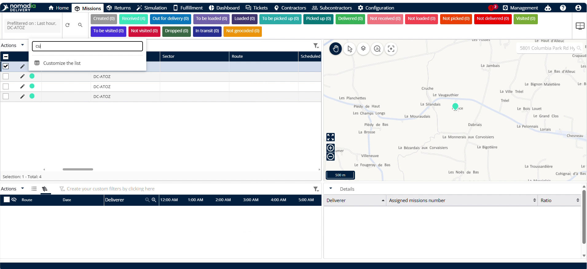

* **Sub ID**: Displays the mobile-entered reception identifier to allow quick tracking directly from the list.

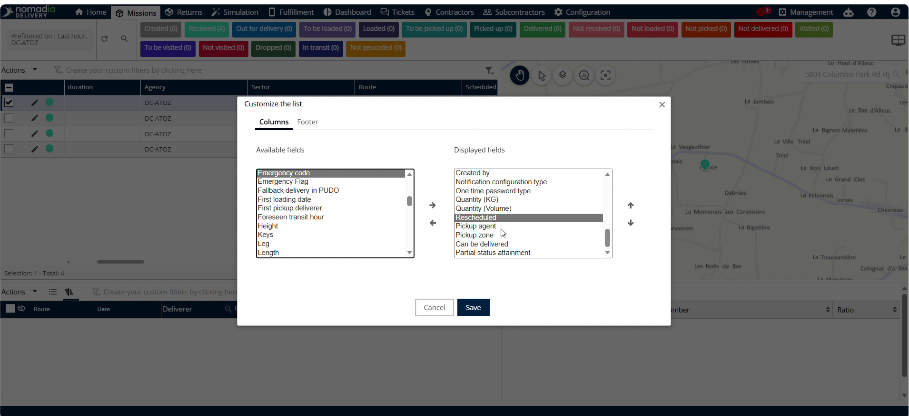

### How To: Associate a Contractor with a Machine Container

1. Navigate to the **Machines** menu.

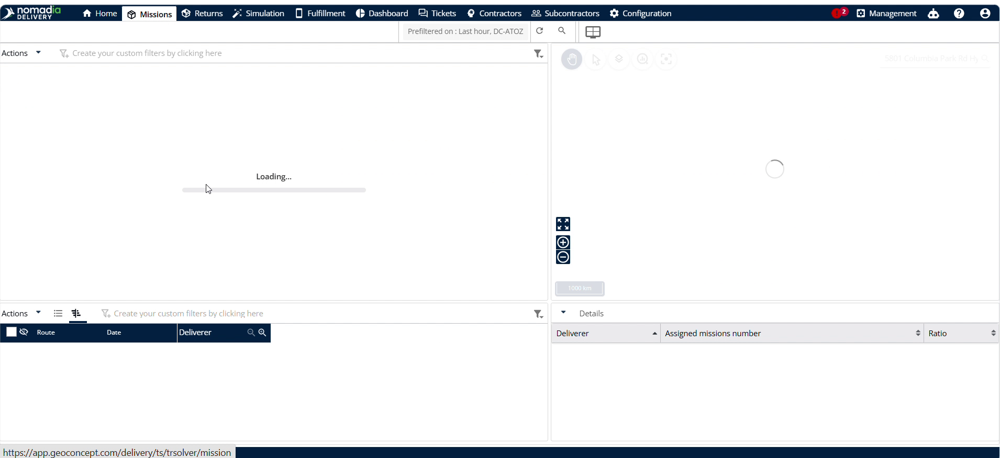

2. Click **Create** or edit an existing machine container.

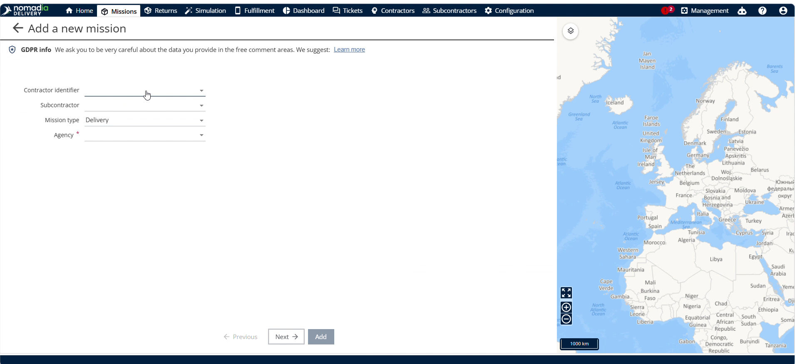

3. Select the associated **Contractor** for the container.

4. Click **Add** to save the container.

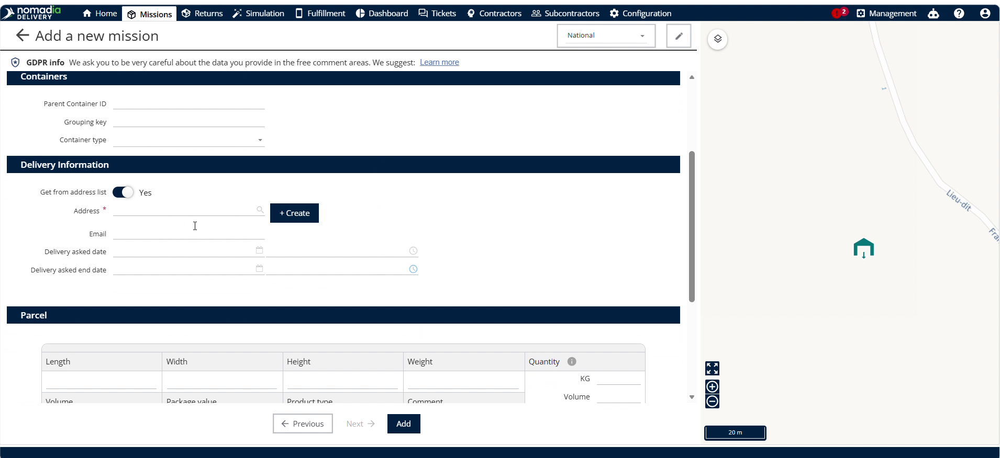

#### Troubleshooting: Unsaved Changes Warning
If you attempt to navigate away without saving, a popup warning will appear.

- Click **No** to stay on the page and save your changes.
- Click **Yes** to leave the page and discard progress.

### How To: Scan and Receive Containers in the Mobile Application

1. Open the mobile application on your field device.

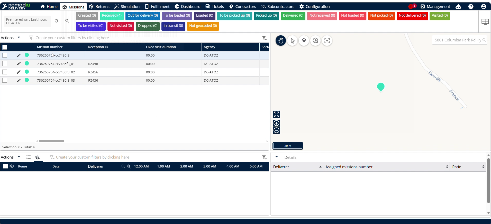

2. Scan the **Parent container form**.

3. Enter the **Reception name** and **Reception ID** when prompted.

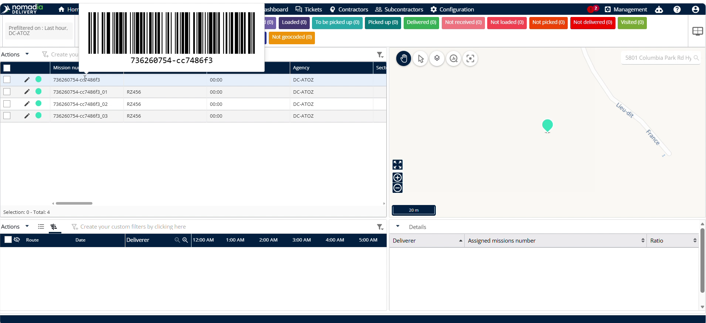

4. Select the appropriate **Reason** from the dropdown menu.

5. Scan all packages to complete the receiving process.

### How To: Display Reception IDs in the Back-Office List

1. Navigate to the main list view in the portal.

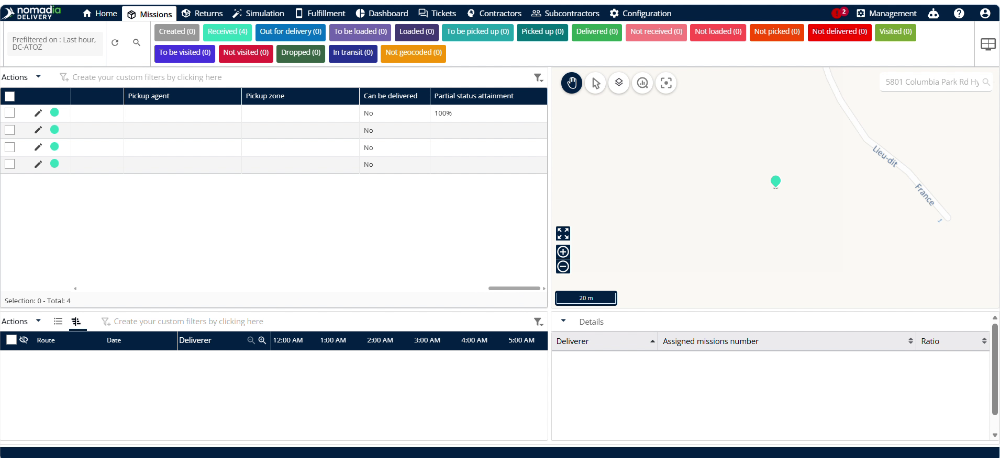

2. Click **Customize the list**.

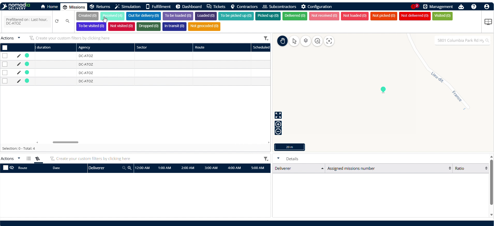

3. Locate the **Sub ID** field and ensure it is selected for display.

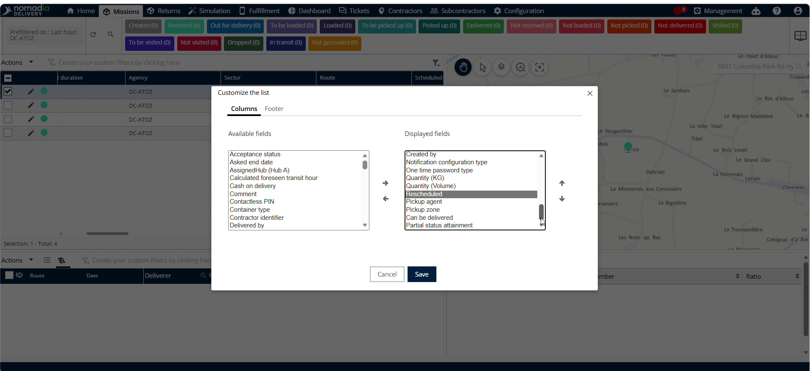

4. Click **Save** to update the list columns.

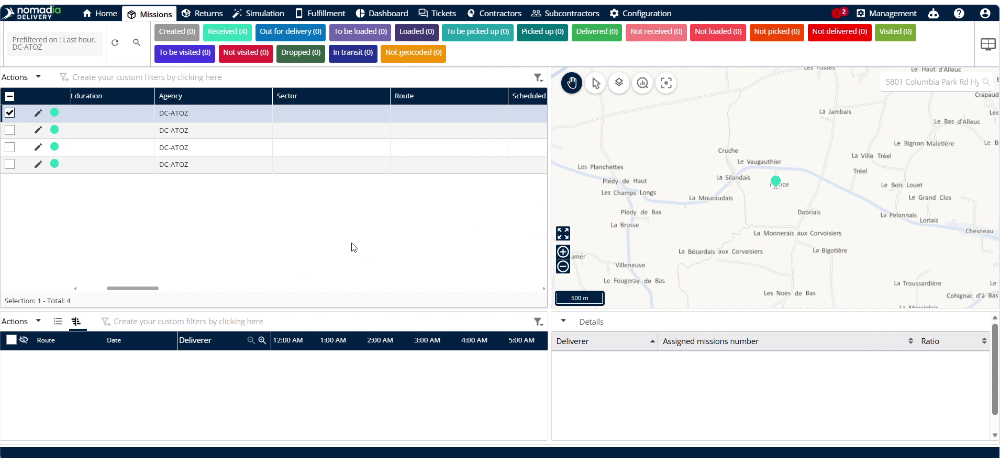

5. Verify the entered **Reception ID** is visible in the list.

### How To: Verify Contractor Email Addresses

1. Navigate to the **Contractor** menu.

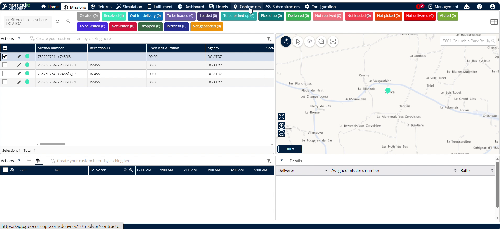

2. Click the **pencil icon** next to the relevant contractor.

3. View and verify the **Contractor email address** on the details page.

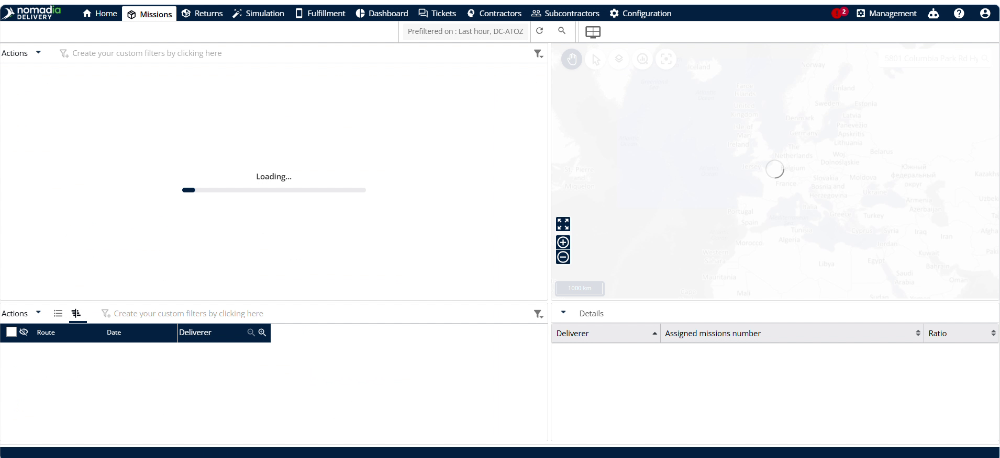

### Productivity Tips

- 💡 **[Automated Reports]**: Enable the **Send reception report** setting to automatically email summaries to contractors, saving manual coordination effort.
- 💡 **[Forced Verification]**: Enable **Scan all the items in the container** under **Received** sub-status to prevent drivers from skipping verification.
- ⚠️ **[Unsaved Progress Warning]**: Avoid exiting the machine creation screen without clicking save, or you will lose all entered details.

***

✉️ Would you like me to create an email template that dispatchers can use to notify contractors about these new automated reception reports?

