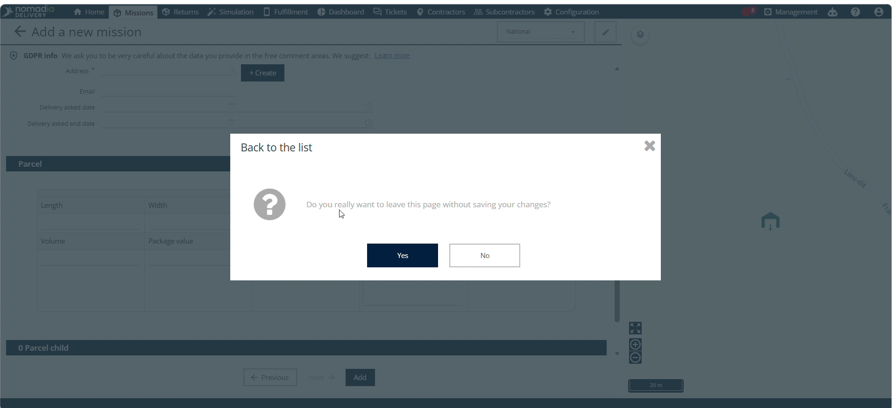
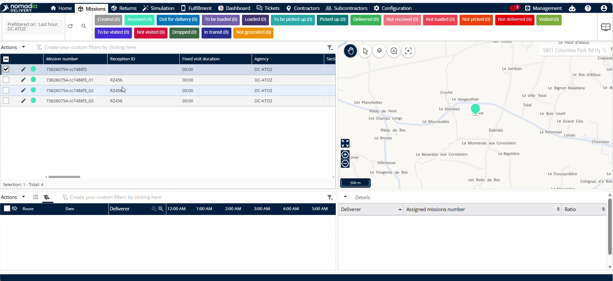
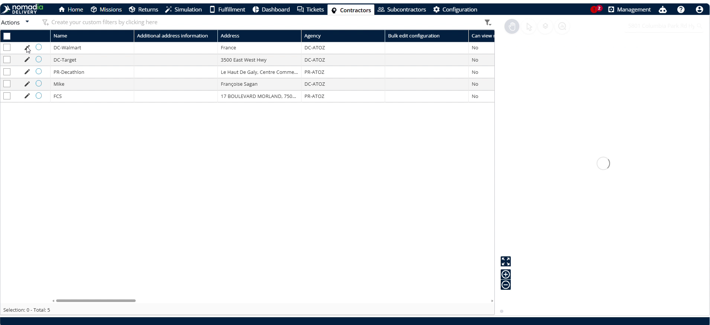

# Reception Management

The **reception management** feature allows dispatchers to manage, verify, and track container deliveries from the field. Enable this feature to automatically receive complete reports and monitor scan logs in real-time. This ensures accurate inventory management and maintains clear communication with your contractors.

#### Getting Started

Ensure you have the following system requirements and configurations set up:

* Access to the **Nomadia Delivery** back-office portal.
* A registered contractor email address to receive automatic reports.
* The mobile application installed on field devices.

Follow these steps for initial setup:

1. Navigate to the **Configuration** menu in the portal.
2. Click **Configure the mobile app**.

3. Enable the **Ask for reception ID** and **Send reception report** toggles under the **Reception** column.
4. Click **Save** to apply the configuration.

<figure><figcaption></figcaption></figure>

5. Go to the **Sub Status** menu and click the **pencil icon** next to the **Received** sub-status.
6. Enable the **Scan all the items in the container** toggle.
7. Click **Save** to update the sub-status rules.

#### Feature Overview

The following UI elements control your reception tracking workflow:

* **Configure the mobile app**: Opens the mobile settings panel to customize field worker workflows.
* **Ask for reception ID**: Prompts drivers for a reception identifier to ensure all received shipments are uniquely tracked.
* **Scan all the items in the container**: Forces drivers to scan every package to prevent missed or incorrect deliveries.
* **Customize the list**: Adjusts columns in the back-office view to select displayed columns.

#### How To: Associate a Contractor with a Machine Container

1. Navigate to the **Missions** menu.
2. Click **Add** or edit an existing Mission container.

<figure><figcaption></figcaption></figure>

3. Select the associated **Contractor** for the container.

<figure><figcaption></figcaption></figure>

4. Click **Add** to save the container.

<figure><figcaption></figcaption></figure>

**Troubleshooting: Unsaved Changes Warning**

If you attempt to navigate away without saving, a popup warning will appear.

* Click **No** to stay on the page and save your changes.
* Click **Yes** to leave the page and discard progress.

#### How To: Scan and Receive Containers in the Mobile Application

1. Open the mobile application on your field device.
2. Click the **+** icon at the bottom
3. Enter the **Reception name** and **Reception ID** when prompted and click **validate**

<figure><figcaption></figcaption></figure>

4. Scan the **Parent container form**.

5. Tap the Tick mark at the bottom.&#x20;
6. You will get a pop up stating "Are you sure you want to finish receiving scanned messages"
7. Click **confirm**

<figure><figcaption></figcaption></figure>

#### How To: Display Reception IDs in the Back-Office List

1. Navigate to the main list view in the portal.
2. Click **Customize the list**.
3. Locate the **Reception ID** field and ensure it is selected for display.
4. Click **Save** to update the list columns.

<figure><figcaption></figcaption></figure>

5. Verify the entered **Reception ID** is visible in the list.

#### How To: Verify Contractor Email Addresses

1. Navigate to the **Contractor** menu.
2. Click the **pencil icon** next to the relevant contractor.

3. View and verify the **Contractor email address** on the details page.

<figure><figcaption></figcaption></figure>

#### Productivity Tips

* 💡 **\[Forced Verification]**: Enable **Scan all the items in the container** under **Received** sub-status to prevent drivers from skipping verification.
* ⚠️ **\[Unsaved Progress Warning]**: Avoid exiting the machine creation screen without clicking save, or you will lose all entered details.

