# routeeditor
# routeeditor

The **routeeditor** feature allows dispatchers to manage route details and survey configurations. Use this tool to adjust route schedules, track survey responses, view logs, and manage vehicle photos. You will achieve complete control over route settings and driver inspection data.

### Getting Started

#### Requirements
- Active user account in **Nomadia Delivery**.
- Access to the **machines** module.

#### Setup Steps
1. Log into **Nomadia Delivery**.

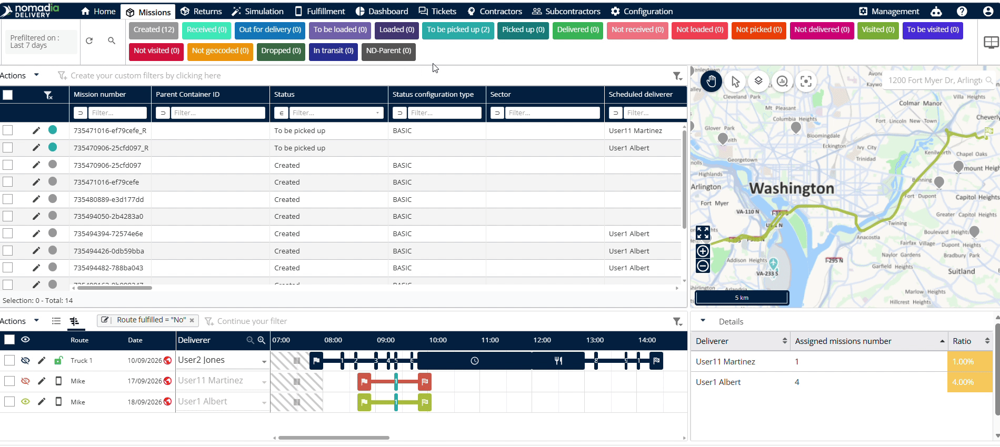

2. Go to **machines** and scroll down to access the **route section**.

3. Click the **edit icon** next to the **delivery name**.

### Feature Overview

- **Date**: Sets the scheduled execution date for the route.

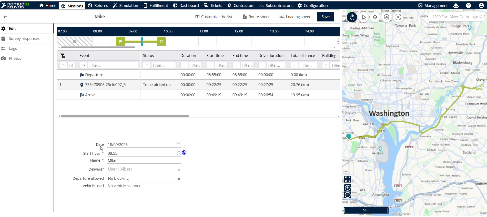

- **Start hour**: Defines the official daily start time for the route.

- **Delivery name**: Displays the locked delivery identifier for assigned routes.

- **Departure allowed**: Controls whether departure permissions block, grant, or disable blocking.

- **Vehicle usage**: Configures operational rules and settings for assigned vehicles.

- **Survey responses**: Displays vehicle inspection survey details submitted from mobile devices.

- **Configuration**: Enables survey response capture and response storage settings.

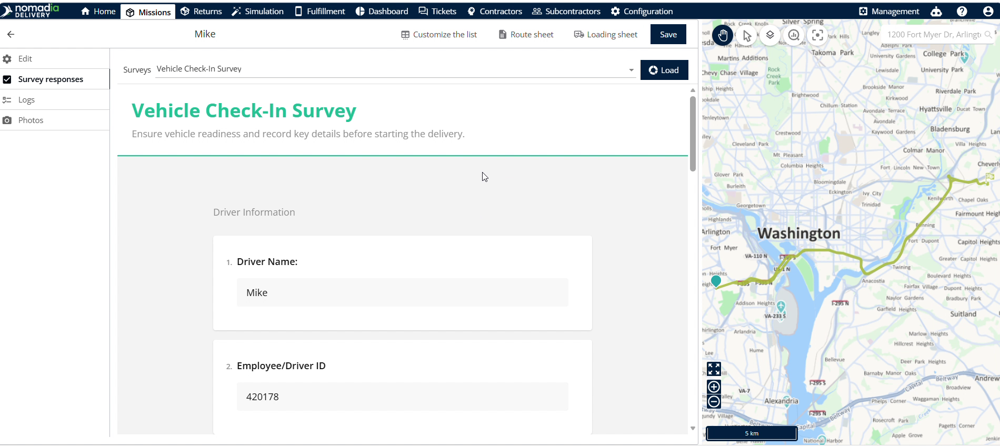

- **Logs**: Shows a detailed audit history of all route modifications.

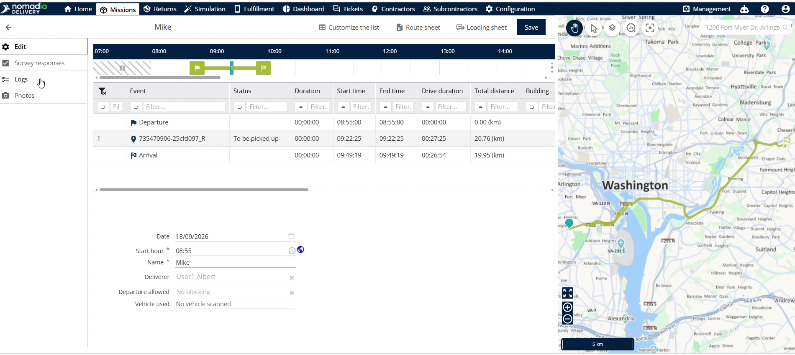

- **Photos**: Loads vehicle photos and manages sample calculations.

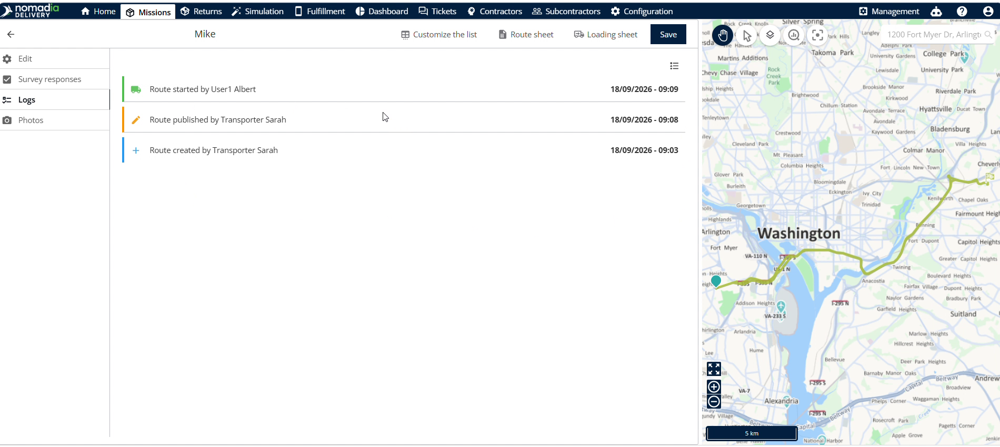

- **Route sheet**: Downloads the printable route summary sheet.

- **Save**: Applies and stores all route modifications permanently.

### How To: Modify Route Details

1. Click the **edit icon** next to the **delivery name**.

2. Update the **date** and **start hour** fields.

3. Select **departure allowed** permissions to set blocking rules.

4. Adjust **vehicle usage** settings as needed.

5. Click **Save** to apply modifications.

### How To: Configure and View Vehicle Surveys

1. Click **Configuration** to open survey options.

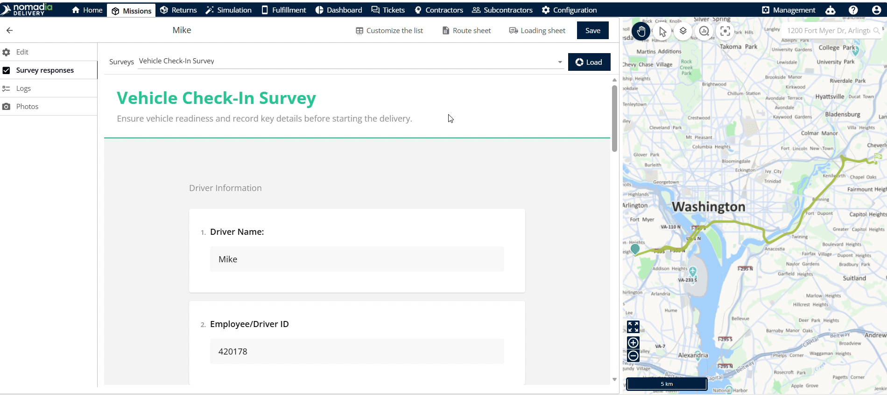

2. Click **Configure the survey**.

3. Click the **pincer icon** next to **vehicle checking survey**.

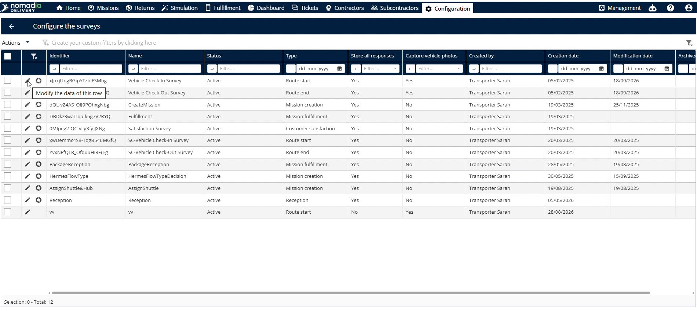

4. Enable **store all responses** and **capture** options.

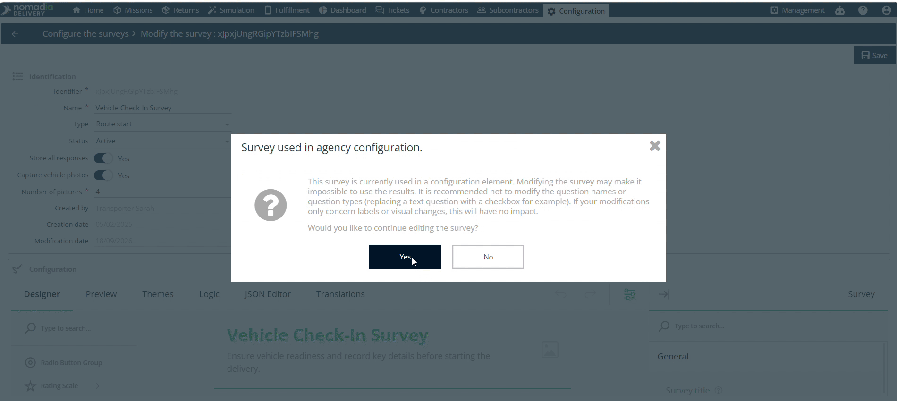

5. Click **Save** to store survey settings.

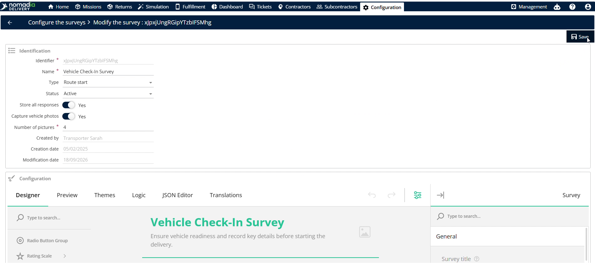

6. Click **Survey responses** in the top left corner.

7. Select **Vehicle checking survey** and click **Load**.

### How To: View Route Modification Logs

1. Click **Logs** in the top menu.

2. Review all past route modifications and change details.

### How To: Manage Vehicle Photos and Samples

1. Click **Photos** to open photo settings.

2. Click **Customize the list** at the top.

3. Select fields and click the **right arrow** to display them.

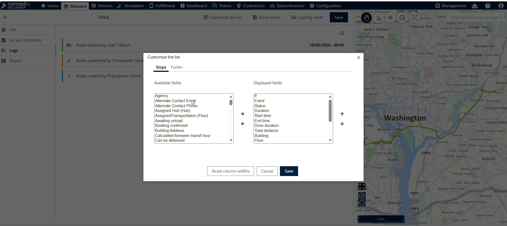

4. Select the photo and choose the **type of sample**.

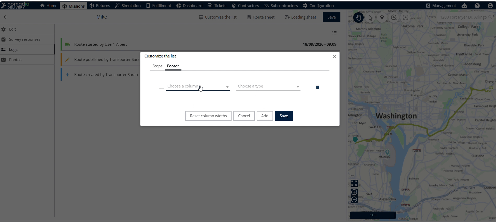

5. Click **Save** and return to view calculations.

### How To: Download Route Sheets

1. Click **Route sheet** to generate the document.

2. Save the downloaded file to your local computer.

#### Troubleshooting
If the **delivery name** field is locked, check the route assignment status. System status prevents modifications to assigned routes.

### Productivity Tips

- 💡 **Survey Pre-configuration**: Configure survey settings initially so mobile submissions appear correctly in the survey viewer.
- ⚠️ **Assigned Route Edits**: Avoid trying to rename assigned routes because assigned status locks the delivery name field.
- 💡 **Audit Tracking**: Review the logs tab to verify all past route edits and maintain operational accountability.
- 💡 **Custom Field Views**: Use the right arrow during list customization to control which sample fields display.

