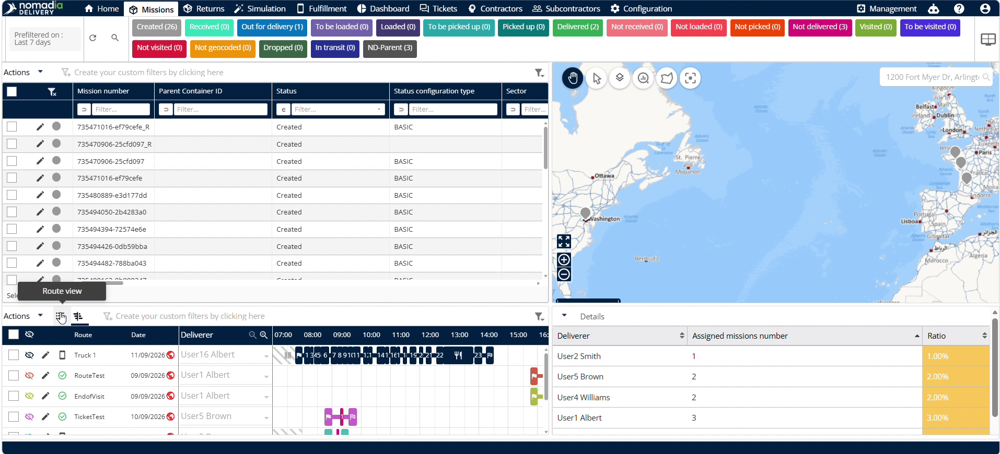
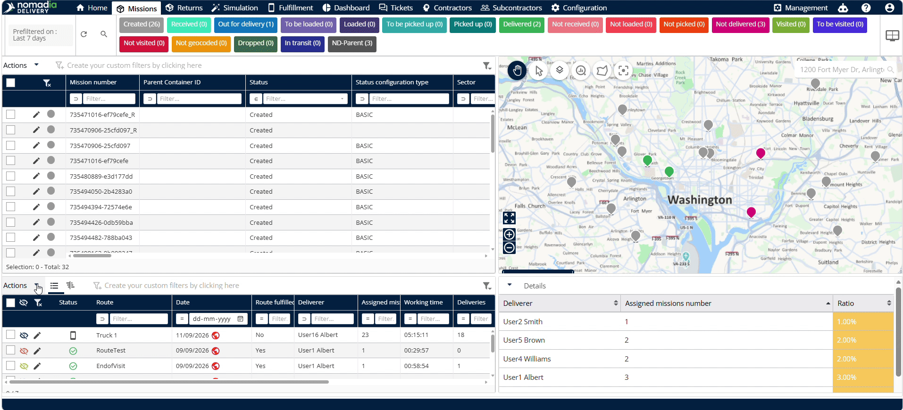
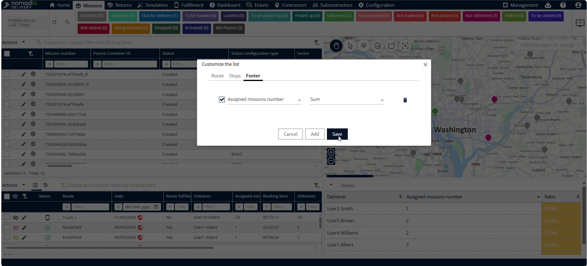

# Table view

The **table view** feature provides a structured tabular view for managing route information in **Nomadia Delivery**. Planners need it to monitor route fulfillment, driver assignments, and mission counts in a consolidated format. You will gain full control over displayed route columns, stop views, and summary footer calculations.

#### Getting Started

Prerequisites and system requirements:

* Access to the **Missions** section in **Nomadia Delivery**.
* Pre-configured routes created in the system.

Initial setup steps:

1. Select **Missions** from the main menu.
2. Scroll down to locate the **Routes** section.
3. Locate the **Table View Menu** next to **Actions**.
4. Click **Table View Menu** to change the **Routes** display to table view.

#### Feature Overview

* **Eye Icon**: View assigned routes directly on the interactive map.
* **Filter View**: Hide or show the column filter row across the table.
* **Status**: Displays the current operational status of each route.
* **Route Name**: Displays the designated route name and its assigned date.
* **Route Fulfillment**: Indicates route fulfillment status with a yes or no value.
* **Deliverer Name**: Displays the name of the assigned driver or deliverer.
* **Assigned Missions**: Displays the total count of machines assigned to the route.
* **Working Time**: Displays the calculated working time required for the route.
* **Mission Breakdown Counts**: Displays breakdown totals for deliveries, pickups, visits, cross docking, drop shipping, and signed pickups.
* **Customize List**: Configures which fields display in the route or stop section.
* **Footer**: Selects table columns to compute summary calculations like machine totals.

#### How To: Customize Route View Fields

1. Click **Actions** in the route menu.

2. Select **Customize List** from the menu options.

3. Select the fields you want to display in the route section.
4. Click the **Right Arrow** to add selected fields to the display list.
5. Click **Save** to apply your route field selections.

#### How To: View Route Stops

1. Click any **Route** row in the table.
2. Review individual stop details for the selected route.
3. Click **Back** to return to the main route view.

#### How To: Customize Stop View Fields

1. Click **Actions** and select **Customizer List**.
2. Select **Stops** from the customization panel.

3. Select the fields to display in the stop view.
4. Click **Save** to confirm your stop view settings.

#### How To: Calculate Column Sums in the Footer

1. Click **Footer** inside the **Customizer List** window.

2. Select a target column, such as **Assigned Machine Number**.

3. Click **Sum** to enable total calculation.

4. Click **Save** to apply footer settings.

5. View the calculated total sum in the table footer row.

#### Productivity Tips

* 💡 **Filter View Toggle**: Click **Filter View** to hide the filter row and maximize table viewing area.
* 💡 **Automatic Sum Calculations**: Use **Footer** sum options to calculate total assigned missions across rows instantly.
* 💡 **Direct Stop Access**: Click any route row directly to open stop view without navigating secondary menus.

