# tableview
# tableview

The **tableview** feature provides a structured tabular view for managing route information in **Nomadia Delivery**. Planners need it to monitor route fulfillment, driver assignments, and machine counts in a consolidated format. You will gain full control over displayed route columns, stop views, and summary footer calculations.

### Getting Started

Prerequisites and system requirements:
- Access to the **Machines** section in **Nomadia Delivery**.
- Pre-configured routes created in the system.

Initial setup steps:
1. Select **Machines** from the main menu.

2. Scroll down to locate the **Routes** section.

3. Locate the **Table View Menu** next to **Actions**.

4. Click **Table View Menu** to change the **Routes** display to table view.

### Feature Overview

- **Eye Icon**: View assigned routes directly on the interactive map.

  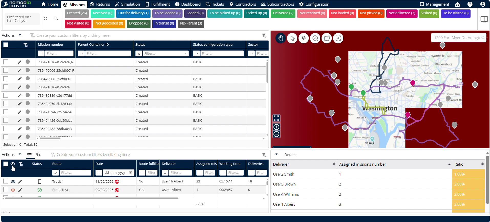

- **Filter View**: Hide or show the column filter row across the table.

  

- **Status**: Displays the current operational status of each route.

  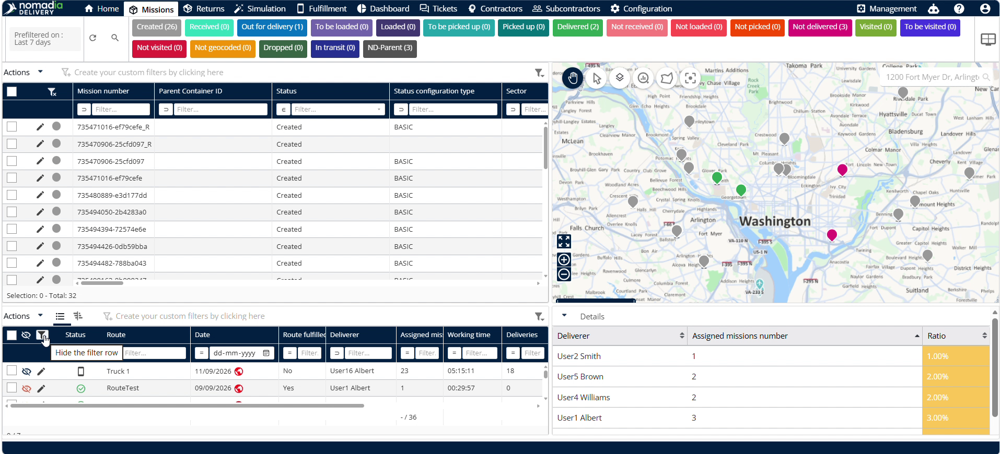

- **Route Name**: Displays the designated route name and its assigned date.

  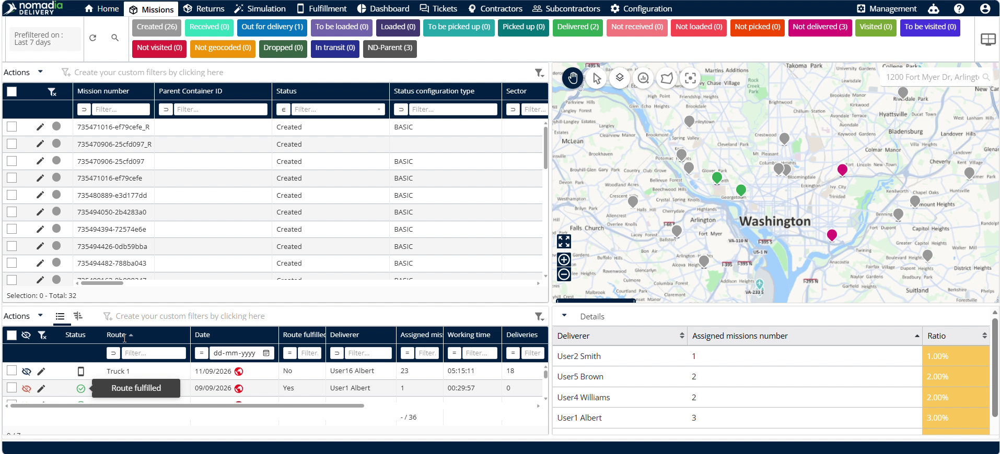

- **Route Fulfillment**: Indicates route fulfillment status with a yes or no value.

  

- **Deliverer Name**: Displays the name of the assigned driver or deliverer.

  

- **Assigned Machines**: Displays the total count of machines assigned to the route.

  

- **Working Time**: Displays the calculated working time required for the route.

  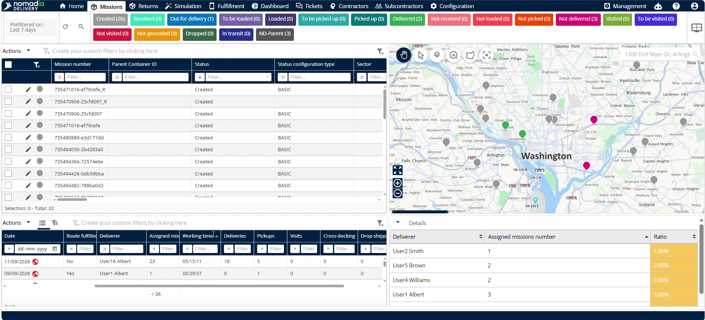

- **Machine Breakdown Counts**: Displays breakdown totals for deliveries, pickups, visits, cross docking, drop shipping, and signed pickups.

  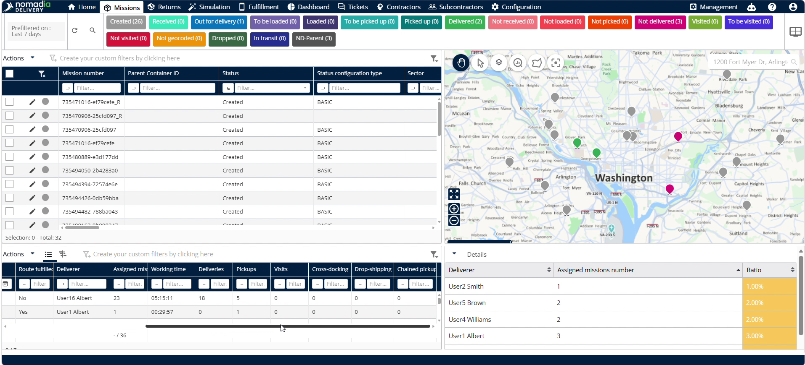

- **Customizer List**: Configures which fields display in the route or stop section.

  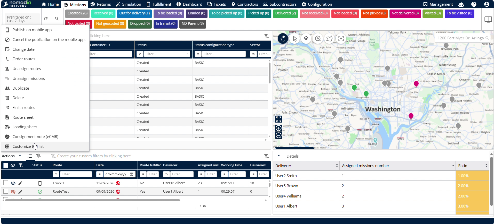

- **Footer**: Selects table columns to compute summary calculations like machine totals.

  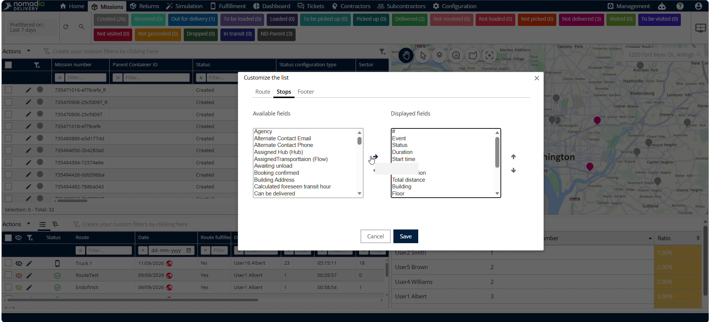

### How To: Customize Route View Fields

1. Click **Actions** in the route menu.

   

2. Select **Customizer List** from the menu options.

   

3. Select the fields you want to display in the route section.

4. Click the **Right Arrow** to add selected fields to the display list.

   

5. Click **Save** to apply your route field selections.

   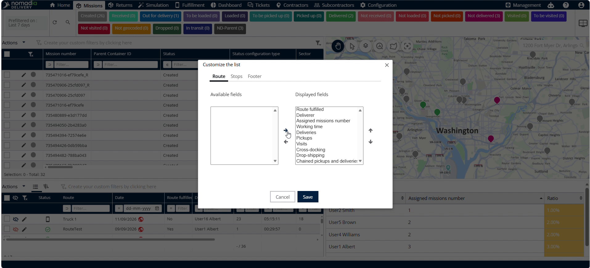

### How To: View Route Stops

1. Click any **Route** row in the table.

   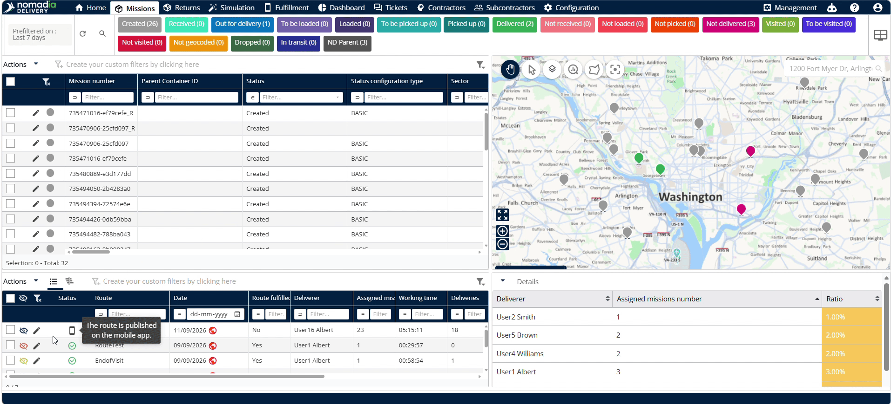

2. Review individual stop details for the selected route.

   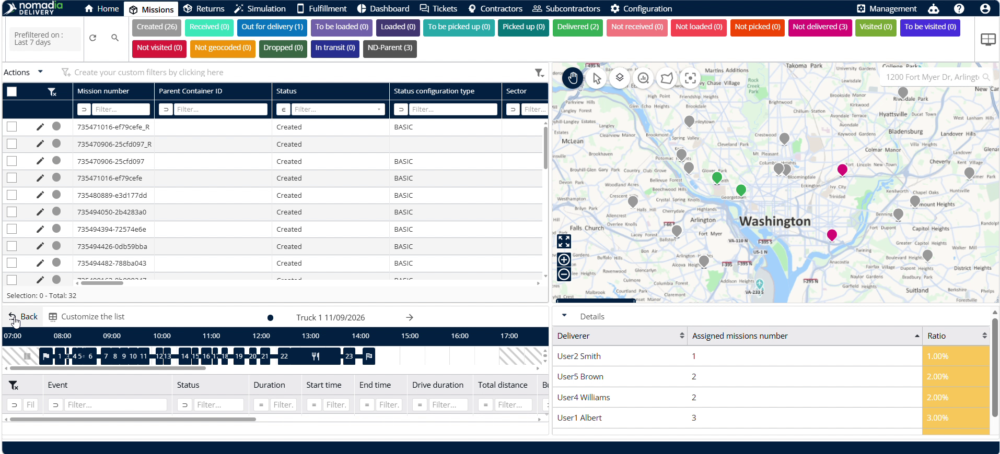

3. Click **Back** to return to the main route view.

   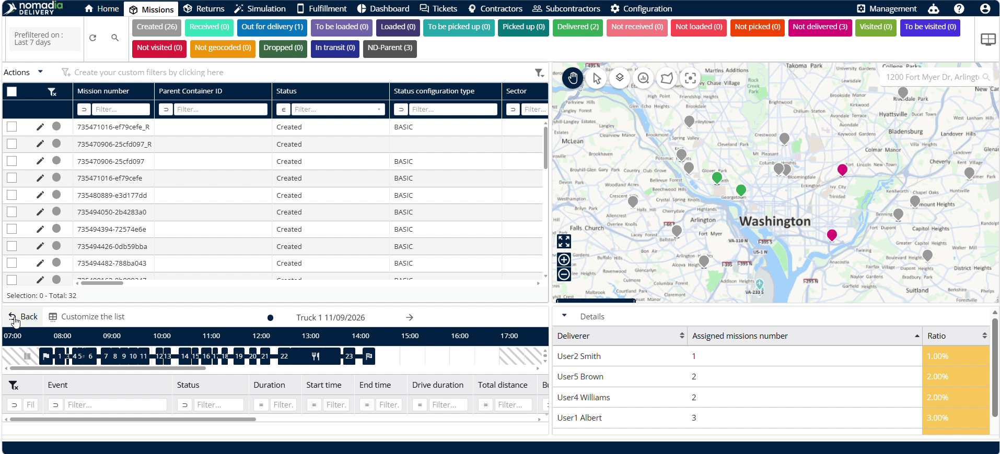

### How To: Customize Stop View Fields

1. Click **Actions** and select **Customizer List**.

2. Select **Stops** from the customization panel.

   

3. Select the fields to display in the stop view.

   

4. Click **Save** to confirm your stop view settings.

### How To: Calculate Column Sums in the Footer

1. Click **Footer** inside the **Customizer List** window.

   

2. Select a target column, such as **Assigned Machine Number**.

   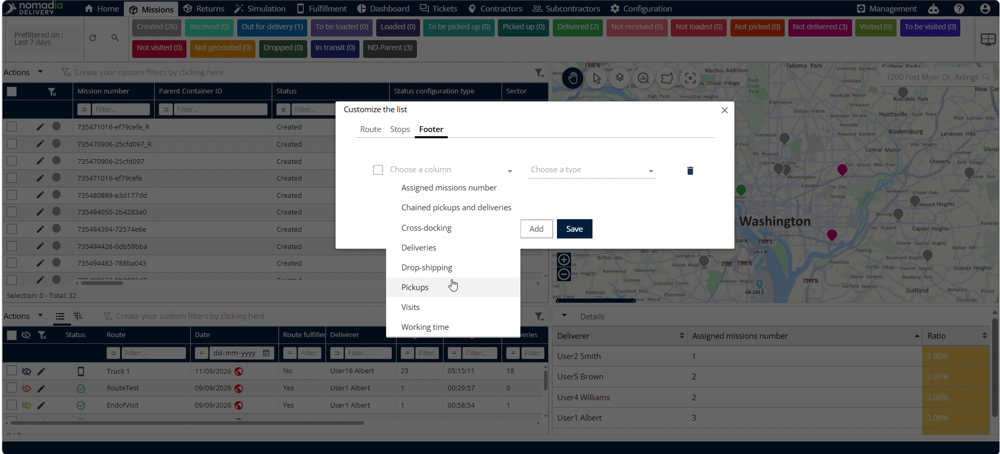

3. Click **Sum** to enable total calculation.

   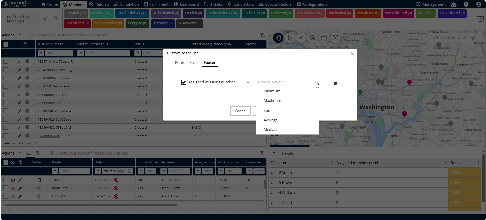

4. Click **Save** to apply footer settings.

   

5. View the calculated total sum in the table footer row.

   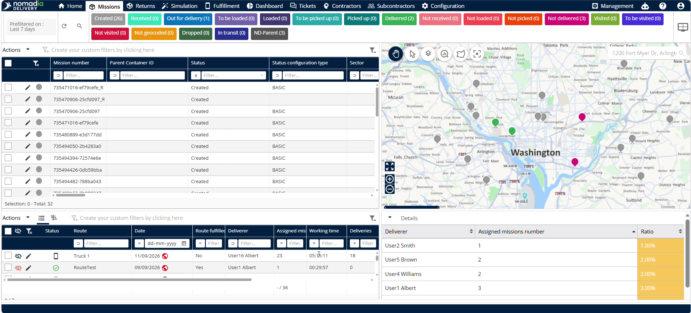

### Productivity Tips

- 💡 **Filter View Toggle**: Click **Filter View** to hide the filter row and maximize table viewing area.
- 💡 **Automatic Sum Calculations**: Use **Footer** sum options to calculate total assigned machines across rows instantly.
- 💡 **Direct Stop Access**: Click any route row directly to open stop view without navigating secondary menus.

---

💡 Would you like me to turn this user guide into a PDF document or create a quick-reference study guide for dispatchers?

